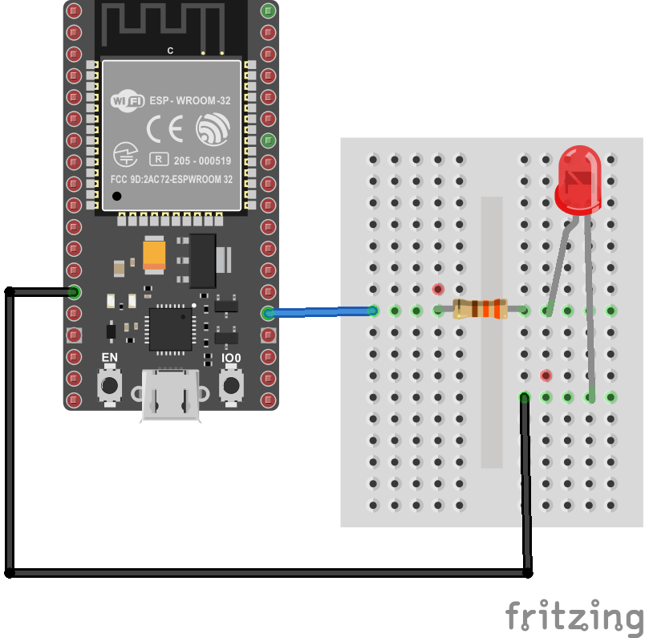
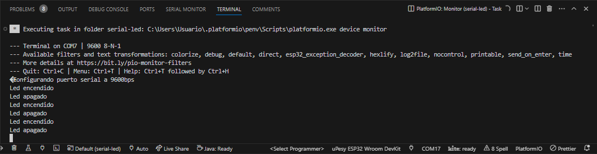
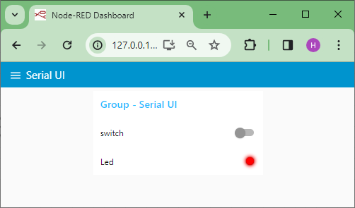
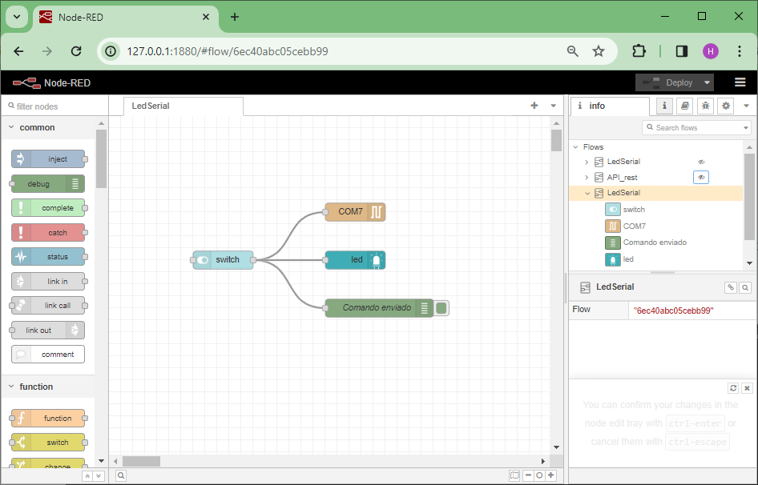

## Paso 4 - Desarrollo de la aplicación con interfaz grafica usando Node-RED


## Prerequisitos

Es necesario tener el ESP32 con el programa descargado y funcional (recordar el [paso 1](../paso1/README.md)). 


<p align = "center.png">

</p>

El código ([main.cpp](../serial-led/src/main.cpp)) del ESP32 se muestra a continuación:

```C++
#include <Arduino.h>

#define LED 2   // Assign LED to pin GPIO2 (Built-in LED)

byte comando;

void setup() {
  // initialize serial communication at 9600 bits per second:
  Serial.begin(9600);
  Serial.write("Configurando puerto serial a 9600bps\n");
  // initialize digital pin LED as an output.
  pinMode(LED, OUTPUT);
  digitalWrite(LED, LOW);
}

void loop() {
  // check if data has been sent from the computer
  if (Serial.available()) {
    // read the most recent byte 
    comando = Serial.read();
    if(comando == 'h') {
      digitalWrite(LED, HIGH);
      Serial.write("Led encendido\n");
    }
    else if(comando == 'l') {
      digitalWrite(LED, LOW);
      Serial.write("Led apagado\n");
    }
  } 
}
```

Antes de proseguir, verifique el el programa del ESP32 funciona correctamente (encendiendo el led cuando se envia el comando `h` y apagandolo cuando se envia el comando `l`) empleando el monitor serial:

<p align = "center.png">

</p>

## Aplicación Node-RED

El procedimiento para crear esta aplicación usando Node-RED se muestra con mas detalle en el siguiente [link](procedimiento/README.md)

### Interfaz grafica

A continuación se muestra la interfaz grafica de la aplicación:

<p align = "center.png">

</p>

### Flujos 

Los flujos asociados a la interfaz se muestran en la siguiente figura continuación:

<p align = "center.png">

</p>

El archivo JSON asociado a los flujos ([led-serial_nodered.json](led-serial_nodered.json)) se muestra a continuación:


```JSON
[
    {
        "id": "6ec40abc05cebb99",
        "type": "tab",
        "label": "LedSerial",
        "disabled": false,
        "info": "",
        "env": []
    },
    {
        "id": "fa62277b6b50eca9",
        "type": "ui_switch",
        "z": "6ec40abc05cebb99",
        "name": "",
        "label": "switch",
        "tooltip": "",
        "group": "ef411bb7c870b8b4",
        "order": 1,
        "width": 0,
        "height": 0,
        "passthru": true,
        "decouple": "false",
        "topic": "topic",
        "topicType": "msg",
        "style": "",
        "onvalue": "h",
        "onvalueType": "str",
        "onicon": "",
        "oncolor": "",
        "offvalue": "l",
        "offvalueType": "str",
        "officon": "",
        "offcolor": "",
        "animate": false,
        "className": "",
        "x": 190,
        "y": 240,
        "wires": [
            [
                "4b506ccd2ea60188",
                "98e385d0b0f255af",
                "1cb4cdf5a9c9e1b4"
            ]
        ]
    },
    {
        "id": "4b506ccd2ea60188",
        "type": "serial out",
        "z": "6ec40abc05cebb99",
        "name": "",
        "serial": "fbe7cabfd61ab0d8",
        "x": 410,
        "y": 160,
        "wires": []
    },
    {
        "id": "98e385d0b0f255af",
        "type": "debug",
        "z": "6ec40abc05cebb99",
        "name": "Comando enviado",
        "active": true,
        "tosidebar": true,
        "console": false,
        "tostatus": false,
        "complete": "payload",
        "targetType": "msg",
        "statusVal": "",
        "statusType": "auto",
        "x": 450,
        "y": 320,
        "wires": []
    },
    {
        "id": "1cb4cdf5a9c9e1b4",
        "type": "ui_led",
        "z": "6ec40abc05cebb99",
        "order": 2,
        "group": "ef411bb7c870b8b4",
        "width": 0,
        "height": 0,
        "label": "Led",
        "labelPlacement": "left",
        "labelAlignment": "left",
        "colorForValue": [
            {
                "color": "#ff0000",
                "value": "0",
                "valueType": "str"
            },
            {
                "color": "#008000",
                "value": "1",
                "valueType": "str"
            }
        ],
        "allowColorForValueInMessage": false,
        "shape": "circle",
        "showGlow": true,
        "name": "",
        "x": 410,
        "y": 240,
        "wires": []
    },
    {
        "id": "ef411bb7c870b8b4",
        "type": "ui_group",
        "name": "Group - Serial UI",
        "tab": "56b83ff5f6280354",
        "order": 1,
        "disp": true,
        "width": "6",
        "collapse": false,
        "className": ""
    },
    {
        "id": "fbe7cabfd61ab0d8",
        "type": "serial-port",
        "serialport": "COM7",
        "serialbaud": "9600",
        "databits": "8",
        "parity": "none",
        "stopbits": "1",
        "waitfor": "",
        "dtr": "none",
        "rts": "none",
        "cts": "none",
        "dsr": "none",
        "newline": "\\n",
        "bin": "false",
        "out": "char",
        "addchar": "",
        "responsetimeout": "10000"
    },
    {
        "id": "56b83ff5f6280354",
        "type": "ui_tab",
        "name": "Serial UI",
        "icon": "dashboard",
        "order": 3,
        "disabled": false,
        "hidden": false
    }
]
```

