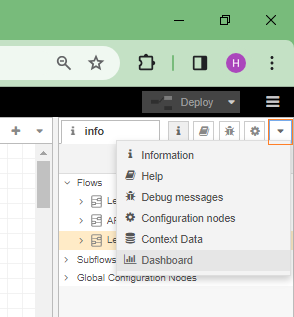
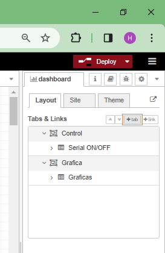
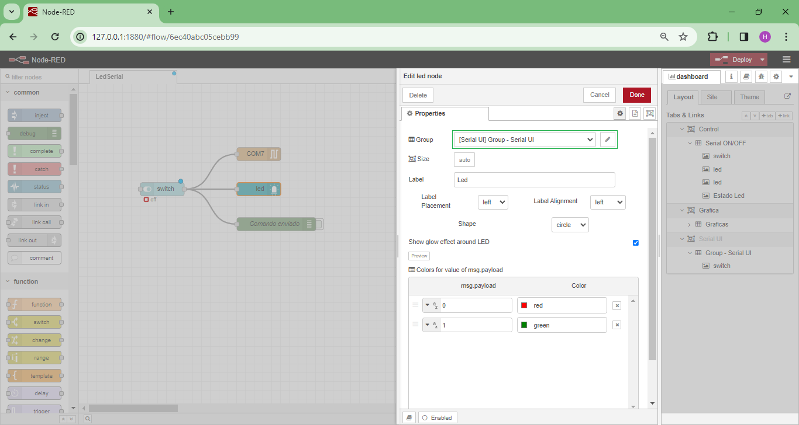

# Creación de la interfaz usando Node-RED

A continuación se describen los pasos para crear la aplicación del ejemplo usando Node-RED.

## Flujos

Los flujos se pueden crear arrastrando componentes o como en nuestro caso, importando el archivo JSON con los flujos (si este se tiene). En nuestro caso el archivo ya se tiene  ([led-serial_nodered.json](led-serial_nodered.json)) de modo que vamos a explicar como se importa:

1. Ejecutar el Node-RED ejecutando en la terminal el comando.
   
   ```
   node-red
   ```

   La siguiente figura muestra el procedimiento:

   <p align = "center">
   
   </p>

   Si todo esta bien en el browser en la URL: ``127.0.0.1:1880` se ejecutará la interfaz de Node-RED:

   <p align = "center">
   
   </p>

2. Importar el archivo JSON que describe el flujo ([led-serial_nodered.json](led-serial_nodered.json) en el caso) dando **click** en el icono de las tres barritas:
   
   <p align = "center">
   
   </p>

   Si todo esta bien aparecera la ventana para importar flujos:

   <p align = "center">
   
   </p>

   Luego dar click en boton **Select file to import** y elegir el flujo a importar:

   <p align = "center">
   
   </p>

   Si todo esta bien, aparecerá el contenido del archivo JSON en la ventana tal y como se muestra en la siguiente figura:

   <p align = "center">
   
   </p>

   Finalmente, seleccionar el boton **import** (de la figura anterior) cargara los flujos en la Interfaz de Node-RED:

   <p align = "center">
   
   </p>

3. Modificar las propiedades de cada uno de los **nodos** al dar **doble click** en el componente a editar. La siguiente figura muestra el caso para el **serial out node**:
   
   <p align = "center">
   
   </p>

   La pestaña **Info** (a la derecha) permite ver la información asociada al flujo en cuestion:

   <p align = "center">
   
   </p>

4. Una vez se haya hecho cualquier cambio, es necesario presionar el botón deploy para que estos tengan efecto:

   <p align = "center">
   
   </p>

   Si todo sale sin errores, el resultado se simular al mostrado en la siguiente figura:

   <p align = "center">
   
   </p>
   

## Dashboard
   
Una vez se han definido los flujos, es necesario crear un dasboard para que el usuario pueda interactuar de manera amigable con la aplicación. Para ello siga los siguientes pasos:

1. Seleccione en el menu desplegable (de la **flechita**) la opción **Dashboard**:
   
   <p align = "center">
   
   </p>

   Si todo esta bien, se deplegará la información con las diferentes dashboards existentes:

   <p align = "center">
   
   </p>

2. Agregar una **tab** al dasboard, para ello de click en el boton **+tab**
   
   <p align = "center">
   
   </p>

3. Edite la nueva **tab** recien agregada:
   
   <p align = "center">
   
   </p>

   Modifique las propiedades de la **tab**, en el caso se modificó el nombre **Name** colocando por valor **Serial UI**

   <p align = "center">
   
   </p>

   Es importante que note (de la figura anterior) que en el momento esta **tab** no se encuentra habilitada.

4. Edite la nueva **tab** recien agregada:
   
   <p align = "center">
   
   </p>

5. Agregue un contenedor **Group** para ubicar de manera ordenada los componentes dando click en el boton **+group**:
   
   <p align = "center">
   
   </p>

   Si todo esta bien aparece un nuevo contenedor como el que se muestra a continuación:

   <p align = "center">
   
   </p>

   Despues de agregar el nuevo contenedor editelo. En nuestro caso se cambio la propiedad **Name** por **Group - Serial UI** tal y como se muestra en la siguiente figura:

   <p align = "center">
   
   </p>

6. Agregue cada uno de los nodos al **tab**:
   
   * Inicialmente se agrego el **switch node**, al dar doble click sobre este y editarlo de tal manera que en la propiedad **Group** se elija el contenedor asociado a la **tab** de interes. En el caso se eligió: **[Serial UI] Group - Serial UI**:
   
     <p align = "center">
     
     </p>

     Luego se verifica que este haya quedado en la **tab** de interes (**Serial UI** en nuestro caso):

     <p align = "center">
     
     </p>

   * Ahora se agrega el  **led node** procediendo de manera simular al caso anterior:
  
      <p align = "center">
      
      </p>
      
     Si todo esta bien, la tab queda como se muestra a continuación:

      <p align = "center">
      
      </p>

7. Verificar la distribución de los componentes de la **tab** dando click en el boton **layout**:
   
   <p align = "center">
   
   </p>

   La forma como estan distribuidos los componentes se muestra a continuación:

   <p align = "center">
   
   </p>

8. Habilitar la **tab** dando click en el boton **Enabled** y luego dando click en el boton **Update**.
   
   <p align = "center">
   
   </p>

   Luego, haga nuevamente el **deploy**:

   <p align = "center">
   
   </p>

9. Despliegue la **Dashboard** dando click el botón destinado para ello (resaltado en el cuadro naranja en la siguiente figura):
    
    <p align = "center">
    
    </p>

10. Una vez aparezca el dasboard en el browser, seleccione la **tab** de interes, la cual para nuestro caso es **Serial UI** tal y como se muestra en la siguiente figura:
    
    <p align = "center">
    
    </p>

    Una vez se selecciona esta **tab** aparecen elementos de la interfaz asociados a los nodos tal y como se muestra en la siguiente figura:

    <p align = "center">
    
    </p>

    Si todo esta bien, es posible encender y apagar el led usando mediante la comunicación serial a traves de la interfaz de nodered.

Para finalizar, lo unico que tiene que hacer es cerrar la interfaz grafica y parar la ejecución de **Node-RED** presionando en la consola la combinación de teclas: **`Ctrl`** + **`C`**. Esto detendrá la ejecución de Node-RED tal y como se muestra en la siguiente figura:

<p align = "center">

</p>
