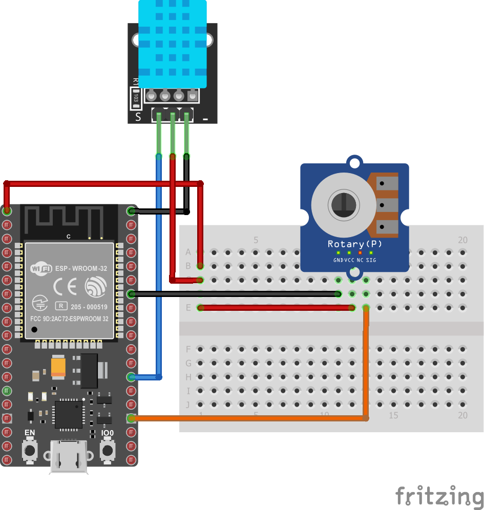
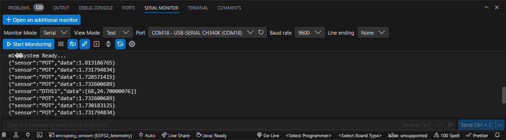
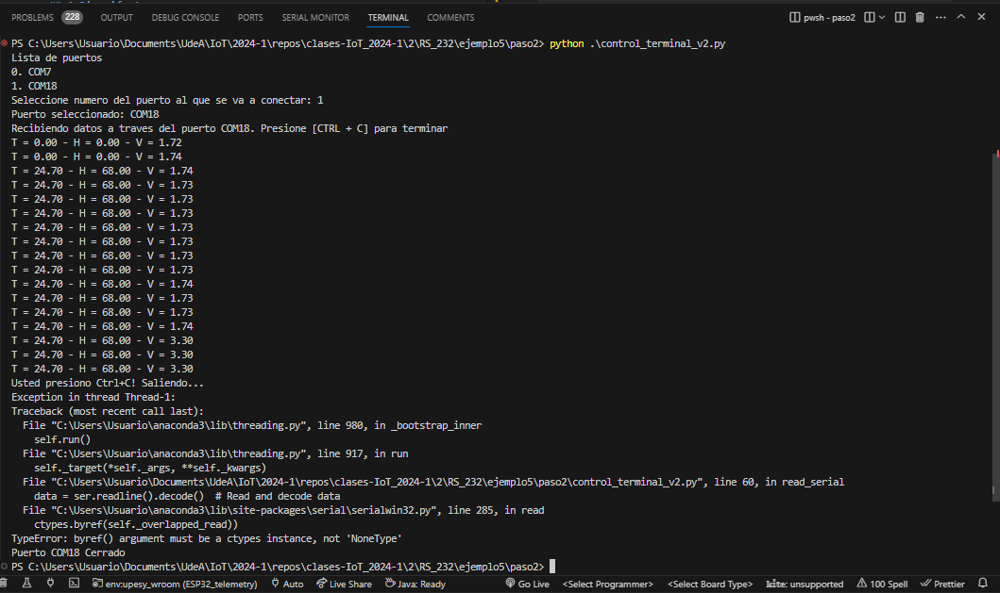

# Ejemplo 5 - Sensado de variables usando el puerto serial en el ESP32

## Enuciado de la aplicación

Desarrollar una aplicación sencilla que permita sensar: temperatura, humedad y voltaje usando el ESP32. Los valores sensados deberan ser enviados serialmente a una aplicación para su despliegue de la siguiente manera:

|Tiempo (seg)|Accion|
|---|---|
|0.5|El ESP32 envia por serial el valor del voltaje al monitor serial o a la aplicación de escritorio|
|2|El ESP32 envia por serial el valor de la tempertarura y la humedad al monitor serial o a la aplicación de escritorio|

En mensaje enviado serialmente tiene el siguiente formato:

```JSON
{"sensor":"DTH11","time":1351824120,"data":[H,T]}
```

## Hardware

A continuación se muestra el Hardware del serial:




## Prerequisitos

A continuación, se listan los ejemplos de software y hardware necesarios para llevar a cabo la implementación del proyecto.

### Hardware necesario

A continuación se muestra el harware necesario:
* **Placa ESP32**: NodeMCU ESP-32S o similar
* **Potenciometro**: Para la variacion del voltaje
* **Modulo DHT11**: Para la medición de la temperatura y la humedad.

### Software necesario

**Librerias de python**: A continuación se listan las librerias de terceros que se deberán instalar para poderlas usar en el script de python.
* **pyserial**: Libreria para comunicación serial
* **kiby**: Libreria para el desarrollo de interfaces graficas

## Desarrollo de la aplicación

La implementación de la aplicación se realizará paso a paso. A continuación se resumen los pasos para realizar esto:

1. **Implementación del firmware de la ESP32**: Inicialmente, según los requerimientos de la aplicación, lo primero que se debe hacer el codificar el programa que va a descargarse en el ESP32. Este paso se abordara en el siguiente paso 1 ([link](paso1/README.md))
   
   

2. **Implementación del software de la aplicación de escritorio**: Una vez verificado el correcto funcionamiento del Firmware del arduino, se procede al desarrollo de la aplicación de escritorio. En nuestro caso se desarrollo una aplicación de escritorio usando python. En lo que respecta a la aplicación de escritorio se realizaron dos variantes:
   * **Desarrollo de la aplicación de consola**: Aplicación de consola que muestra la información que llega desde el ESP32. Esta se tratará con detalle en el paso 2 ([link](paso2/README.md)) 
  
   

   * **Desarrollo de la aplicación con interfaz grafica**: En construcción...

## Referencias

* https://arduinojson.org/
* https://arduinojson.org/v7/api/
* https://arduinojson.org/v7/example/parser/