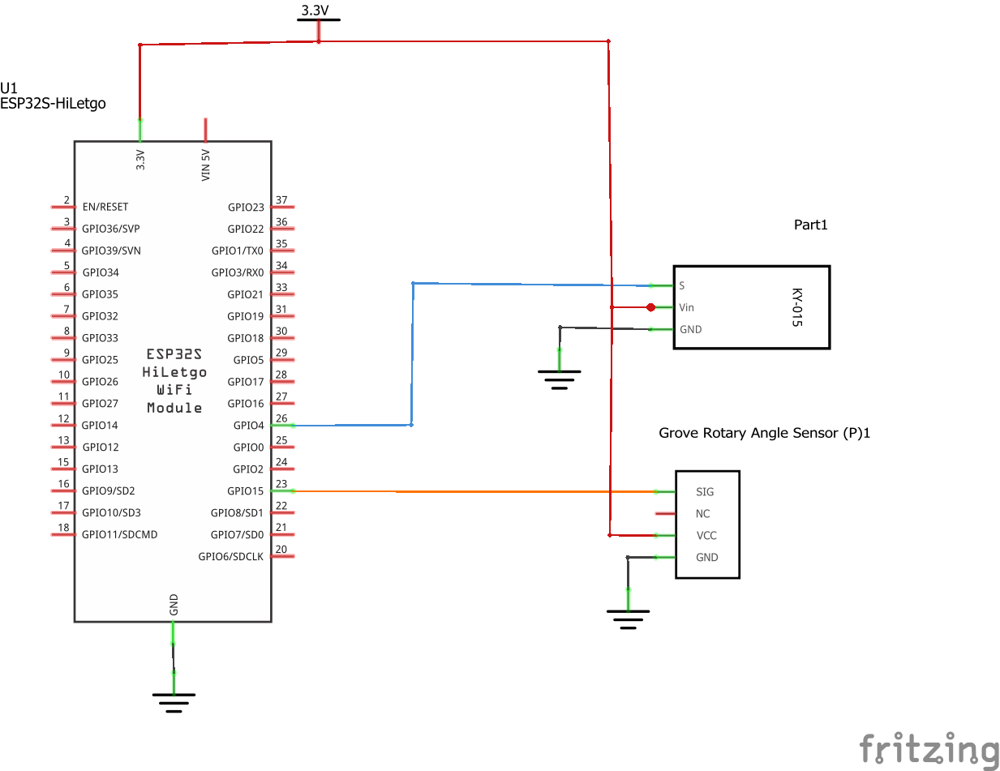
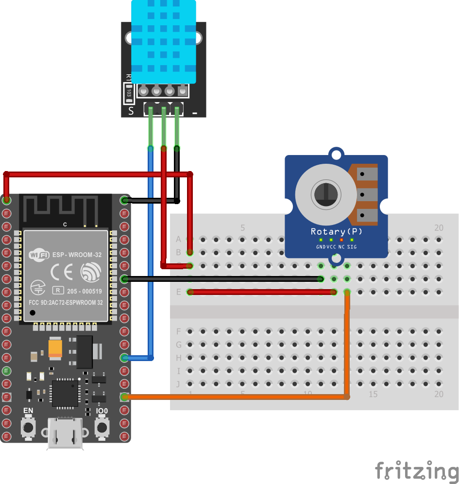
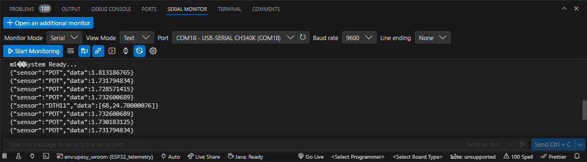
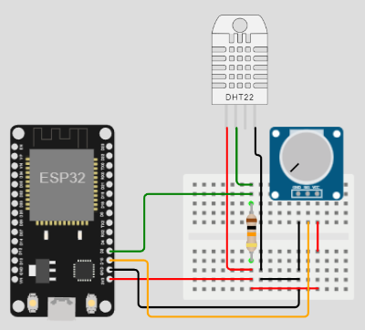

# Paso 1 - Implentacion del programa en el ESP32


## Resumen

Realizar que imprima la tempetatura y la humedad obtenida con un sensor DHT11 e imprimir el valor usando el monitor serial.

## Hardware

El archivo fritzing del proyecto es [esp32_T-V-H.fzz](esp32_T-V-H.fzz)

### Componentes

La siguiente tabla muestra los componentes principales del circuito a montar:

|Componentes|Cantidad|Observaciones|
|---|---|---|
|ESP32|1||
|DHT11 Temperature and Humidity Module|1|Disponible en el kit Elegoo ([datasheet](https://cdn.sparkfun.com/assets/b/3/f/9/d/OKY3068-1.pdf))|
|Grove - Rotary Angle Sensor|1|Disponible en el Groove Started Kit ([link](https://wiki.seeedstudio.com/Grove-Rotary_Angle_Sensor/))|

### Esquematico



### Diagrama de conexión



## Software

El Proyecto generado por Platformio es **ESP32_telemetry** y se encuentra en el siguiente directorio [ESP32_telemetry](../ESP32_telemetry/)

### Placas

Las placas para las cuales se configuró el proyecto se resume en la siguiente tabla:

|Board|	Framework|
|----|----|
|nodemcu-32s|	Arduino|
|upesy_wroom|	Arduino|

### Librerias empleadas

Las librerias empleadas se muestran a continuación:

|#|	Libreria|	Observaciones|
|---|---|---|
|1|DHT|**DHT sensor library** [[repo]](https://github.com/adafruit/DHT-sensor-library)|
|2|Adafruit Unified Sensor|**Adafruit Unified Sensor Driver** [[repo]](https://github.com/adafruit/Adafruit_Sensor)|
|3|ArduinoJson|**ArduinoJson** [[doc]](https://arduinojson.org/)|

### Archivo de configuración en Platformio

```ini
; PlatformIO Project Configuration File
;
;   Build options: build flags, source filter
;   Upload options: custom upload port, speed and extra flags
;   Library options: dependencies, extra library storages
;   Advanced options: extra scripting
;
; Please visit documentation for the other options and examples
; https://docs.platformio.org/page/projectconf.html

[env:upesy_wroom]
platform = espressif32
board = upesy_wroom
framework = arduino
lib_deps = 
	adafruit/Adafruit Unified Sensor@^1.1.14
	adafruit/DHT sensor library@^1.4.6
	bblanchon/ArduinoJson@^7.0.3

[env:node32s]
platform = espressif32
board = node32s
framework = arduino
lib_deps = 
	adafruit/Adafruit Unified Sensor@^1.1.14
	adafruit/DHT sensor library@^1.4.6
	bblanchon/ArduinoJson@^7.0.3
```

###  Código

El código de la aplicación (**main.cpp**) se muestra a continuación:

```C++
#include <Arduino.h>
#include <ArduinoJson.h>
#include "DHT.h"

#define SAMPLE_TIME 500
 
// --------------------------------- Entradas --------------------------------- //

// DTH11: Sensor de temperatura y humedad
#define DHTPIN 4     // Digital pin connected to the DHT sensor

// Uncomment whatever type you're using!
#define DHTTYPE DHT11   // DHT 11
//#define DHTTYPE DHT22   // DHT 22  (AM2302), AM2321
//#define DHTTYPE DHT21   // DHT 21 (AM2301)

DHT dht(DHTPIN, DHTTYPE);

// Potenciometro: Variable Analoga
#define ANALOG_PIN 15

// ------------------ Variables ------------------
bool sample_DHT11 = false;
int sample_th = 0;

// Allocate the JSON document
JsonDocument doc;

void setup() {
  Serial.begin(9600);
  Serial.println(F("System Ready..."));
  dht.begin();
}


void loop() {
  // Wait a few seconds between measurements.
  delay(SAMPLE_TIME);
  int sensorValue = analogRead(ANALOG_PIN);
  float sensorVoltage = (3.3*sensorValue)/4095; // ADC de 12 bits
  doc["sensor"] = "POT";
  // Add an array.
  doc["data"] = sensorVoltage;
  serializeJson(doc, Serial);
  Serial.println();
  sample_th++;


  // Reading temperature or humidity takes about 250 milliseconds!
  // Sensor readings may also be up to 2 seconds 'old' (its a very slow sensor)
  float H = dht.readHumidity();
  // Read temperature as Celsius (the default)
  float T = dht.readTemperature();


  // Check if any reads failed and exit early (to try again).
  if (isnan(H) || isnan(T)) {
    Serial.println(F("Failed to read from DHT sensor!"));
    return;
  }

  if(sample_th%4 == 0) {
    // Captura de la temperatura (Cada 2 segundos)
    // Add values in the document
    doc["sensor"] = "DTH11";
    // Add an array.
    JsonArray data = doc["data"].to<JsonArray>();
    data.add(H);
    data.add(T);
    // Generate the minified JSON and send it to the Serial port.
    serializeJson(doc, Serial);
    // The above line prints:
    // {"sensor":"DTH11","time":1351824120,"data":[H,T]}

    // Start a new line
    Serial.println();
    sample_th = 0;
  }
}
```

## Pruebas

### Montaje fisico

Cuando se prueba la aplicación, la salida tiene la siguiente forma:



## Simulación

La simulación del programa descargado se encuentra en ([link](https://wokwi.com/projects/392118312420212737)). Es importante aclarar, que la simulación se realizo con el **DHT22** que es el componente disponible:



Cuando la prueba resulte exitosa, vaya al paso 2 ([link](../paso2/))

