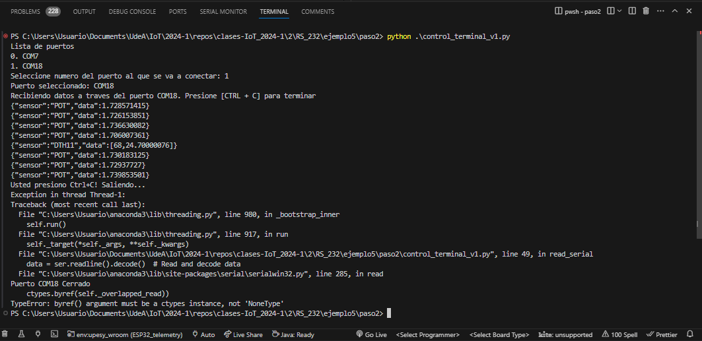
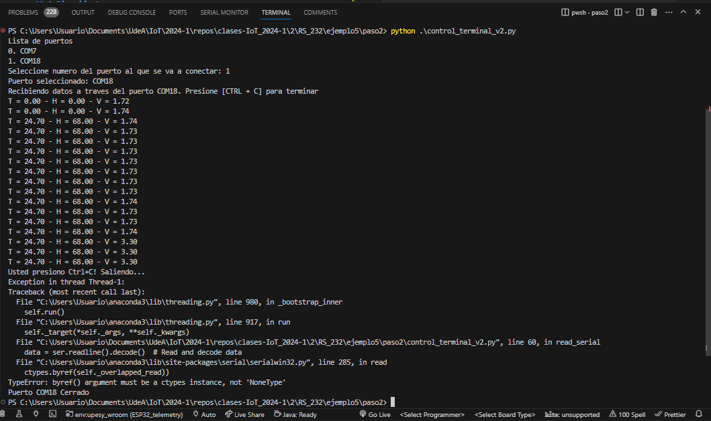

# Paso 2 - Desarrollo de la aplicación en python (Texto)


## Probando la aplicación

Antes de probar la aplicación tenga en cuenta lo siguiente:
1. Tras haber realizado exitosamente las pruebas de funcionamiento en el ESP32, cierre el monitor serial (de Arduino o Platformio) si lo tiene abierto.
   
2. Tenga el hardware conectado al serial:
   
   

3. Ejecute el script de python:
   
   ```
   python archivo_python.py
   ```

A continuación se va a realizar las pruebas de los dos scripts creados para tal fin.

## Aplicación 1

El programa [control_terminal_v1.py](control_terminal_v1.py) permite elegir el puerto al que se conectara la aplicación y recibe e imprime los datos con las medidas enviados desde el ESP32. El valor recibido es impreso tal y como se recibe.

### Sofware

El siguiente es el código del programa:

```py
import sys
import glob
import serial
import threading
import queue

data_queue = queue.Queue()
# Create and start the thread

def serial_ports():
    """ Lists serial port names

        :raises EnvironmentError:
            On unsupported or unknown platforms
        :returns:
            A list of the serial ports available on the system
    """
    print(sys.platform)
    if sys.platform.startswith('win'):
        ports = ['COM%s' % (i + 1) for i in range(256)]
    elif sys.platform.startswith('linux') or sys.platform.startswith('cygwin'):
        # this excludes your current terminal "/dev/tty"
        ports = glob.glob('/dev/tty[A-Za-z]*')
    elif sys.platform.startswith('darwin'):
        ports = glob.glob('/dev/tty.*')
    else:
        raise EnvironmentError('Unsupported platform')

    result = []
    for port in ports:
        try:
            s = serial.Serial(port)
            s.close()
            result.append(port)
        except (OSError, serial.SerialException):
            pass
    return result

def menu_ports(p_list):    
    print("Lista de puertos")
    for i in range(len(p_list)):
        print(f"{i}. {p_list[i]}")
    
def read_serial(ser, queue):
  while True:
    data = ser.readline().decode()  # Read and decode data
    # Process data (print, store in queue, etc.)
    queue.put(data)  # Example: Add data to a queue

def configure_serial(port = '', baud_rate = 9600):
    serial_object = serial.Serial(port = port, baudrate = baud_rate, timeout=.1)
    return serial_object

def setup_serial_port():
    ports = serial_ports()    
    menu_ports(ports)
    num_port = int(input("Seleccione numero del puerto al que se va a conectar: "))
    port = ports[num_port]    
    print(f"Puerto seleccionado: {port}")
    ser = configure_serial(port)
    return ser

def main():
    # Inicializacion del puerto serial
    ser = setup_serial_port()   
    # Cola para leer los datos que llegan desde el puerto serial
    data_queue = queue.Queue()
    # Crear e iniciar el hilo de lectura del serial
    read_thread = threading.Thread(target=read_serial, args=(ser, data_queue))
    read_thread.start()
    print(f"Recibiendo datos a traves del puerto {ser.port}. Presione [CTRL + C] para terminar")
    while True:
        # Check data queue (if used)
        try:   
            if not data_queue.empty():
                data = data_queue.get()
                print(f"{data}",end = '')
        except KeyboardInterrupt:
            print('Usted presiono Ctrl+C! Saliendo...')
            ser.close()
            print(f'Puerto {ser.port} Cerrado')
            sys.exit(0)

if __name__ == "__main__":
    main()
```

### Prueba de la aplicación

Inicialmente se debe ejecutar el script usando el comando:

```
python3 control_terminal_v1.py 
```

La siguiente imagen muestra el resultado:



## Aplicación 2

Esta es una leve mejora de la aplicación 1. En este caso el código [control_terminal_v2.py](control_terminal_v2.py) una vez que recibe los datos en serial, convierte el string en formato JSON a un diccionario y a partir de este obtiene los datos de los sensores para imprimirlos.

### Sofware

```py
import sys
import glob
import serial
import threading
import queue
import json

# https://docs.python.org/es/3/library/queue.html

# Variables
Temperatura = 0.0
Humedad = 0.0
Voltaje = 0.0


"""
------------------------------------------------------------------------------------------------
                                           Funciones
------------------------------------------------------------------------------------------------
"""

# Lista los puertos seriales disponibles
def serial_ports():
    """ Lists serial port names

        :raises EnvironmentError:
            On unsupported or unknown platforms
        :returns:
            A list of the serial ports available on the system
    """
    print(sys.platform)
    if sys.platform.startswith('win'):
        ports = ['COM%s' % (i + 1) for i in range(256)]
    elif sys.platform.startswith('linux') or sys.platform.startswith('cygwin'):
        # this excludes your current terminal "/dev/tty"
        ports = glob.glob('/dev/tty[A-Za-z]*')
    elif sys.platform.startswith('darwin'):
        ports = glob.glob('/dev/tty.*')
    else:
        raise EnvironmentError('Unsupported platform')

    result = []
    for port in ports:
        try:
            s = serial.Serial(port)
            s.close()
            result.append(port)
        except (OSError, serial.SerialException):
            pass
    return result

# Imprime la lista de puertos seriales disponibles
def menu_ports(p_list):    
    print("Lista de puertos")
    for i in range(len(p_list)):
        print(f"{i}. {p_list[i]}")

# Agrega un dato a la cola cuando llega al serial
def read_serial(ser, queue):
  while True:
    data = ser.readline().decode()  # Read and decode data
    # Process data (print, store in queue, etc.)
    queue.put(data)  # Example: Add data to a queue

# Configura el objeto serial
def configure_serial(port = '', baud_rate = 9600):
    serial_object = serial.Serial(port = port, baudrate = baud_rate, timeout=.1)
    return serial_object

# Menu de configuracion del programa
def setup_serial_port():
    ports = serial_ports()    
    menu_ports(ports)
    num_port = int(input("Seleccione numero del puerto al que se va a conectar: "))
    port = ports[num_port]    
    print(f"Puerto seleccionado: {port}")
    ser = configure_serial(port)
    return ser


"""
------------------------------------------------------------------------------------------------
                                        Funcion main
------------------------------------------------------------------------------------------------
"""
def main():
    # Variables globales
    global Temperatura
    global Humedad
    global Voltaje
    # Variable para imprimir datos cuando el JSON es valido
    print_data = True
    # Inicializacion del puerto serial
    ser = setup_serial_port()   
    # Cola para leer los datos que llegan desde el puerto serial
    data_queue = queue.Queue()
    # Formato JSON de los datos recibidos por serial

    # Crear e iniciar el hilo de lectura del serial
    read_thread = threading.Thread(target=read_serial, args=(ser, data_queue))
    read_thread.start()
    print(f"Recibiendo datos a traves del puerto {ser.port}. Presione [CTRL + C] para terminar")
    while True:
        # Check data queue (if used)
        try:   
            if not data_queue.empty():
                data = data_queue.get()
                # print(f"{data}",end = '')
                data_dict = json.loads(data)
                # print(data_dict)                
                if (data_dict["sensor"] == "DTH11"):    
                    Humedad = data_dict["data"][0]
                    Temperatura = data_dict["data"][1]
                elif (data_dict["sensor"] == "POT"):
                    Voltaje = data_dict["data"]
                print(f"T = {Temperatura:.2f} - H = {Humedad:.2f} - V = {Voltaje:.2f}")
        except KeyboardInterrupt:
            print('Usted presiono Ctrl+C! Saliendo...')
            ser.close()
            print(f'Puerto {ser.port} Cerrado')
            sys.exit(0)
        except json.JSONDecodeError as e:
            """No pasa nada"""
            # print("JSON invalido")
            None

"""
------------------------------------------------------------------------------------------------
                                     Inicio del programa
------------------------------------------------------------------------------------------------
"""
if __name__ == "__main__":
    main()
```

### Prueba de la aplicación

Inicialmente se debe ejecutar el script usando el comando:

```
python3 control_terminal_v3.py 
```

La siguiente imagen muestra el resultado:



Si todo lo realizado en este paso fue correcto, vaya al paso 3 ([link](../paso3/README.md))

## Referencias

* https://github.com/pfalcon/picotui
* https://pypi.org/project/pyTermTk/
* https://opensource.com/article/17/5/4-practical-python-libraries
* https://click.palletsprojects.com/en/5.x/
* https://pypi.org/project/fuzzyfinder/
* https://python-prompt-toolkit.readthedocs.io/en/latest/
* https://dev.to/wmramadan/textual-is-the-only-python-terminal-ui-framework-you-will-need-3f4e
* https://docs.python.org/es/3/library/queue.html