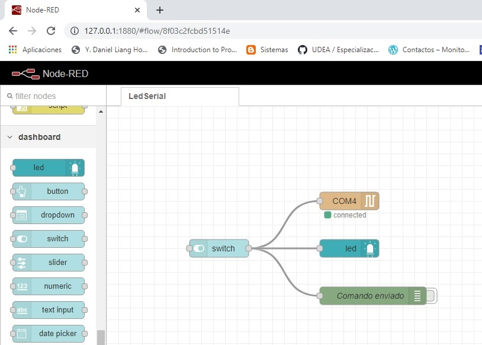

## Ejemplo 1

Nota: Para este caso el NodeMCU se conecto en el puerto COM4.

### Flujos



### Archivo JSON del flujo

```JSON
[
    {
        "id": "8f03c2fcbd51514e",
        "type": "tab",
        "label": "LedSerial",
        "disabled": false,
        "info": "",
        "env": []
    },
    {
        "id": "4223f9a6022ad425",
        "type": "serial in",
        "z": "8f03c2fcbd51514e",
        "name": "",
        "serial": "2d788a5279b4022f",
        "x": 240,
        "y": 920,
        "wires": [
            [
                "a0f7810da1e7da19"
            ]
        ]
    },
    {
        "id": "a0f7810da1e7da19",
        "type": "debug",
        "z": "8f03c2fcbd51514e",
        "name": "",
        "active": true,
        "tosidebar": true,
        "console": false,
        "tostatus": false,
        "complete": "false",
        "statusVal": "",
        "statusType": "auto",
        "x": 490,
        "y": 1020,
        "wires": []
    },
    {
        "id": "e21cac250786043c",
        "type": "ui_switch",
        "z": "8f03c2fcbd51514e",
        "name": "",
        "label": "switch",
        "tooltip": "",
        "group": "6b1e2e21762b19c2",
        "order": 1,
        "width": 0,
        "height": 0,
        "passthru": true,
        "decouple": "false",
        "topic": "topic",
        "topicType": "msg",
        "style": "",
        "onvalue": "1",
        "onvalueType": "str",
        "onicon": "",
        "oncolor": "",
        "offvalue": "0",
        "offvalueType": "str",
        "officon": "",
        "offcolor": "",
        "animate": false,
        "className": "",
        "x": 190,
        "y": 240,
        "wires": [
            [
                "376f8e5d0443b0b3",
                "907e42d0afe16e15",
                "e09580f758a4e79d"
            ]
        ]
    },
    {
        "id": "376f8e5d0443b0b3",
        "type": "serial out",
        "z": "8f03c2fcbd51514e",
        "name": "",
        "serial": "2d788a5279b4022f",
        "x": 410,
        "y": 160,
        "wires": []
    },
    {
        "id": "907e42d0afe16e15",
        "type": "debug",
        "z": "8f03c2fcbd51514e",
        "name": "Comando enviado",
        "active": false,
        "tosidebar": true,
        "console": false,
        "tostatus": false,
        "complete": "payload",
        "targetType": "msg",
        "statusVal": "",
        "statusType": "auto",
        "x": 450,
        "y": 320,
        "wires": []
    },
    {
        "id": "e09580f758a4e79d",
        "type": "ui_led",
        "z": "8f03c2fcbd51514e",
        "order": 2,
        "group": "6b1e2e21762b19c2",
        "width": 0,
        "height": 0,
        "label": "Led",
        "labelPlacement": "left",
        "labelAlignment": "left",
        "colorForValue": [
            {
                "color": "#ff0000",
                "value": "0",
                "valueType": "str"
            },
            {
                "color": "#008000",
                "value": "1",
                "valueType": "str"
            }
        ],
        "allowColorForValueInMessage": false,
        "shape": "circle",
        "showGlow": true,
        "name": "",
        "x": 410,
        "y": 240,
        "wires": []
    },
    {
        "id": "2d788a5279b4022f",
        "type": "serial-port",
        "serialport": "COM4",
        "serialbaud": "9600",
        "databits": "8",
        "parity": "none",
        "stopbits": "1",
        "waitfor": "",
        "dtr": "none",
        "rts": "none",
        "cts": "none",
        "dsr": "none",
        "newline": "\\n",
        "bin": "false",
        "out": "char",
        "addchar": "",
        "responsetimeout": "10000"
    },
    {
        "id": "6b1e2e21762b19c2",
        "type": "ui_group",
        "name": "Serial ON/OFF",
        "tab": "967cce18485c37d2",
        "order": 2,
        "disp": true,
        "width": 6,
        "collapse": false,
        "className": ""
    },
    {
        "id": "967cce18485c37d2",
        "type": "ui_tab",
        "name": "Home Serial",
        "icon": "dashboard",
        "disabled": false,
        "hidden": false
    }
]
```

## Circuito

Dibujar el circuito en fritzing.

## Codigo

```C++
#define LED_BUILTIN 2 // opens serial port, sets data rate to 9600 bps

int incomingByte = 0; // for incoming serial data

#define ON '1'
#define OFF '0'

void setup() {
  pinMode(LED_BUILTIN, OUTPUT);
  Serial.begin(9600); // opens serial port, sets data rate to 9600 bps
}

void loop() {
  // send data only when you receive data:
  if (Serial.available() > 0) {
    // read the incoming byte:
    incomingByte = Serial.read();
    if(incomingByte == ON) {
      digitalWrite(LED_BUILTIN, LOW);      
    }
    else {
      digitalWrite(LED_BUILTIN, OFF);   
    }
  }
}
```

