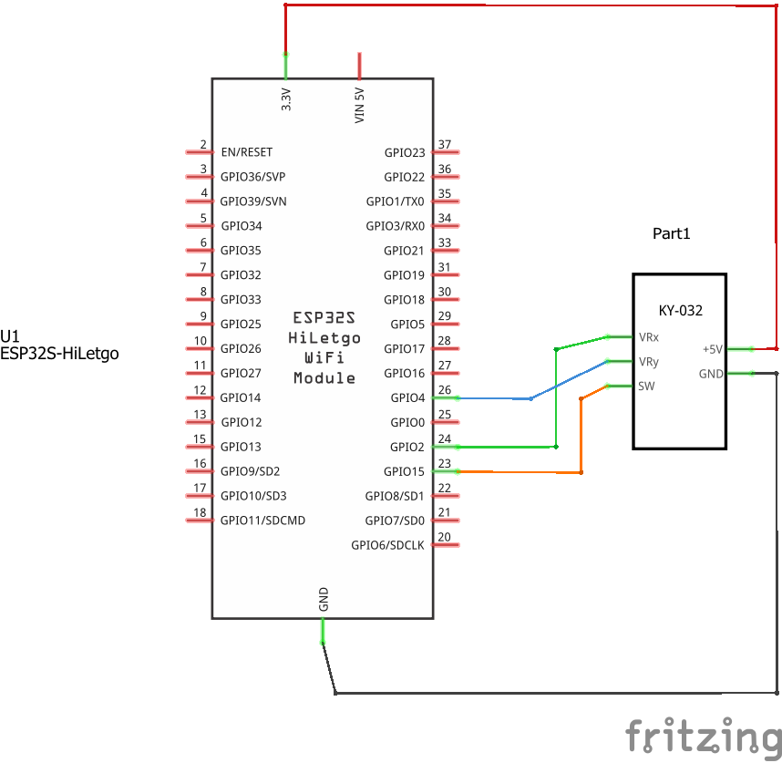
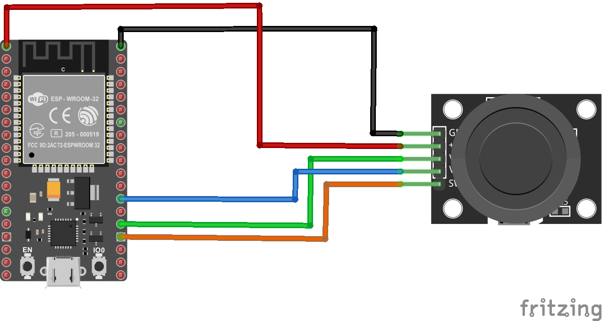

# Adapte el siguiente ejemplo

## Uso de un joystic en el ESP32

## Resumen

En el siguiente ejemplo se conecta un joystick para prender a la placa ESP32. El firmware descargado en la placa imprime en el monitor serial las coordenadas $x$, $y$ y $z$ ademas de un valor digital que indica si el joystic fue presionado o no.

## Hardware

### Componentes

La siguiente tabla muestra los componentes principales del circuito a montar:

|Componentes|Cantidad|Observaciones|
|---|---|---|
|ESP32|1||
|Joystick Module (Elegoo)|1|Disponible en el kit Elegoo ([datasheet](https://cdn.sparkfun.com/assets/b/3/f/9/d/OKY3068-1.pdf)) y en el kid Landzo|

### Esquematico



### Diagrama de conexión

La siguiente tabla describe la conexión entre el ESP32 y el modulo joystick

|ESP32|Joystick|
|---|---|
|GND |GND (pin 1 - izquierda)|
|3.3V (VIN3.3V) |+5 (pin 2)|
|P2 (GPIO2) |VRx (pin 3)|
|P4 (GPIO4) |VRy (pin 4)|
|P15 (GPIO15) |SW (pin 5 - derecha)|

* **Nota**: Tenga en cuenta el detalle sobre el pin asociado al **ADC2** cuando vaya a realizar una implementación que use wifi.

A continuación se muestra la conexión entre el ESP32 y el joystick:



## Software

A continuación se muestra el programa que se ejecuta en el ESP32 (el cual basicamente es el mismo programa implementado para el Arduino UNO pero empleando otros pines). Su trabajo consiste en implementarlo en plaftormio.

#### Programa

El programa codificado se muestra a continuación:

```ino
/**
   Hardware Connections:

    | ESP32	| DTH11 |
    |---|---|
    |GND   |   GND (pin 1 - izquierda) |
    |3.3   |   +5 (pin 2) |
    |P2    |   VRx (pin 3) |
    |P4    |   VRy (pin 4) |
    |P15   |   SW (pin 5 - derecha) |
*/

const int pinX = 2;    //  P2 (GPIO02 - ADC11)
const int pinY = 4;    //  P4 (GPIO04 - ADC12)
const int pinSW = 15;  //  P15 (GPIO15)
int valueX = 0;        //  Analog
int valueY = 0;        //  Analog
int valueZ = 0;        //  Digital

void setup() {
  Serial.begin(9600);
}

void loop() {
  valueX = analogRead(pinX); 
  Serial.print("X:");
  Serial.print(valueX, DEC); 
  valueY = analogRead(pinY); 
  Serial.print(" | Y:"); 
  Serial.print(valueY, DEC); 
  valueZ = digitalRead(pinSW);
  Serial.print(" | Z: "); 
  Serial.println(valueZ, DEC); 
  delay(100);
}
```

## Prueba

Pruebe que el programa funciona correctamente, si todo esta bien, verá algo como lo que se muestra a en la simulación disponible en el siguiente [link](https://wokwi.com/projects/357780574847798273)

## Actividad

Cada uno de los equipos deberá portar el siguiente programa para que envie las coordenadas leidas desde el joystick a la plataforma **dweet.io**. La solución deberá ser colocada por cada equipo en una de las carpetas elegidas ([equipo1](equipo1/),[equipo2](equipo2/), [equipo3](equipo3/), [equipo4](equipo4/)). Esta carpeta debera tener:
1. El comprimido del proyecto de platformio.
2. El programa que se ejecuta en el ESP32 (**main.cpp**)
3. El archivo de configuración.
4. Varias fotos donde se evidencie el montaje fisico y el despliegue de las variables en dweet.io
