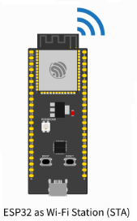
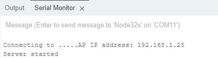
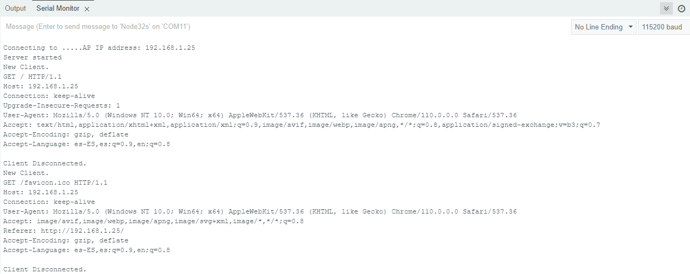
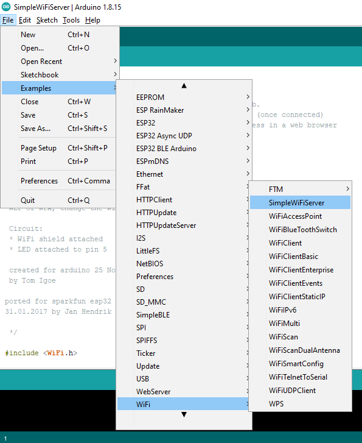

# Ejemplo 2

## Descripción

En el siguiente ejemplo se muestra una red compuesta por un portatil y un ESP32 los cuales se conectan a traves de un AP inalambrico: 


Tal como se muestra en la figura anterior, cada uno de los elementos esta configurado para funcionar de acuerdo a la siguiente descripción:
* **Portatil (o similar)**: Será empleado como cliente y se conectará a la red a traves del ESP32 configurado como AP.
* **ESP32 (STA)**: Este ESP32 sera configurado como estación y ejecurara un servidor que permitira pender y apagar remotamente un Led. La conexión de este a la red local sera a traves del ESP32 configurado como AP.

## Elementos necesarios

|#|Item|Cantidad|
|---|---|---|
|1|Equipo con conectividad inalambrica (celular, portatil, etc)|1|1|
|2|ESP32|1|


## Código

### ESP32 (STA)



El programa es exactamente el mismo del ejemplo 1 en el que se configuro el  ESP32 como STA. La unica diferencia radica en que la configuración se cambia para que este se conecte a la red a traves del Access Point inalambrico:

```ino
/*
  WiFiAccessPoint.ino creates a WiFi access point and provides a web server on it.

  Steps:
  1. Connect to the access point "yourAp"
  2. Point your web browser to http://IP_ESP32/H to turn the LED on or http://IP_ESP32/L to turn it off
     OR
     Run raw TCP "GET /H" and "GET /L" on PuTTY terminal with 192.168.4.1 as IP address and 80 as port

  Created for arduino-esp32 on 04 July, 2018
  by Elochukwu Ifediora (fedy0)
*/

#include <WiFi.h>
#include <WiFiClient.h>

// Set these to your desired credentials.
const char *ssid = "AP_SSID";
const char *password = "AP_password";

// Set web server port number to 80
WiFiServer server(80);

void setup() {
  pinMode(LED_BUILTIN, OUTPUT);
  Serial.begin(115200);
  Serial.println();
  Serial.print("Connecting to ");

  // Connect to Wi-Fi network with SSID and password
  WiFi.begin(ssid, password);
  while (WiFi.status() != WL_CONNECTED) {
    delay(500);
    Serial.print(".");
  }
  
  IPAddress myIP = WiFi.localIP();
  Serial.print("AP IP address: ");
  Serial.println(myIP);
  server.begin();
  Serial.println("Server started");
}

void loop() {
  WiFiClient client = server.available();   // listen for incoming clients

  if (client) {                             // if you get a client,
    Serial.println("New Client.");           // print a message out the serial port
    String currentLine = "";                // make a String to hold incoming data from the client
    while (client.connected()) {            // loop while the client's connected
      if (client.available()) {             // if there's bytes to read from the client,
        char c = client.read();             // read a byte, then
        Serial.write(c);                    // print it out the serial monitor
        if (c == '\n') {                    // if the byte is a newline character

          // if the current line is blank, you got two newline characters in a row.
          // that's the end of the client HTTP request, so send a response:
          if (currentLine.length() == 0) {
            // HTTP headers always start with a response code (e.g. HTTP/1.1 200 OK)
            // and a content-type so the client knows what's coming, then a blank line:
            client.println("HTTP/1.1 200 OK");
            client.println("Content-type:text/html");
            client.println();

            // the content of the HTTP response follows the header:
            client.print("Click <a href=\"/H\">here</a> to turn ON the LED.<br>");
            client.print("Click <a href=\"/L\">here</a> to turn OFF the LED.<br>");

            // The HTTP response ends with another blank line:
            client.println();
            // break out of the while loop:
            break;
          } else {    // if you got a newline, then clear currentLine:
            currentLine = "";
          }
        } else if (c != '\r') {  // if you got anything else but a carriage return character,
          currentLine += c;      // add it to the end of the currentLine
        }

        // Check to see if the client request was "GET /H" or "GET /L":
        if (currentLine.endsWith("GET /H")) {
          digitalWrite(LED_BUILTIN, HIGH);               // GET /H turns the LED on
        }
        if (currentLine.endsWith("GET /L")) {
          digitalWrite(LED_BUILTIN, LOW);                // GET /L turns the LED off
        }
      }
    }
    // close the connection:
    client.stop();
    Serial.println("Client Disconnected.");
  }
}
```

Del código anterior, la parte que configura la conexión tiene que ver con las siguientes lineas:

```ino
// Set these to your desired credentials.
const char *ssid = "AP_SSID";
const char *password = "AP_password";
```

No olvidar modificar, de descargar el programa a la tarjeta, estos parametros con los del AP al que se va a conectar.

## Puesta en marcha

### Parte 1 - Descarga del software en los dispositivos

1. Antes de descargar el código a la tarjeta configure los parametros de Red cambiando los valores de las variables ```ssid``` y ```password``` a los parametros de la red WiFi a la cual va a conectarse la tarjeta.
2. Descargue el código del ESP32 STA y ponga en marcha el monitor serial. La salida sera similar a la siguiente:
    


### Parte 2 - Prueba de conectividad

Desde el computador verifique la conectividad con los elementos de la red usando el comando ```ping```

```
ping IP_DEVICE
```

### Pruebas de la aplicación

Siguiendo los comentacios que aparecen el código del ESP_STA proceda a realizar las pruebas sobre la aplicación siguiendo el paso 2 de los comentarios:

> * **Forma 1**: Point your web browser to ```http://IP_ESP32/H``` to turn the LED on or ```http://IP_ESP32/L``` to turn it off
> * **Forma 2**: Run raw TCP ```"GET /H"``` and ```"GET /L"``` on PuTTY terminal with ```IP_ESP32``` as IP address and 80 as port.

En nuestro caso, esta prueba se realizo cargando en el browser la siguiente pagina (alojada en el ESP32_STA) empleando para este caso la URL: ```192.168.1.25```. Si se observa el monitor serial de la ESP_STA cuando se hace la petición desde el navegador, la salida impresa será como la mostrada a continuación:



## Nota

El ejemplo base (del cual se tomo el analizado previamente) encuentra dentro se los ejemplos que vienen con el IDE de Arduino (una vez se han instalado los plugings correspondientes al ESP32). Este ejemplo es **SimpleWiFiServer**; para acceder siga la siguiente ruta: **Examples > WiFi > SimpleWiFiServer** tal y como se muestra en la siguiente imagen:



## Enlaces:
* https://github.com/paulocsanz?tab=repositories
* https://github.com/me-no-dev?tab=repositories
* https://github.com/espressif/arduino-esp32/blob/master/libraries/WiFi/examples/WiFiAccessPoint/WiFiAccessPoint.ino
* https://github.com/hideakitai?tab=repositories
* https://help.ubidots.com/en/articles/748067-connect-an-esp32-devkitc-to-ubidots-over-mqtt
* https://help.ubidots.com/en/articles/4855281-connect-your-esp32-to-ubidots-over-http-tcp-or-udp