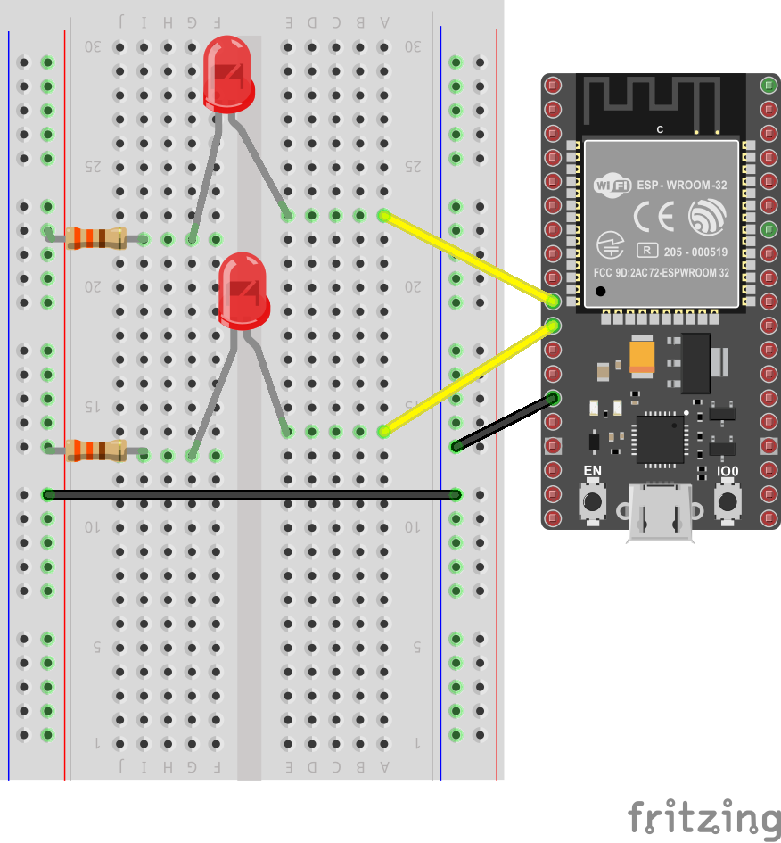
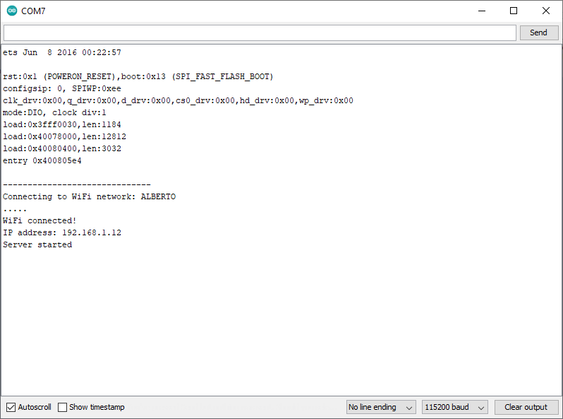
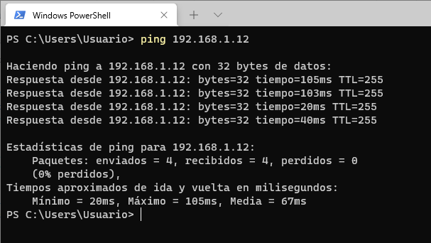
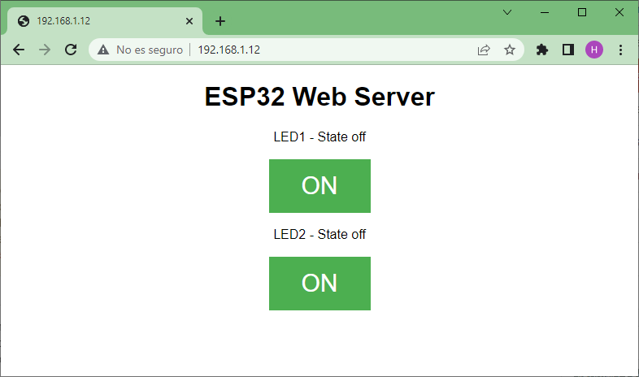
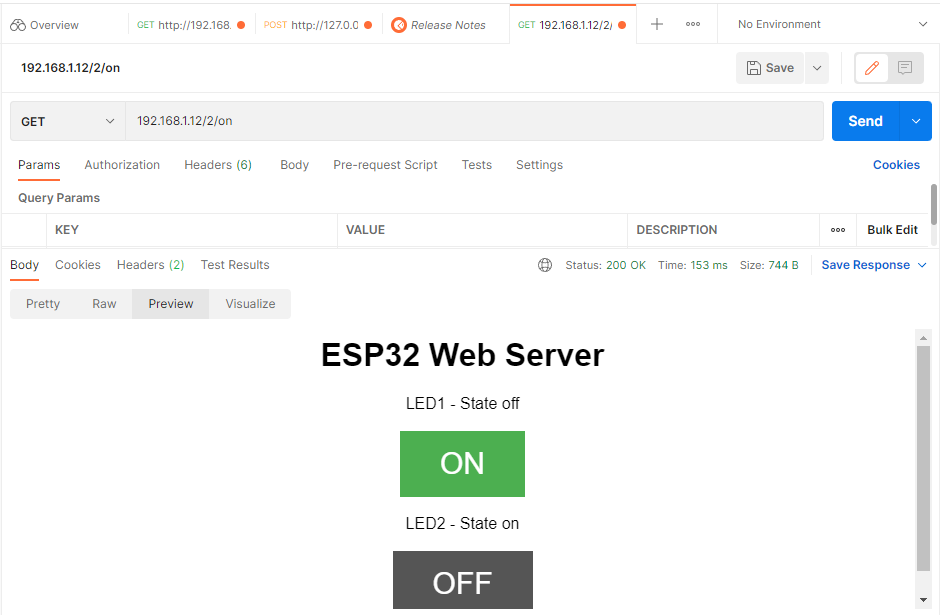

# Ejemplo 3

## Descripción

Este ejemplo, tomado de **ESP32 Web Server – Arduino IDE** ([link](https://randomnerdtutorials.com/esp32-web-server-arduino-ide/)), es una versión mejorada del ejemplo 2 ([link](../ejemplo2/README.md)) analizado previamente.

En este caso, a diferencia del ejemplo 2, se muestra una interfaz web mas amigable para el control de luces y se manejan dos leds.

## Hardware

Los componentes necesarios para implementar este ejemplo son:

|#|Elemento|Cantidad|
|----|----|----|
|1|ESP32|1|
|2|Led|2|
|3|Resistencia de 330 Ohm|2|

El diagrama de conexión se muestra a continuación:



## Software

El código del ESP32 se muestra a continuación:

```ino
#include <WiFi.h>
#include <WiFiClient.h>

/****************************************/
/*         WiFi Definitions             */
/****************************************/

// Set these to your desired credentials.
const char* ssid     = "yourssid";
const char* password = "yourpasswd";

/****************************************/
/*           Pin Definitions            */
/****************************************/
const int LED1 = 26; // P26 (GPIO26)
const int LED2 = 27; // P27 (GPIO27)

// Auxiliar variables to store the current output state
String led1State = "off";
String led2State = "off";

// Current time
unsigned long currentTime = millis();
// Previous time
unsigned long previousTime = 0; 
// Define timeout time in milliseconds (example: 2000ms = 2s)
const long timeoutTime = 2000;


// Set web server port number to 80
WiFiServer server(80);

// Variable to store the HTTP request
String header;


void setup() 
{
  initHardware();
  connectToWiFi(ssid, password);
  server.begin();
  Serial.println("Server started");  
}

void loop() 
{
  // Check if a client has connected
  WiFiClient client = server.available(); // Listen for incoming clients
  if (client) {                             // If a new client connects,
    currentTime = millis();
    previousTime = currentTime;
    Serial.println("New Client.");          // print a message out in the serial port
    String currentLine = "";                // make a String to hold incoming data from the client
    while (client.connected() && currentTime - previousTime <= timeoutTime) {  // loop while the client's connected
      currentTime = millis();
      if (client.available()) {             // if there's bytes to read from the client,
        char c = client.read();             // read a byte, then
        Serial.write(c);                    // print it out the serial monitor
        header += c;
        if (c == '\n') {                    // if the byte is a newline character
          // if the current line is blank, you got two newline characters in a row.
          // that's the end of the client HTTP request, so send a response:
          if (currentLine.length() == 0) {
            // HTTP headers always start with a response code (e.g. HTTP/1.1 200 OK)
            // and a content-type so the client knows what's coming, then a blank line:
            client.println("HTTP/1.1 200 OK");
            client.println("Content-type:text/html");
            client.println("Connection: close");
            client.println();
            
            // turns the GPIOs on and off
            if (header.indexOf("GET /1/on") >= 0) {
              Serial.println("LED1 on");
              led1State = "on";
              digitalWrite(LED1, HIGH);
            } else if (header.indexOf("GET /1/off") >= 0) {
              Serial.println("LED1 off");
              led1State = "off";
              digitalWrite(LED1, LOW);
            } else if (header.indexOf("GET /2/on") >= 0) {
              Serial.println("LED2 on");
              led2State = "on";
              digitalWrite(LED2, HIGH);
            } else if (header.indexOf("GET /2/off") >= 0) {
              Serial.println("LED2 off");
              led2State = "off";
              digitalWrite(LED2, LOW);
            }
            
            // Display the HTML web page
            client.println("<!DOCTYPE html><html>");
            client.println("<head><meta name=\"viewport\" content=\"width=device-width, initial-scale=1\">");
            client.println("<link rel=\"icon\" href=\"data:,\">");
            // CSS to style the on/off buttons 
            // Feel free to change the background-color and font-size attributes to fit your preferences
            client.println("<style>html { font-family: Helvetica; display: inline-block; margin: 0px auto; text-align: center;}");
            client.println(".button { background-color: #4CAF50; border: none; color: white; padding: 16px 40px;");
            client.println("text-decoration: none; font-size: 30px; margin: 2px; cursor: pointer;}");
            client.println(".button2 {background-color: #555555;}</style></head>");
            
            // Web Page Heading
            client.println("<body><h1>ESP32 Web Server</h1>");
            
            // Display current state, and ON/OFF buttons for GPIO 34
            client.println("<p>LED1 - State " + led1State + "</p>");
            // If the led1State is off, it displays the ON button       
            if (led1State=="off") {
              client.println("<p><a href=\"/1/on\"><button class=\"button\">ON</button></a></p>");
            } else {
              client.println("<p><a href=\"/1/off\"><button class=\"button button2\">OFF</button></a></p>");
            } 
               
            // Display current state, and ON/OFF buttons for GPIO 35  
            client.println("<p>LED2 - State " + led2State + "</p>");
            // If the led2State is off, it displays the ON button       
            if (led2State=="off") {
              client.println("<p><a href=\"/2/on\"><button class=\"button\">ON</button></a></p>");
            } else {
              client.println("<p><a href=\"/2/off\"><button class=\"button button2\">OFF</button></a></p>");
            }
            client.println("</body></html>");
            
            // The HTTP response ends with another blank line
            client.println();
            // Break out of the while loop
            break;
          } else { // if you got a newline, then clear currentLine
            currentLine = "";
          }
        } else if (c != '\r') {  // if you got anything else but a carriage return character,
          currentLine += c;      // add it to the end of the currentLine
        }
      }
    }
    // Clear the header variable
    header = "";
    // Close the connection
    client.stop();
    Serial.println("Client disconnected.");
    Serial.println("");
  }
}

void connectToWiFi(const char * ssid, const char * pwd)
{
  int ledState = 0;

  printLine();
  Serial.println("Connecting to WiFi network: " + String(ssid));

  WiFi.begin(ssid, pwd);

  while (WiFi.status() != WL_CONNECTED) 
  {
    // Blink LED while we're connecting:
    digitalWrite(LED_BUILTIN, ledState);
    ledState = (ledState + 1) % 2; // Flip ledState
    delay(500);
    Serial.print(".");
  }

  Serial.println();
  Serial.println("WiFi connected!");
  Serial.print("IP address: ");
  Serial.println(WiFi.localIP());
}


void initHardware()
{
  Serial.begin(115200);
  // Initialize the output variables as outputs
  pinMode(LED1, OUTPUT);
  pinMode(LED2, OUTPUT);
  // Set outputs to LOW
  digitalWrite(LED1, LOW);
  digitalWrite(LED2, LOW);
  // Don't need to set ANALOG_PIN as input, 
  // that's all it can be.
}

void printLine()
{
  Serial.println();
  for (int i=0; i<30; i++)
    Serial.print("-");
  Serial.println();
}
```

## Puesta en marcha

Antes de descargar el programa al ESP32, no olvidar modificar las lineas de configuración de acceso al AP:

```ino
// Set these to your desired credentials.
const char* ssid     = "yourssid";
const char* password = "yourpasswd";
```

Una vez hecho esto, abrir el monitor serial de acuerdo a la configuración realizada en el programa (115200 para el caso). Si todo esta bien, la salida será como la que se muestra a continuación:



Una vez leida la IP arrojada en el monitor serial, se recomienda verificar conectividad antes de hacer el test de la aplicación. Para ello desde un PC conectado a la misma red local se puede usar el comando **ping** tal y como se muestra a continuación:



Si hay conectividad; ahora si, desde un navegador (en un PC o dispositivo movil) colocar la dirección IP del ESP32 e interactuar con la interfaz verificando que los leds conectados a la ESP32 se enciendan y apaguen. A continuación se muestra la interfaz grafica desplegada:



Tambien es posible hacer el test de la interfaz usando aplicaciones como Postman, para ello coloque las siguientes URLs:

|URL|Efecto|
|---|---|
|```http://yourAddress/1/on```| Enciende el LED1 |
|```http://yourAddress/1/off```| Apaga el LED1 |
|```http://yourAddress/2/on```| Enciende el LED2 |
|```http://yourAddress/2/off```| Apaga el LED2 |

La siguiente figura muestra el caso en el cual **yourAddress** es la del ejemplo (**192.168.1.12**)



