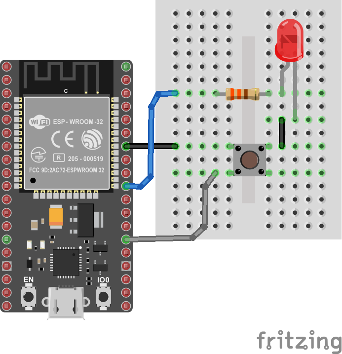
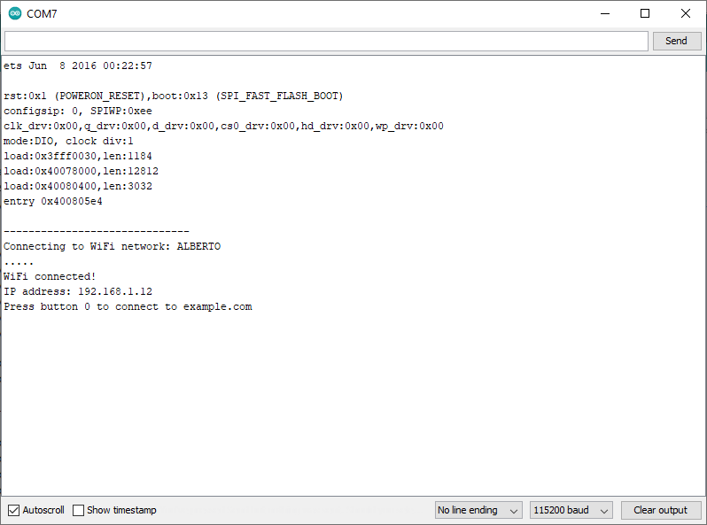
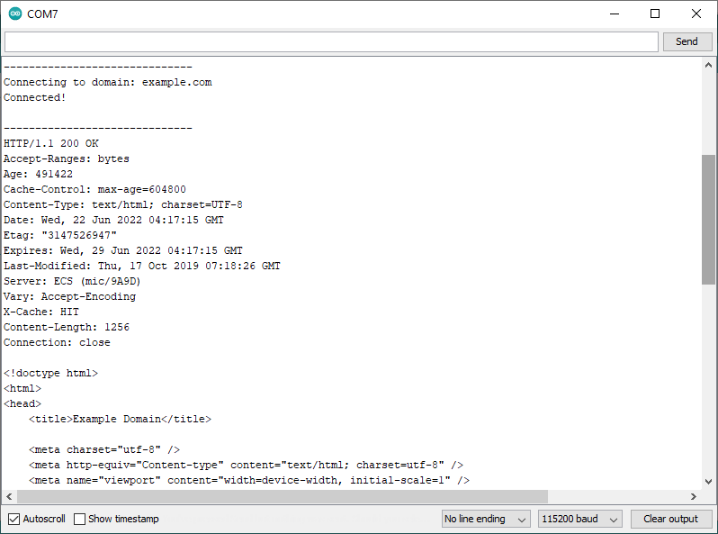
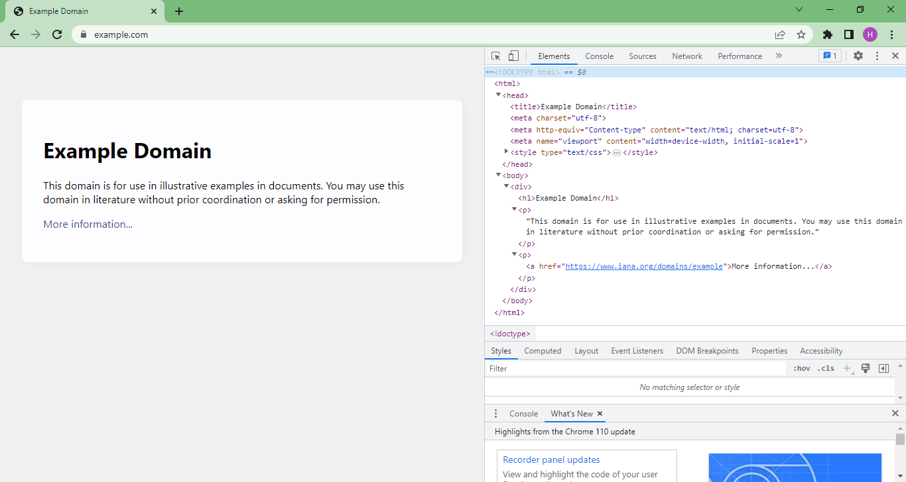
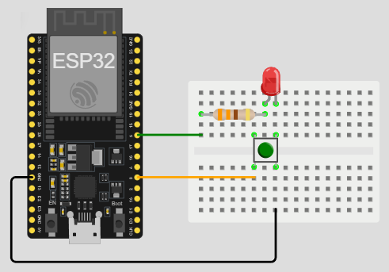

# Ejemplo 4

## Descripción

 Este ejemplo es tomado de la sección **Arduino Example: WiFi** ([link](https://learn.sparkfun.com/tutorials/esp32-thing-hookup-guide/all#arduino-example-wifi)) del tutorial **ESP32 Thing Hookup Guide**([link](https://learn.sparkfun.com/tutorials/esp32-thing-hookup-guide/)). 

 En este ejemplo, se usa la libreria WiFi para demostrar como conectar el ESP32 a una red wifi cercana y acceder como cliente, al dominio remoto **http://example.com/**

## Hardware

La siguiente tabla muestra los componentes de hardware necesarios para el caso:

|#|Elemento|Cantidad|
|----|----|----|
|1|ESP32|1|
|2|Pulsador|1|
|3|Led|1|
|4|Resistencia de 330 Ohm|1|

La siguiente figura muestra el diagrama de conexión asociado al ejemplo:



## Software

El programa a descargar se muestra a continuación:

```ino
#include <WiFi.h>

// WiFi network name and password:
const char * networkName = "YOUR_NETWORK_HERE";
const char * networkPswd = "YOUR_PASSWORD_HERE";

// Internet domain to request from:
const char * hostDomain = "example.com";
const int hostPort = 80;

const int BUTTON_PIN = 0;
const int LED_PIN = 5;

void setup()
{
  // Initilize hardware:
  Serial.begin(115200);
  pinMode(BUTTON_PIN, INPUT_PULLUP);
  pinMode(LED_PIN, OUTPUT);

  // Connect to the WiFi network (see function below loop)
  connectToWiFi(networkName, networkPswd);

  digitalWrite(LED_PIN, LOW); // LED off
  Serial.print("Press button 0 to connect to ");
  Serial.println(hostDomain);
}

void loop()
{
  if (digitalRead(BUTTON_PIN) == LOW)
  { // Check if button has been pressed
    while (digitalRead(BUTTON_PIN) == LOW)
      ; // Wait for button to be released

    digitalWrite(LED_PIN, HIGH); // Turn on LED
    requestURL(hostDomain, hostPort); // Connect to server
    digitalWrite(LED_PIN, LOW); // Turn off LED
  }
}

void connectToWiFi(const char * ssid, const char * pwd)
{
  int ledState = 0;

  printLine();
  Serial.println("Connecting to WiFi network: " + String(ssid));

  WiFi.begin(ssid, pwd);

  while (WiFi.status() != WL_CONNECTED) 
  {
    // Blink LED while we're connecting:
    digitalWrite(LED_PIN, ledState);
    ledState = (ledState + 1) % 2; // Flip ledState
    delay(500);
    Serial.print(".");
  }

  Serial.println();
  Serial.println("WiFi connected!");
  Serial.print("IP address: ");
  Serial.println(WiFi.localIP());
}

void requestURL(const char * host, uint8_t port)
{
  printLine();
  Serial.println("Connecting to domain: " + String(host));

  // Use WiFiClient class to create TCP connections
  WiFiClient client;
  if (!client.connect(host, port))
  {
    Serial.println("connection failed");
    return;
  }
  Serial.println("Connected!");
  printLine();

  // This will send the request to the server
  client.print((String)"GET / HTTP/1.1\r\n" +
               "Host: " + String(host) + "\r\n" +
               "Connection: close\r\n\r\n");
  unsigned long timeout = millis();
  while (client.available() == 0) 
  {
    if (millis() - timeout > 5000) 
    {
      Serial.println(">>> Client Timeout !");
      client.stop();
      return;
    }
  }

  // Read all the lines of the reply from server and print them to Serial
  while (client.available()) 
  {
    String line = client.readStringUntil('\r');
    Serial.print(line);
  }

  Serial.println();
  Serial.println("closing connection");
  client.stop();
}

void printLine()
{
  Serial.println();
  for (int i=0; i<30; i++)
    Serial.print("-");
  Serial.println();
}
```

## Puesta en marcha

Antes de descargar el programa al ESP32, no olvidar modificar las lineas de configuración de acceso al AP:

```ino
// WiFi network name and password:
const char * networkName = "YOUR_NETWORK_HERE";
const char * networkPswd = "YOUR_PASSWORD_HERE";
```

Una vez hecho esto, abrir el monitor serial de acuerdo a la configuración realizada en el programa (115200 para el caso). Si todo esta bien, la salida será como la que se muestra a continuación:



Luego, al presionar el pulsador, entonces la salida en el monitor serial será:



Si se observa la salida serial y se compara al inspecciónar en el navegador la pagina accedida (**example.com**), se puede observar, que lo que se imprime en el monitor serial es el codigo HTML de la pagina accedida.



## Simulación

La simulación en Wokwi se muestra en el siguiente [link](
https://wokwi.com/projects/394017617608690689). Es importante anotar, que se realizaron unos cambios breves con el fin de que la simulación funcionara.



## Referencias

* https://arduinotogo.com/

