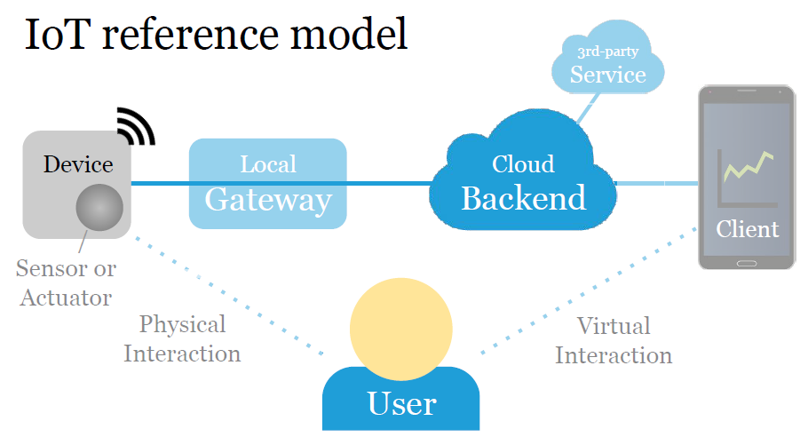
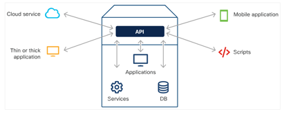
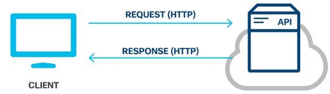

# Plataformas IoT

Hasta el momento hemos visto los siguientes temas:

* Conceptos basicos de programación de las sistemas de desarrollo Arduino UNO y ESP32.
* Algunos conceptos basicos entre sensores y actuadores.
* Comunicación serial.
* Comunicación inalambrica usando Wifi.

De los temas anteriormente vistos, es importante resaltar la importancia que juega la comunicación en una arquitectura IoT; asi mismo, que estas no son las unicas maneras de trabajar con datos, sin embargo, con saber por ahora esto basta.

Tal y como se muestra en la siguiente figura (tomada de IoT Engineering - [link](https://github.com/tamberg/fhnw-iot/tree/master/03))



En el modelo de referencia IoT, uno de los elementos claves son las plataformas IoT pues permiten almacenar y almacenar (entre otras cosas) datos de sensores. Para conectar las cosas con estas plataformas con las cosas, es importante conocer la forma como se lleva a cabo la comunicación y la interación establecida por estas la cual, generalmente es a traves de peticiones HTTP expuestas a traves de APIs.

Respecto al manejo de APIs, el siguiente documento se muestra un ejemplo tipico de un API ([cheatsheet_api](cheatsheet_api.pdf))

## 1. APIs

Una interfaz de programación de aplicaciones (API) permite una conversación de software con otra.  Utiliza interacciones basadas en la web o protocolos de comunicación comunes y sus propios estándares patentados determinando qué tipo de datos, servicios y funcionalidad expone la aplicación a terceros.



Las API están diseñadas para ser consumidas mediante programación por otras aplicaciones y también pueden ser usadas por usuarios que desean interactuar con la aplicación manualmente. 

Los tres tipos más populares de estilos arquitectónicos API son:
* RPC
* SOAP
* REST

## 2. API REST

Transferencia de Estado Representacional (REST) es un estilo arquitectónico escrito por Roy Thomas Fielding.

Una API de servicio web REST (API REST) es una interfaz de programación que se comunica a través de HTTP, por lo que utiliza los mismos conceptos que el protocolo HTTP:
* Solicitudes/respuestas HTTP
* Verbos HTTP
* Código de estado HTTP
* Encabezados/cuerpo HTTP



A continuación vamos a analizar tanto las solicitudes como las respuestas.

### 2.1. Solicitudes de API REST

Las solicitudes de API REST son solicitudes HTTP en las que una aplicación (cliente) pide al servidor que realice una función.  Las solicitudes de API REST se componen de cuatro componentes principales:
* **Identificador uniforme de recursos (URI)**: También conocido como **localizador uniforme de recursos (URL)**, identifica qué recurso desea manipular el cliente. 
  
  

  Tal y como se resalta en la figura anterior, las URI tienen los siguientes componentes:
  * **Esquema**: especifica qué protocolo HTTP se debe usar, http o https.
  * **Autoridad**: consta de dos partes, a saber, host y puerto
  * **Ruta de acceso**: representa la ubicación del recurso, los datos u objeto, que se va a manipular en el servidor. 
  * **Consulta**: proporciona detalles adicionales sobre el ámbito, el filtrado o para aclarar una solicitud. 
  
* **Método HTTP:**: Empleado para comunicarse con los servicios web para los que se solicita la acción para el recurso dado. La asignación sugerida del método HTTP a la acción es la siguiente:
  
  |Método HTTP:|Acción|Descripción|
  |---|---|---|
  |POST|Crear (Create)|Crear un nuevo objeto o recurso.|
  |GET|lectura (Read)|Recuperar detalles de recursos del sistema.|
  |PUT|Actualizar|Reemplace o actualice un recurso existente.|  
  |PARCHE|Actualización parcial|Actualice algunos detalles de un recurso existente.|
  |DELETE|Eliminar (Delete)|Remover un recurso del sistema.|

* **Encabezado**: tienen el formato de pares **```nombre-valor```** separados por dos puntos (**:**); esto es, ```[nombre]: [valor]```. Podemos distinguir dos tipos de encabezados:
  *  **Encabezados de solicitud**: incluye información adicional que no esté relacionada con el contenido del mensaje.
  
     |Clave | Valor de ejemplo |Descripción |
     |---|---|---|
     |Autorización|DMFNCMFUDDP2YWDYYW básico|Proporciona credenciales para autorizar la solicitud|

  *  **Encabezados de entidad**: información adicional que describe el contenido del cuerpo del mensaje.
    
      |Clave | Valor de ejemplo |Descripción |
      |---|---|---|
      |Tipo de contenido|aplicación/ JSON|PEspecificar el formato de los datos en el cuerpo|
 
* **Cuerpo**: El cuerpo de la solicitud de API REST contiene los datos correspondientes al recurso que el cliente desee manipular. Las solicitudes de API REST que utilizan el método HTTP POST, PUT y PATCH suelen incluir un cuerpo lo que hace que cuerpo sea opcional dependiendo del método HTTP. 

### 2.2. Respuestas API REST

Las respuestas de la API REST son respuestas HTTP que comunica los resultados de la solicitud HTTP de un cliente. La Respuesta REST API se componen de tres componentes principales:
* **Estado HTTP**: El código de estado HTTP ayuda al cliente a determinar el motivo del error y a veces puede proporcionar sugerencias para solucionar el problema. Los códigos de estado HTTP constan de tres dígitos, donde el primer dígito es la categoría de respuesta y los otros dos dígitos son asignados en orden numérico. Hay cinco categorías diferentes de códigos de estado HTTP:
   * **1xx - Informativo**: con fines informativos, las respuestas no contienen un cuerpo
   * **2xx - Éxito**: el servidor recibió y ha aceptado la solicitud
   * **3xx - Redirección**: el cliente tiene que tomar una acción adicional para completar la solicitud
   * **4xx - Error de cliente**: la solicitud contiene un error como sintáxis incorrecta o entrada no válida
   * **5xx - Error del servidor**: no se pueden cumplir las solicitudes válidas.
 
    Los codigos de estado mas comunes se muestran a continuación:

    |Código de Estado HTTP|Mensaje de estado|Descripción|
    |---|---|---|
    |200|Aceptar|La solicitud se realizó correctamente y normalmente contiene una carga útil (cuerpo)|
    |201|Creada|Se cumplió la solicitud y se creó el recurso que fue solicitado|
    |202|Aceptada|La solicitud ha sido aceptada para su procesamiento y está en proceso|
    |400|Solicitud no valida|La solicitud no se procesará debido a un error con la solicitud|
    |401|No autorizado|La solicitud no tiene credenciales de autenticación válidas para realizar la solicitud|
    |403|Prohibida|La solicitud ha sido entendida pero ha sido rechazada por el servidor|
    |404|No se encontró|No se puede cumplir la solicitud porque la ruta de acceso del recurso de la solicitud no se encontró en el servidor|
    |500|Error del servidor interno|No se puede cumplir la solicitud debido a un error del servidor|
    |503|El servicio no está disponible|No se puede cumplir la solicitud porque actualmente el servidor no puede manejar la solicitud|

* **Encabezado**: El encabezado de la respuesta proporciona información adicional entre el servidor y el cliente en el formato de par **```nombre-valor```** que está separado por dos puntos (**:**), ```[nombre]:[valor]```. Hay dos tipos de encabezados: 
   * **Encabezados de respuesta**: contiene información adicional que no está relacionada con el contenido del mensaje. Los encabezados de respuesta típicos para una solicitud de API REST incluyen:
    
     |Clave|Valor de ejemplo|Descripción|
     |---|---|---|
     |Set-Cookie|JSESSIONID=30A9DN810FQ428P; Ruta=/|Se utiliza para enviar Cookies desde el servidor|
     |Control de caché|Control de caché: max-edad=3600, público|Especificar directivas que DEBEN ser obedecidas por todos los mecanismos de almacenamiento en el caché|

   * **Encabezados de entidad**: son información adicional que describe el contenido del cuerpo del mensaje. Un encabezado de entidad común especifica el tipo de datos que son devueltos:

     |Clave|Valor de ejemplo|Descripción|
     |---|---|---|
     |Tipo de contenido|Aplicación/JSON|SEspecificar el formato de los datos en el cuerpo|
    
* **Cuerpo**: Contiene los datos asociados a la respuesta.

## 3. Plataformas IoT

La siguiente tabla resume algunas de las plataformas IoT disponibles:


| **Plataforma**               | **Descripción**                                                             | **Enlace**                                     | **Enlace API**                                     |
|------------------------------|-----------------------------------------------------------------------------|------------------------------------------------|---------------------------------------------------|
|**Dweet.io**|Plataforma de Internet de las Cosas (IoT), similar de alguna manera a twiter, que permite a los dispositivos conectados "hablar" entre ellos al enviar y recibir mensajes (o "dweets") en tiempo real.|[Dweet.io](https://dweet.io/)|[API](https://dweet.io/play/)|
|**Firebase**|Aunque esta plataforma no esta diseñada especificamente como una plataforma IoT, si puede emplearse para el desarrollo de aplicaciones IoT|[Firebase](https://firebase.google.com/)|[API](https://firebase.google.com/docs/reference)|
| **Azure IoT Hub**             | Plataforma IoT de Microsoft para conectar y gestionar dispositivos a escala. | [Azure IoT Hub](https://azure.microsoft.com/en-us/services/iot-hub/) | [API](https://learn.microsoft.com/en-us/rest/api/iothub/)        |
| **AWS IoT Core**              | Solución IoT de Amazon Web Services para gestionar dispositivos y datos.     | [AWS IoT Core](https://aws.amazon.com/iot-core/) | [API](https://docs.aws.amazon.com/iot/latest/apireference/Welcome.html) |
| **Ubidots**                   | Plataforma IoT en la nube para gestionar dispositivos y visualizar datos.    | [Ubidots](https://ubidots.com/)                 | [API](https://ubidots.com/docs/)                                |
| **ThingSpeak**                | Plataforma de código abierto para almacenar y visualizar datos de sensores.  | [ThingSpeak](https://thingspeak.com/)           | [API](https://thingspeak.com/docs)                              |
| **Losant**                    | Plataforma escalable para la gestión de dispositivos y análisis de datos.    | [Losant](https://www.losant.com/)               | [API](https://docs.losant.com/rest-api/overview/)               |
| **Particle**                  | Ecosistema completo para IoT con hardware, conectividad y gestión de datos.  | [Particle](https://www.particle.io/)            | [API](https://docs.particle.io/reference/device-cloud/api/)     |
| **Blynk**                     | Plataforma IoT para crear aplicaciones móviles que interactúan con hardware. | [Blynk](https://blynk.io/)                      | [API](https://blynkapi.docs.apiary.io/)                         |
| **Thinger.io**                | Plataforma en la nube para la gestión de dispositivos IoT y visualización.   | [Thinger.io](https://thinger.io/)               | [API](https://docs.thinger.io/api/)                             |
| **Kaa IoT**                   | Plataforma modular de código abierto para la gestión de dispositivos IoT.    | [Kaa IoT](https://www.kaaiot.com/)              | [API](https://kaaiot.io/docs/)                                  |
| **ThingsBoard**               | Plataforma de código abierto para la gestión y visualización de dispositivos.| [ThingsBoard](https://thingsboard.io/)          | [API](https://thingsboard.io/docs/reference/http-api/)          |


## 4. Ejemplos 

1. Realizar una petición Web empleando un microcontrolador como cliente como cliente.

   **Procedimiento**: El procedimiento se describe en el ejemplo 1 [[link]](ejemplo1/README.md)

2. Enviar la información leida desde un potenciometro conectado al ESP32 a la plataforma [dweet.io](https://dweet.io/).

   **Procedimiento**: El procedimiento se describe en el ejemplo 2 [[link]](ejemplo2/README.md)

3. **ToDo**: Enunciado en construcción ([link](ejemplo3/))

## 5. Actividad

Dirijase al siguiente [link](actividad/README.md) para realizar la actividad.

## 6. Referencias

* https://learn.adafruit.com/adafruit-io/rest-api
* https://www.sparkfun.com/news/2379
* http://dweet.io/
* http://freeboard.io/

