# Ejemplo

Explorar la plataforma https://dweet.io/ enviando a esta un valor analogico.

Es importante tener en cuenta la siguiente información sobre obtenida de la documentación: 

> ADC2 pins cannot be used when Wi-Fi is used. So, if you’re using Wi-Fi and you’re having trouble getting the value from an ADC2 GPIO, you may consider using an ADC1 GPIO instead, that should solve your problem.

Segun lo anterior, usar el puerto GPIO15 que es el asociado al ADC2 es un problema (agradecimiento [@DanielJaramillo94](https://github.com/DanielJaramillo94) encontro la solución). Teniendo en cuenta lo anterior, la recomendación es usar otro puerto que no sea ADC2, como el 34 por ejemplo, lo cual permitió solucionar el error.

## Hardware

### Componentes

Los componentes necesarios para implementar este ejemplo son:

|#|	Elemento|	Cantidad|
|---|---|---|
|1|	ESP32|	1|
|2|	Potenciometro (Grove - Rotary Angle Sensor [[link]](https://wiki.seeedstudio.com/Grove-Rotary_Angle_Sensor/))|	1|

### Esquematico

El esquematico de este sistema se muestra a continuación:

<p aling = "center">
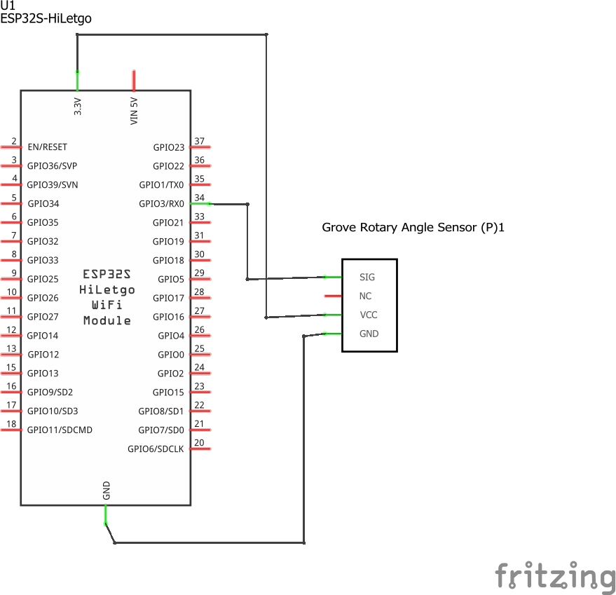
</p>

### Conexiones

El diagrama de conexión se muestra a continuación:

<p aling = "center">
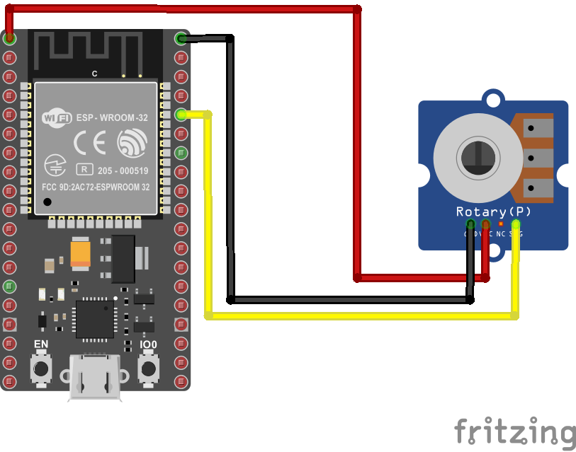
</p>


> **Archivo Fritzing** <br>
> El archivo Fritzing sensor_analogo.fzz del ejemplo se puede descargar del siguiente [link](sensor_analogo.fzz)


## Software

### Software parte 1

Este programa realiza las siguientes tareas:
* Lee el valor analogo del potenciometro.
* Envia el valor leido al PC mediante el puerto serial.


```cpp
const int analogInPin = 3;  //  GPIO3
int sensorValue = 0;         // Value read from the pot

void setup() {
  // Start Serial  
  Serial.begin(115200);    
}

void loop() {
  // Read the analog in value
  sensorValue  = analogRead(analogInPin);
  
  // Display data  
  Serial.print("Sensor:  ");
  Serial.println(sensorValue);
   
  // Wait a few seconds between measurements.
  delay(2000);
}
```

### Software parte 2

Este programa es una mejora del anterior que realiza las siguientes tareas:
* Se conecta a una red local Wifi.
* Muestra un log para conocer el estado de la conexión y algunos parametros asociados a la red.
* Lee el valor analogo del potenciometro.
* Envia el valor leido a la plataforma [dweet.io]([https://dweet.io/]) y al monitor serial mediante el puerto serial.


```cpp
#include <WiFi.h>
#include <WiFiClient.h>

// WiFi parameters
const char* ssid = "ssid";
const char* password = "password";

const int analogInPin = 34; // GPIO34
int sensorValue = 0;        // Value read from the pot

String thing_name = "node001";

// Host
const char* host = "dweet.io";

void setup() {
  // Start Serial
  Serial.begin(115200);
  delay(10);  

  // We start by connecting to a WiFi network
  Serial.println();
  Serial.println();
  Serial.print("Connecting to ");
  Serial.println(ssid);
  WiFi.begin(ssid, password);
  while (WiFi.status() != WL_CONNECTED) {
    delay(500);
    Serial.print(".");
  }

  Serial.println("");
  Serial.println("WiFi connected");
  Serial.println("IP address: ");
  Serial.println(WiFi.localIP());
}

void loop() {
  Serial.print("Connecting to ");
  Serial.println(host);

  // Use WiFiClient class to create TCP connections
  WiFiClient client;
  const int httpPort = 80;
  if (!client.connect(host, httpPort)) {
    Serial.println("connection failed");
    return;
  }

  // Read the analog in value
  sensorValue  = analogRead(analogInPin);


  // We now create a URI for the request
  String url = "/dweet/for/" + thing_name + "?value=" + String(sensorValue);

  // Send request
  Serial.print("Requesting URL: ");
  Serial.println(url);
  client.print(String("GET ") + url + " HTTP/1.1\r\n" +
               "Host: " + host + "\r\n" +
               "Connection: close\r\n\r\n");

  unsigned long timeout = millis();
  while (client.available() == 0) {
    if (millis() - timeout > 1000) {
      Serial.println(">>> Client Timeout !");
      client.stop();
      return;
    }
  }
  
  // Read all the lines from the answer
  while(client.available()){
    String line = client.readStringUntil('\r');
    Serial.print(line);
  }

  // Close connecting
  Serial.println();
  Serial.println("closing connection");

}
```

> **Importante** <br>
> Note del codigo que el nombre de la cosa en este caso es: ```node001```

### Test

Vaya a [https://dweet.io/](https://dweet.io/) y explore el API, para ello siga el link https://dweet.io/play/

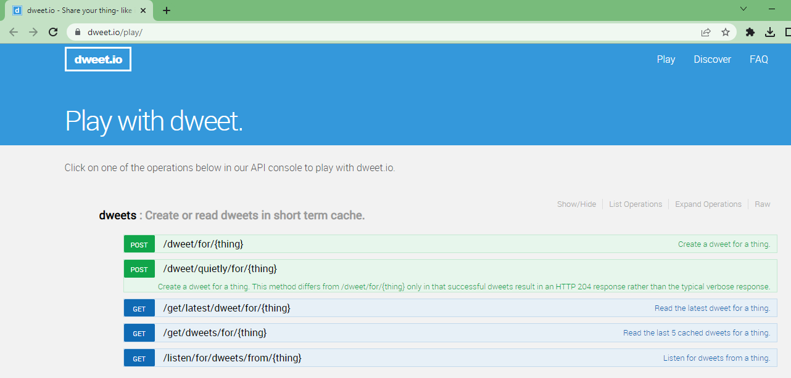


<!--

Luego registre el dispositivo https://dweet.io/follow

https://dweet.io/dweet/for/my-thing-name?hello=world

https://dweet.io/dweet/for/my-thing-name?hello=world

String url = "/dweet/for/" + thing_name + "?value=" + String(sensorValue);
-->

Registre la cosa dando click en el boton **POST** tal y como se muestra a continuación:

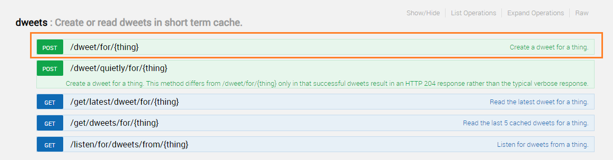

En los campos que se despliegan coloque el nombre que le pondra a la cosa, en este ejemplo se uso **node001** tal y como se mostro en la siguiente figura:

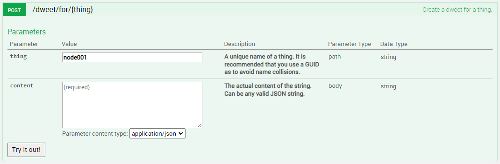

Verifique que la cosa esta registrada en https://dweet.io/follow colocando el nombre de la cosa (```node001``` en este caso):

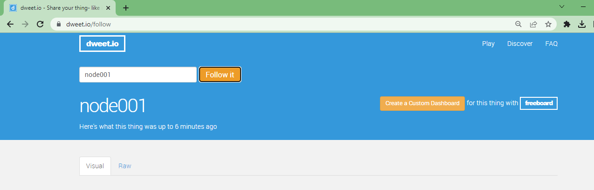

Para ver los datos que envia la cosa vaya en el navegador a https://dweet.io/follow/thing_name, donde ```thing_name``` es el nombre de la cosa (```node001``` en este caso):

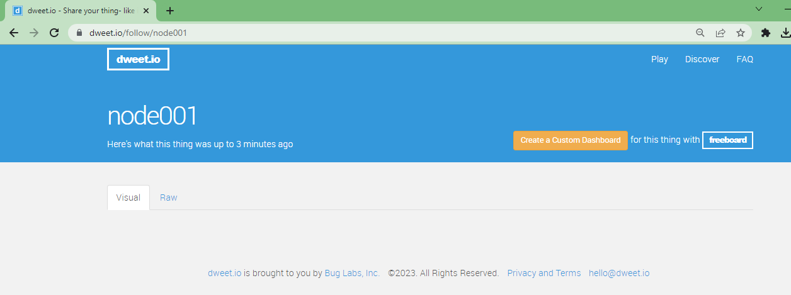

Usando el API, coloque manualmente un valor cualquiera usando el par ```{KEY: VALUE}```, en este caso ```KEY``` es ```"value"``` y ```VALUE``` es ```0```. De este modo los parametros seran ```{"value": 0}``` tal y como se muestra a continuación:

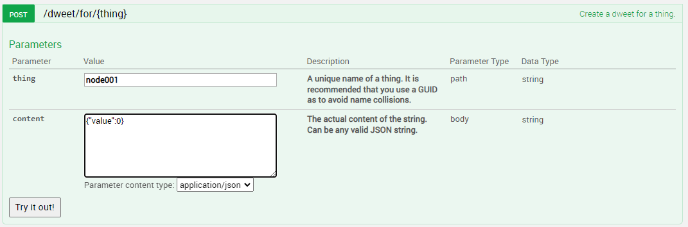

Luego observe nuevamente la direccion de la cosa, en nuestro caso: https://dweet.io/follow/node001. 

Proceda a descargar en la ESP32 el código; este despues de ponerse a funcionar arroja la siguiente salida en el monitor serial:

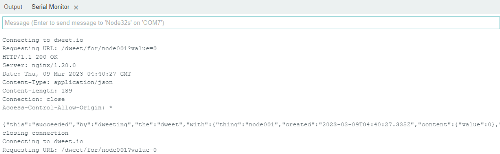

Notese que el ESP32 esta haciendo peticiones para colocar los datos en **dweet.io**, esto se puede corroborar cargango la pagina de la cosa https://dweet.io/follow/node001. La siguiente figura muestra la grafica en el tiempo de los valores enviados:

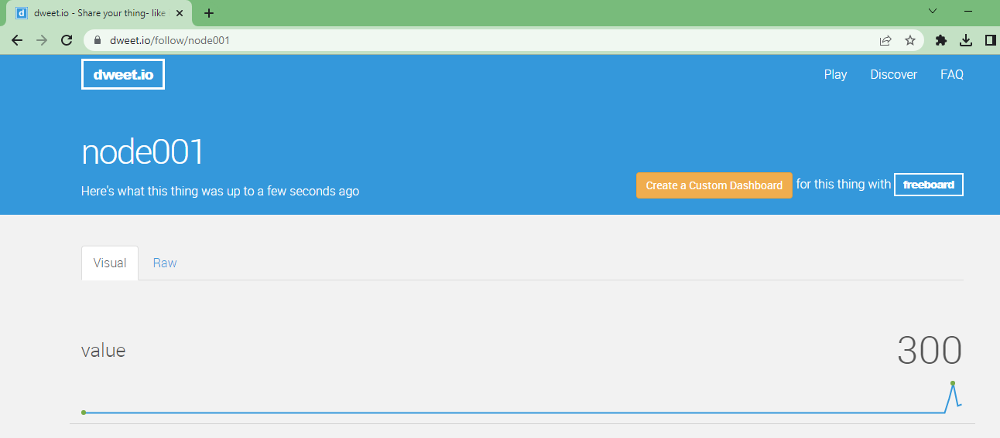

## Actividad

Explore la creación de una dashboard que se asocie a la información que usted esta enviando en este ejemplo precionando el boton **Create a Custom DashBoard**.

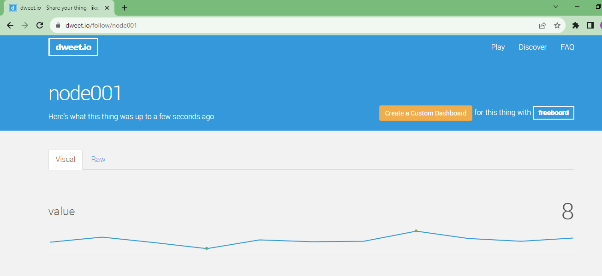

## Simulación

La simulación en Wokwi del ejemplo anterior puede ser accedida a traves del siguiente [link](https://wokwi.com/projects/408644135818185729)

La siguiente figura muestra el comportamiento de la cosa haciendo envios a la plataforma dweet.io:

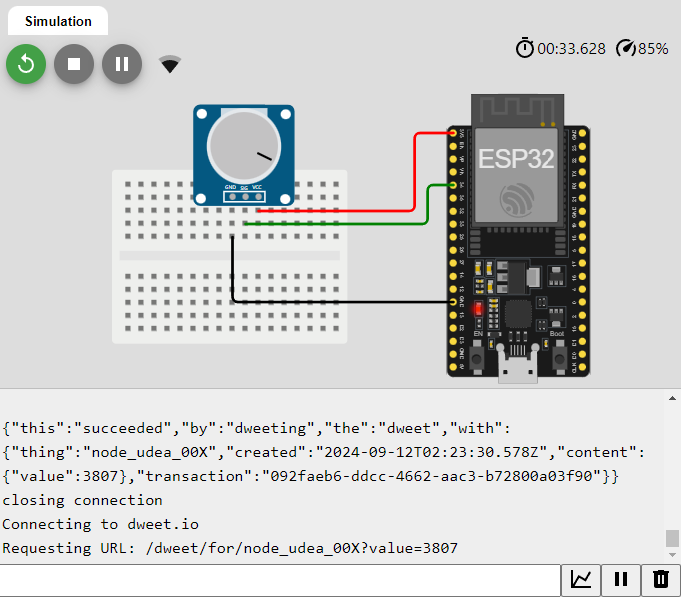

En la siguiente figura se muestra el despliegue de los datos enviados por la cosa en dweet.io:

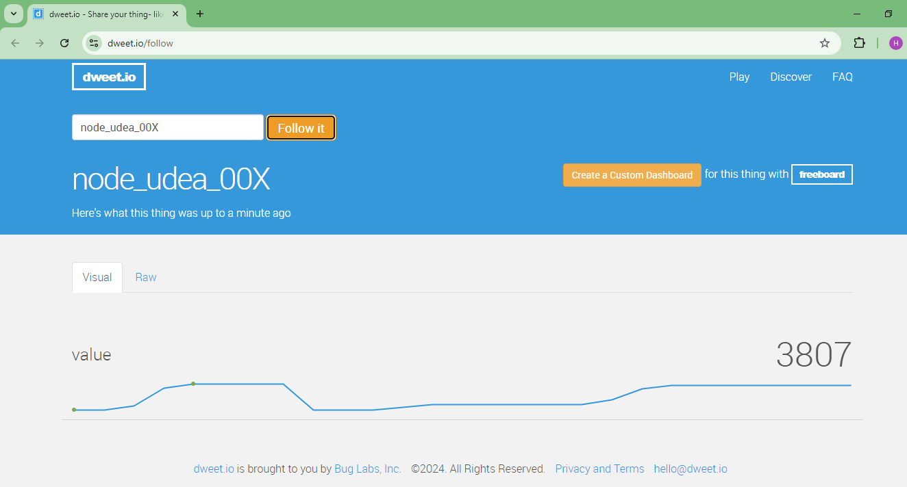

## Enlaces

* https://wokwi.com/projects/348987008435094100
* https://www.esp32.com/viewtopic.php?t=20934
* https://www.home-assistant.io/integrations/dweet/
* https://yungger.medium.com/so-easy-micropython-dweet-io-iot-cloud-platform-42ade3b12187
* https://www.hackster.io/javier-munoz-saez/esp8266-sending-data-to-an-online-deskboard-3e7e91
* https://github.com/phyunsj/dweet.io-node-red
* http://developers.sensetecnic.com/article/post-data-to-dweetio-using-fred/
* https://docs.iotify.io/temp/untitled-4
* https://www.learnrobotics.org/blog/create-a-database-for-iot-using-dweet-io-tutorial/
* https://www.learnrobotics.org/blog/nodemcu-dweet-io-freeboard-io-tutorial-for-iot/
* https://brown-cs1600.github.io/

