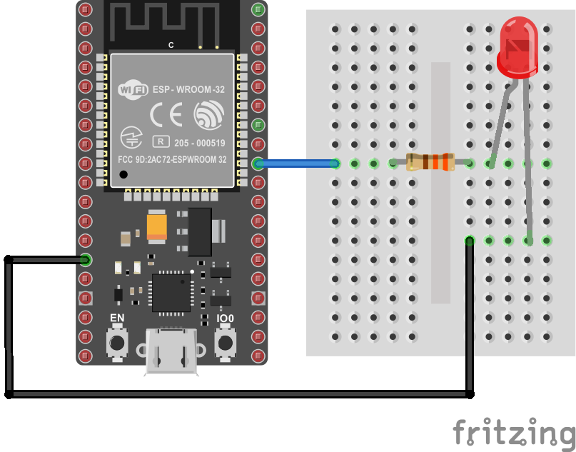

# Ejemplo 3 - Creación del API para controlar el encendido y apagado de un led conectado al Arduino

## Antes de empezar

Si desea trabajar en un entorno virtual en vez de ene el entorno nativo, siga las siguientes recomendaciones.

### Entorno virtual

Si no quiere usar los recursos nativos de la maquina puede crear un entorno virtual para Python. Asumiendo que el nombre del entorno es `env`, siga los siguientes pasos:

1. Crear el entorno virtual y activar el entorno virtual en el directorio que haya seleccionado como directorio de trabajo:

   * **Windows**:
     
     ```bash
     python -m venv env
     .\cv_env\Scripts\activate 
     ```

   * **Linux**:

     ```
     python -m venv env
     source env/bin/activate
     ```

2. Instalar los paquetes necesarios para el entorno virtual:
    
   ```
   pip install fastapi
   pip install "uvicorn[standard]"
   pip install pyserial
   pip install python-multipart
   ```

   Despues de instaladas las dependencias y de manera opcional, se pueden guardar las dependencias instaladas en un archivo que llamaremos `requierements.txt`. Esto permite facilita replicar el entorno virtual en otro sistema, ahorrando el paso anterior si se tiene este archivo a la mano:

   ```bash
   pip freeze > requirements.txt
   ```

   El siguiente comando muestra como se replica el entorno si se tiene el archivo `requierements.txt` a la mano:

   ```bash
   pip install -r requirements.txt
   ```

3. Pruebe la aplicación python. Suponiendo que la aplicación se llame `app.py`, el comando a aplicar seria:
   
   ```
   python app.py
   ```

4. Cuando acabe de realizar las pruebas desactive el entorno virtual:
   
   ```
   deactivate
   ```

## Programa ESP32

Suponiendo que el circuito implementado en el ESP32 es el mostrado en la siguiente figura:



Asumiendo que ya se tiene el ESP32 programado y funcionando para recibir comandos de encendido y apagado traves de la interfaz de comunicación serial tal y como se muestra en el siguiente [link](https://wokwi.com/projects/393263531512991745).

A continuación se muestra el código que es descargado en el ESP32.

```cpp
#include <Arduino.h>

// I/O pines
#define LED_PIN 18

// Commands
#define ON '1'
#define OFF '0'

int incomingByte = 0; // for incoming serial data

/** setup **/
void setup() {  
  pinMode(LED_PIN, OUTPUT); // initialize digital pin LED_BUILTIN as an output.
  digitalWrite(LED_PIN, LOW);
  Serial.begin(115200);         // opens serial port, sets data rate to 115200 bps
  // Serial.write("Puerto serial inicializado...\n");
  
}

/** loop **/
void loop() {
  // send data only when you receive data:
  if (Serial.available() > 0) {
    // read the incoming byte:
    incomingByte = Serial.read();
    if(incomingByte == ON) {
      digitalWrite(LED_PIN, HIGH);    
      // Serial.write("Led encendido\n");     
    }
    else {
      digitalWrite(LED_PIN, LOW);   
      // Serial.write("Led Apagado\n");
    }
  }
}
```

## Implementación de la aplicación

1. **Parte 1**: Implementación de una aplicación serial sencilla ([link](./parte1/README.md))
2. **Parte 2**: Si lo que se desea es controlar mediante un API rest el encendido y apagado del led, mejore el código implementado en la parte 1 mediante el uso de un Framework como Flask, Django o Fast API para la implementación del back end. ([link](./parte2/README.md))
3. **Parte 3**: Implente una interfaz front end sencilla para el control del ESP32 mediante el despliegue de esta en el navegador. [link](./parte3/README.md)

Como caso opcional se muestra el caso de esta implementación mediante Node-RED ([link](./parte2a/README.md))

## Referencias

1. https://www.delftstack.com/
2. https://www.delftstack.com/howto/python/list-serial-ports-in-python/