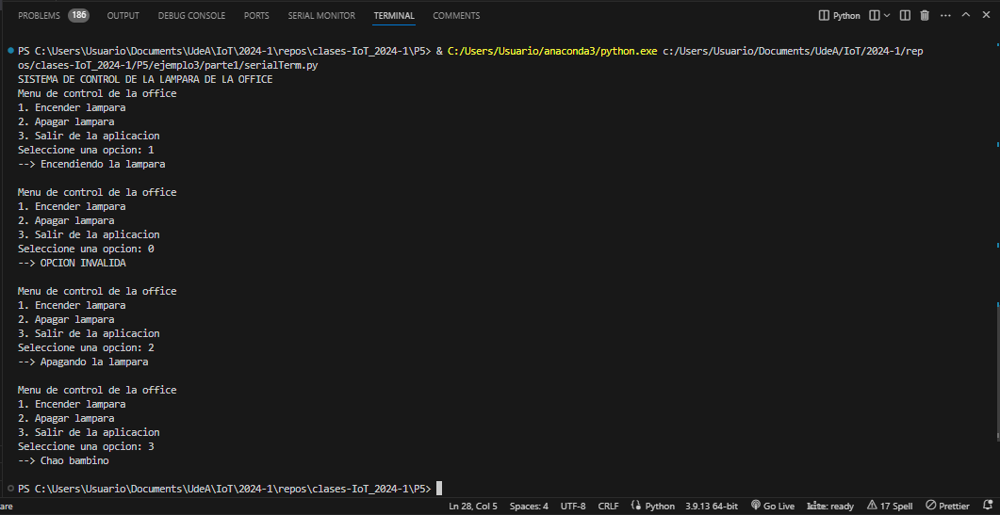

# Parte 1 - Interfaz de control serial por consola

Tal y como se vió en la parte de comunicación serial, es posible crear una aplicación de escritorio sencilla en python para el envio de comandos a la ESP32. En el archivo [serialTerm.py](serialTerm.py) se muestra el código asociado a esta. Para ejecutar el script digite el siguiente comando en la terminal.

```
python serialTerm.py
```

La siguiente figura muestra en resultado de la ejecución:



