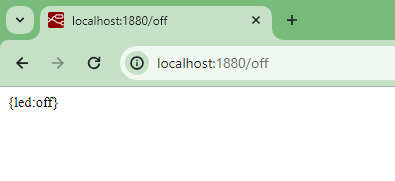

# Parte 2a - Implementación en nodered

## Prerequisitos


## Software

### API Endpoints

Los endpoints se muestran a continuación:

|HTTP method | API endpoint |Descrición|
|---|---|---|
|```GET``` | ```/on``` | Enciende el led (Una vez la aplicación se ha conectado) |
|```GET``` | ```/off``` | Apaga el led (Una vez la aplicación se ha desconectado) |

### Implementación en Node-RED

Los flujos que implementan la aplicación se definen en el archivo JSON [flows_LedSerialAPI.json](flows_LedSerialAPI.json) cuya forma se muestra a continuación:

<p align = "center">

</p>

La siguiente figura muestra un resumen de los nodos usados:

<p align = "center">

</p>


## Probando la aplicación

Cuando se hace el deploy de la aplicación en Node-RED la salida, en la ventana de Node-RED será simular a la siguiente figura:

<p align = "center">

</p>


### Pruebas

La siguiente tabla resume los comandos **curl** empleados para hacer las pruebas para los endpoints existentes para la aplicación:

|Comando |Descrición|
|---|---|
|```curl URL/on``` | Enciende el led (Una vez la aplicación se ha conectado) |
|```curl URL/off``` | Apaga el led (Una vez la aplicación se ha desconectado) |

Al ejecutar los comandos anteriores en la aplicación, el resultado fue similar al siguiente:

<p align = "center">

</p>

El resultado se usar las herramientas de usar el navegador se muestra a continuación:


1. **Encendido del led**: Al enviar la petición para encender la luz, si todo esta bien, se debe encender el led en la ESP32:

   <p align = "center">
   
   </p>
  

2. **Apagado del led**: El resultado de apagar el led se muestra en la siguiente figura:
   
   <p align = "center">
   
   </p>

## Referencias

* https://flows.nodered.org/node/node-red-node-serialport
* https://cookbook.nodered.org/http/
* https://cookbook.nodered.org/http/handle-query-parameters
* https://cookbook.nodered.org/http/handle-url-parameters
* https://www.digikey.com.mx/es/maker/tutorials/2022/how-to-use-variables-in-node-red