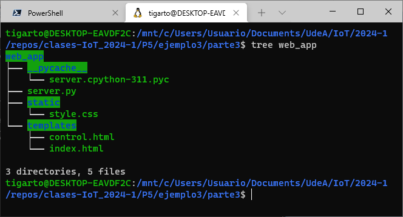
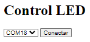
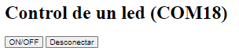
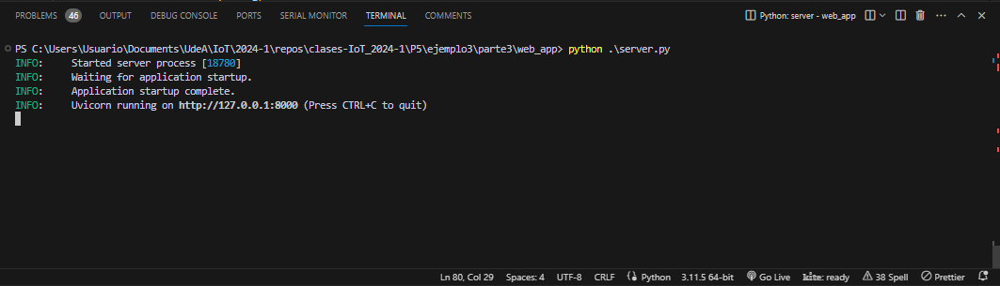
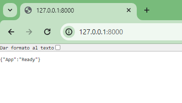

# Aplicación

## Prerequisitos

Como en la aplicación se va a enviar información desde campos de formularios en vez de JSON, es necesario realizar la instalación del parser multipart para python (ver [link](https://fastapi.tiangolo.com/tutorial/request-forms/)). Para ello se utiliza el comando:

```
pip install python-multipart
```
## Software

### Archivos asociados

Esta aplicación tiene varios archivos asociados de acuerdo a la estructura mostrada en el siguiente comando (teniendo en cuenta que para el caso el directorio **web_app** es el directorio raiz de la aplicación)

<p align = "center">

</p>

Los archivos asociados a la aplicación se detallan a continuación:

#### Front End

* [**`style.css`**](web_app/static/style.css): Archivo de estilos css para el despligue de las paginas.
  
  ```css
  /* Aun no tiene nada */
  ```

* [**index.html**](web_app/templates/index.html): Pagina inicial cuando se inicia la aplicación. Despliega los puertos disponibles y permite iniciar la conexión serial.
  
  <p align = "center">
  
  </p>

  El código se muestra a continuación:

  ```html
  <!DOCTYPE html>
  <html lang="en">

  <head>
      <meta charset="UTF-8">
      <meta name="viewport" content="width=device-width,   initial-scale=1.0">
      <title>Led Serial</title>
      <link href="{{ url_for('static', path='/style.css') }}"   rel="stylesheet">
  </head>

  <body>
      <h1> Control LED </h1>
      <form action="control" id="port_form">
          <select id="port_select" name="port">
              
              <option value="{{ puerto }}">{{ puerto }}</  option>
              
          </select>
          <button type="submit">Conectar</button>
      </form>
  </body>

  </html>
  ```

* **control.html**: Pagina para el control del encendido y apagado del led y la desconexión del puerto serial.
  
  <p align = "center">
  
  </p>

  El código se muestra a continuación:

  ```html
  <!DOCTYPE html>
  <html lang="en">
  <head>
      <meta charset="UTF-8">
      <meta name="viewport" content="width=device-width, initial-scale=1.0">
      <title>Document</title>
      <link href="{{ url_for('static', path='/style.css') }}" rel="stylesheet">
  </head>
  <body>
      <h1> Control de un led ({{puerto}})</h1>
      <button onclick="window.location.href='/led_change'"> ON/OFF </button>
      <button onclick="window.location.href='/disconnect'"> Desconectar </button>
  </body>
  </html>  
  ```

#### Back End

El back end se implemento con FastAPI. El archivo [server.py](web_app/server.py) contiene el código de la aplicación;

```py
from fastapi import FastAPI, Request, Response, Form
from fastapi.responses import HTMLResponse
from fastapi.staticfiles import StaticFiles
from fastapi.templating import Jinja2Templates
from fastapi.encoders import jsonable_encoder
from typing import Annotated
import uvicorn 
import os

import serial
import serial.tools.list_ports

app = FastAPI()
app.led_status = False
app.port = None
app.serial = None

app.mount("/static", StaticFiles(directory="static"), 
          name="static")
templates = Jinja2Templates(directory="templates")

@app.get('/')
def root():
    return {"App": "Ready"}

@app.get("/home", response_class=HTMLResponse)
async def read_item(request: Request):
    if app.serial != None:
        # Verificacion del estado del serial 
        if app.serial.isOpen() == True:
            print("Puerto serial desconectado...")
            app.serial.close()
    # Lista de los puertos
    comlist = serial.tools.list_ports.comports()
    puertos = []
    for element in comlist:
      puertos.append(element.device)
    # Actualización de la template asociada a la conexión
    return templates.TemplateResponse("index.html", {"request": request, "puertos": puertos})

@app.get("/control")
async def control(request: Request, port: str):
    app.port = port
    serial_speed = 115200
    print(f"Iniciando conexión serial con el puerto {app.port} a {serial_speed} bps")
    app.serial = serial.Serial(app.port, serial_speed)
    if app.serial == None:
        return {"Connection": "Fail"}
    else:
        # return {"Connection": "Open"}
        return templates.TemplateResponse("control.html", {"request": request, "puerto": app.port})

@app.get("/led_change")
async def led_on(request: Request):
    # Cambio del estado del led al opuesto
    app.led_status = not(app.led_status)
    if app.led_status:
        # Envio del comando de encendido del led
        print("LED: On")
        app.serial.write(b'1')
    else:
        # Envio del comando de apagado del led
        print("LED: Off")
        app.serial.write(b'0')
    # Actualización de la template asociada al control del led
    return templates.TemplateResponse("control.html", {"request": request, "puerto": app.port})

@app.get("/disconnect")
async def disconnect(request: Request):
    app.serial.close()
    # Lista de puertos
    comlist = serial.tools.list_ports.comports()
    puertos = []
    for element in comlist:
      puertos.append(element.device)
    # Index
    return templates.TemplateResponse("index.html", {"request": request, "puertos": puertos})
    

if __name__ == "__main__":
    config = uvicorn.Config("server:app", log_level="info", reload=True)
    server = uvicorn.Server(config)
    server.run()
```

### API Endpoints

Los End points implementados se muestran a continuación:

|HTTP method | API endpoint |Descrición|
|---|---|---|
|```GET``` | ```/``` |	Indica el estado del servidor |
|```GET``` | ```/home``` |	Obtiene una lista de puertos |
|```GET``` | ```/control``` |	Donde se encuentra el control |
|```GET``` | ```/disconnect``` | Desconecta la aplicación del puerto serial |
|```GET``` | ```/led_change``` | Cambia el estado del LED (ON/OFF) una vez la aplicación se ha conectado |


## Probando la aplicación

### Arranque del servidor

Inicialmente nos ubicamos en el directorio raiz de la aplicación (**web_app** en nuestro caso):

```
cd web_app
```

Luego se ejecutamos el script **server.py**, usando en este caso el comando python:

```
python3 server.py
```

La siguiente imagen muestra el servidor en acción:

<p align = "center">

</p>

Si se pone la URL `127.0.0.1:8000` el resultado se muestra a continuación:

<p align = "center">

</p>

Con esto sabemos que el servidor esta arriba y listo para recibir peticiones.

### Interactuando con la aplicación

En construcción...

## Referencias

* https://dweet.io/follow/ubiquitous-pear
* https://nodered.org/docs/user-guide/messages
* https://stevesnoderedguide.com/working-with-json-data-node-red
* https://www.creatifwerks.com/2023/06/10/how-to-extract-json-values-from-nodered-json-object/
* https://medium.com/@ankur.kus1/build-rest-api-using-flow-based-programming-node-red-4ed343228ba
* https://noderedguide.com/
* http://steves-internet-guide.com/http-basics/
* http://www.steves-internet-guide.com/http-headers/
* https://flaviocopes.com/http-curl/
* https://code-maven.com/slides/python/fastapi-return-html-file
* https://gist.github.com/gbaldera/3751301
* https://jinja.palletsprojects.com/en/3.1.x/templates/
* https://fastapi.tiangolo.com/advanced/custom-response/
* https://stackoverflow.com/questions/74504161/how-to-submit-selected-value-from-html-dropdown-list-to-fastapi-backend
* https://opentechschool.github.io/python-flask/core/forms.html
* https://fastapi.tiangolo.com/tutorial/request-forms/ 
* https://eugeneyan.com/writing/how-to-set-up-html-app-with-fastapi-jinja-forms-templates/

