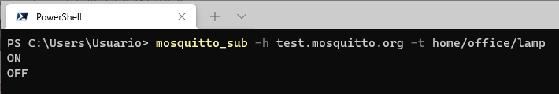
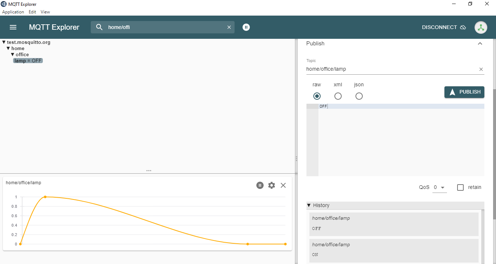

# Ejemplo 1

Realizar una implementación sencilla que permita el encedido y apagado del led integrado al ESP32. Tal y como se muestra en la siguiente figura.


## 1. Thing - ESP32

### 1.1. Red MQTT

Para este caso, el **topic tree** a implementar es el siguiente:


Como el objetivo es que el ESP32 reciba comandos para encender y apagar el Led, la implementación de la red MQTT, para este caso, tendra la siguiente forma:


### Configuración de la cosa

1. **Hardware**:
   
   * **Lista de componentes**:
   
     |#|Elemento|Cantidad|
     |--|--|--|
     |1|ESP32|1|

   * **Esquematico**:

     

   * **Conexión**:
     
     

2. **Librerias**: 
   
   |#|Libreria|Observaciones|
   |---|---|---|
   |1|PubSubClient|Libreria que implementa el protocolo MQTT|

3. **Parametros WiFi**:
   
   |Parametro|Valor|
   |---|---|
   |SSID|```"IoT"```|
   |PASSWORD|```"1245678h"```|

4. **Parametros MQTT**: 
   
   |Parametro|Valor|
   |---|---|
   |BROKER|```"test.mosquitto.org"```|
   |ID|```"thing-001"```|
   
5. **Topicos**:
   
   |#|Topico|Mensaje|Descripción|Rol (S/P)|
   |---|---|---|---|---|
   |1|```home/office/lamp```|```cmd```|```cmd``` corresponde al comando enviado para encender (```"ON"```) o apagar el led ```"OFF"```.|```S```|
   

6. **Código**:

**Archivo de configuración**: platformio.ini

```ini
[env:nodemcu-32s]
platform = espressif32
board = nodemcu-32s
framework = arduino
lib_deps = 
	knolleary/PubSubClient@^2.8
```

**Header**: config.h

```h
#pragma once
#include <string>

using namespace std;

// ESP32 I/O config
#define LIGHT_PIN 2

// WiFi credentials
const char *SSID = "IoT";
const char *PASSWORD = "1245678h";

// MQTT settings
const string ID = "thing-001";

const string BROKER = "test.mosquito.org";
const string CLIENT_NAME = ID + "lamp_client";

const string TOPIC = "home/office/lamp";
```

**Archivo main**: main.cpp

```cpp
#include <Arduino.h>
#include <WiFi.h>
#include <PubSubClient.h>

#include "config.h"

WiFiClient espClient;
PubSubClient client(espClient); // Setup MQTT client

// --- ESP32

void setup_ports() {
  pinMode(LIGHT_PIN, OUTPUT); // Configure LIGHT_PIN as an output
}


// ---- Wifi

void connectWiFi() {
  Serial.print("Connecting to ");
  Serial.print(SSID);
  while (WiFi.status() != WL_CONNECTED) {   
    Serial.print(".");
    WiFi.begin(SSID, PASSWORD);
    delay(500);
  }
  Serial.println();
  Serial.print(ID.c_str());
  Serial.println(" connected!");
  Serial.print("IP address: ");
  Serial.println(WiFi.localIP());
}

// ---- MQTT


// Handle incomming messages from the broker
void clientCallback(char* topic, byte* payload, unsigned int length) {
  String response;

  for (int i = 0; i < length; i++) {
    response += (char)payload[i];
  }
  Serial.print("Message arrived [");
  Serial.print(TOPIC.c_str());
  Serial.print("] ");
  Serial.println(response);
  if(response == "ON")  // Turn the light on
  {
    digitalWrite(LIGHT_PIN, HIGH);
  }
  else if(response == "OFF")  // Turn the light off
  {
    digitalWrite(LIGHT_PIN, LOW);
  }
}

void reconnectMQTTClient() {
  while (!client.connected()) {
    Serial.println("Attempting MQTT connection...");
    if (client.connect(CLIENT_NAME.c_str())) {
      Serial.print("connected to Broker: ");
      Serial.println(BROKER.c_str());
      // Topic(s) subscription
      client.subscribe(TOPIC.c_str());
    }
    else {
      Serial.print("Retying in 5 seconds - failed, rc=");
      Serial.println(client.state());
      delay(5000);
    }
  }
}

void createMQTTClient() {
  client.setServer(BROKER.c_str(), 1883);
  client.setCallback(clientCallback);
  reconnectMQTTClient();
}

void setup() {
  // Setup ports
  setup_ports();
  // Serial setup
  Serial.begin(9600);
  while (!Serial)
    ; // Wait for Serial to be ready
  delay(1000);
  connectWiFi();
  createMQTTClient();
}

void loop() {
  reconnectMQTTClient();
  client.loop();
  delay(1000);
}
```

### 1.2. Prueba

En la siguiente figura se muestra el monitor serial de la **cosa** (ESP32):

Para realizar el debug de la **cosa** (ESP32 que controla la lampara), vamos a realizar la siguiente implementación conectando un segundo cliente con el fin de enviar y recibir mensajes de la **cosa**:


La siguiente tabla muestran los comandos aplicados al cliente para encender y apagar el led:

|Acción|Comando mosquitto_pub|
|---|---|
|Encender el led|```mosquitto_pub -h test.mosquitto.org -t home/office/lamp -m ON```|
|Apagar el led|```mosquitto_pub -h test.mosquitto.org -t home/office/lamp -m OFF```|

En la siguiente figura se muestra la aplicación de los comandos anteriores:


Ahora, vamos a mostrar los mensajes enviados a la ESP32 usando el **mosquito_sub**:

```
mosquitto_sub -h test.mosquitto.org -t home/office/lamp 
```

La saluda se muestra a continuación:




### 1.3. Simulacion

El procedimiento es similar al que se llevo a cabo en las pruebas. Para este caso, la simulación de este ejemplo se encuentra en el siguiente [link](https://wokwi.com/projects/378532525347307521)


En el caso, mediante el uso de los clientes de mosquitto,fue posible enviar mensajes al ESP32 de la simulación tal y como se mostraba en la prueba real.


El comportamiento al emplear otro cliente como el **MQTT Explorer** es similar. A continuación se muestra un posible resultado:




## 2. Controlando el encendido y apagado del led desde python

El siguiente ejemplo muestra el control usando hecho en python. En construcción...

```python
import paho.mqtt.client as mqtt
import time

# Variables de la aplicacion
BROKER_IP = "test.mosquitto.org"
TOPIC = "home/office/lamp"

# Comandos
messLampOn = "ON"
messLampOff = "OFF"

# Mensajes
messReceibed = False

def on_connect(mqttc, obj, flags, rc, properties):
    if rc == 0:
        print("Conexion MQTT Establecida")
    else:
        print("No se pudo establecer la conexion (return code %d)\n", rc)
    

# 1. Creacion de la isntanca del cliente
CLIENT_ID = "officeLamp"
mqtt_client = mqtt.Client(callback_api_version =  mqtt.CallbackAPIVersion.VERSION2,
                          client_id=CLIENT_ID)
mqtt_client.on_connect = on_connect

# 2. Incovacion del metodo connect
mqtt_client.connect(BROKER_IP, 1883, 60)

# 3. Llamando el loop para mantener el flujo de trafico de red en el broker
# 4. No se llevo a cabo en este caso.
mqtt_client.loop_start()
time.sleep(2) # Para esperar que la conexion se establezca antes de desplegar el menu

print("SISTEMA DE CONTROL DE LA LAMPARA DE LA SALA")
while True:
    print("Menu de control de la sala")
    print("1. Encender lampara")
    print("2. Apagar lampara")
    print("3. Salir de la aplicacion")
    opc = input("Seleccione una opcion: ")
    if opc == '1':
        print("--> Encendiendo la lampara\n")
        mqtt_client.publish(TOPIC,messLampOn)  # Uso de publish para prender la lampara
    elif opc == '2':
        print("--> Apagando la lampara\n")
        mqtt_client.publish(TOPIC,messLampOff) # Uso de publish para apagar la lampara
    elif opc == '3':
        messReceibed = False
        print("--> Chao bambino\n")
        break
    else:
        messReceibed = False
        print("--> OPCION INVALIDA\n")
mqtt_client.loop_stop()
```

A continuación se muestra el resultado de ejecutar el cliente hecho en python usando el simulador ([link](https://wokwi.com/projects/378532525347307521)). Note que el comportamiento esperado es independendiente del cliente que envie los resultados:


## Referencias

* https://www.emqx.com/en/blog/how-to-use-mqtt-in-python
* https://eclipse.dev/paho/index.php?page=clients/python/index.php
* https://cedalo.com/blog/configuring-paho-mqtt-python-client-with-examples/
* https://pypi.org/project/paho-mqtt/
* https://github.com/eclipse/paho.mqtt.python/issues/575