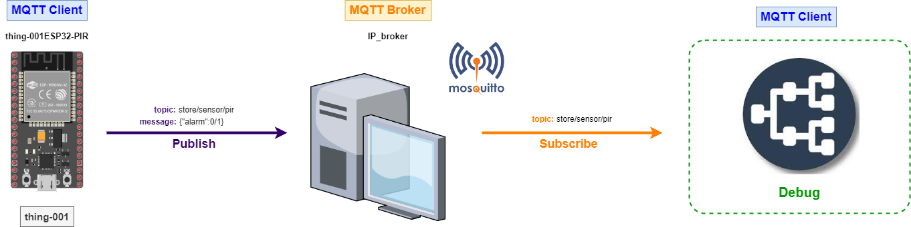

# Ejemplo 2

Realizar una implementación sencilla de una alarma la cual tiene la siguiente forma:


La siguiente figura:

|Thing|Observaciones|
|---|---|
|**```thing-001```**|Cosa conectada a un sensor PIR para detectar presencia. Cuando la presencia es detectada envia un comando por MQTT para indicar la presencia a una alarma que se encuentra en otro lugar|
|**```thing-002```**|Cosa conectada a un buzzer, esta implementa una alarma sonora que indica la presencia de una persona al recibir un comando desde la cosa que esta conectada al sensor PIR|

Tal y como se muestra en la figura, el broker se encuentra ejecutandose en un computador el cual se encuentra en la misma red local donde se conectan las cosas.

## Implentación de las cosas

### 1. Red MQTT

Para este caso, el **topic tree** a implementar es el siguiente:


### 1.1. Thing 1 - ESP-PIR 

1. **Hardware**:
   
   * **Lista de componentes**:
   
     |#|Elemento|Cantidad|
     |--|--|--|
     |1|ESP32|1|
     |2|HC-SR501 PIR MOTION SENSOR (kit Elegoo)|1|

   * **Esquematico**:

     

   * **Conexión**: Ojo, en el kit elegoo los pines **Vcc** y el **GND** son los opuestos a los mostrados en la siguiente figura:
     
     

2. **Librerias**: 
   
   |#|Libreria|Observaciones|
   |---|---|---|
   |1|PubSubClient|Libreria que implementa el protocolo MQTT|
   |2|ArduinoJsON ([link](https://arduinojson.org/))|Libreria para manejar información en formato JSON|

3. **Parametros WiFi**:
   
   |Parametro|Valor|
   |---|---|
   |SSID|```"IoT"```|
   |PASSWORD|```"1245678h"```|

4. **Parametros MQTT**: 
   
   |Parametro|Valor|
   |---|---|
   |BROKER|```"192.168.43.55"```|
   |ID|```"thing-001"```|
   
5. **Topicos**:
   
   |#|Topico|Mensaje|Descripción|Rol (S/P)|
   |---|---|---|---|---|
   |1|```store/sensor/pir```|```{"alarm":cmd}```|```cmd``` corresponde un valor entero que indica presencia (```1```) o ausencia (```0```) de personas.|```P```|
   

6. **Código**:

**Archivo de configuración**: platformio.ini

```ini
[env:nodemcu-32s]
platform = espressif32
board = nodemcu-32s
framework = arduino
lib_deps = 
	bblanchon/ArduinoJson@^6.21.3
	knolleary/PubSubClient@^2.8
```

**Header**: config.h

```h
#pragma once

#include <string>

using namespace std;

// ESP32 I/O config

// Alarm
#define LIGHT_PIN 2 
// PIR
#define PIR_MOTION_SENSOR 5

// WiFi credentials
const char *SSID = "IoT";
const char *PASSWORD = "1245678h";

// MQTT settings
const string ID = "thing-001";

const string BROKER = "192.168.43.55";
const string CLIENT_NAME = ID + "ESP32-PIR";

const string TOPIC = "store/sensor/pir";
```

**Archivo main**: main.cpp

```cpp
#include <Arduino.h>
#include <WiFi.h>
#include <ArduinoJson.h>
#include <PubSubClient.h>

#include "config.h"

const unsigned MOV_TIMER = 1000;  // 1000 ms

WiFiClient espClient;
PubSubClient client(espClient); // Setup MQTT client

int motion_detected = LOW; 

// Timer

hw_timer_t * timer = NULL;       // H/W timer 

volatile bool event_timer = false; // Interrupt counter

void ARDUINO_ISR_ATTR onTimer(){
  event_timer = true; // Event timer: bandera 1 s 
}

void setup_timer() {
  timer = timerBegin (0    /* timer 0*/, 
                     80,   /* Preescaler: 80 */
                     true  /* Counting: UP (true)*/ 
                    );
  timerAttachInterrupt(timer, &onTimer, true);

  timerAlarmWrite(timer, 
                  MOV_TIMER*1000, /* Irq cada 1000*1000ms = 1 s */
                  true            /* Repeat the alarm (true) */
                 );
  timerAlarmEnable(timer);
}

// --- ESP32

void setup_ports() {
  pinMode(LIGHT_PIN, OUTPUT); 
  pinMode(PIR_MOTION_SENSOR, INPUT); 
}

// ---- Wifi

void connectWiFi() {
  Serial.print("Connecting to ");
  Serial.print(SSID);
  while (WiFi.status() != WL_CONNECTED) {   
    Serial.print(".");
    WiFi.begin(SSID, PASSWORD, 6);
    delay(500);
  }
  Serial.println();
  Serial.print(ID.c_str());
  Serial.println(" connected!");
  Serial.print("IP address: ");
  Serial.println(WiFi.localIP());
}

// ---- MQTT


void reconnectMQTTClient() {
  while (!client.connected()) {
    Serial.println("Attempting MQTT connection...");
    if (client.connect(CLIENT_NAME.c_str())) {
      Serial.print("connected to Broker: ");
      Serial.println(BROKER.c_str());
      // Topic(s) subscription
      client.subscribe(TOPIC.c_str());
    }
    else {
      Serial.print("Retying in 5 seconds - failed, rc=");
      Serial.println(client.state());
      delay(5000);
    }
  }
}

void createMQTTClient() {
  client.setServer(BROKER.c_str(), 1883);
  reconnectMQTTClient();
}

void setup() {
  // Setup ports
  setup_ports();
  // Serial setup
  Serial.begin(9600);
  while (!Serial)
    ; // Wait for Serial to be ready
  delay(1000);
  connectWiFi();
  createMQTTClient();
  setup_timer();
}

void loop() {
  reconnectMQTTClient();
  client.loop();
  if (event_timer) {
    event_timer = false; // Reconocimiento de la irq (evento)
    motion_detected = digitalRead(PIR_MOTION_SENSOR);

    digitalWrite(LIGHT_PIN,motion_detected);   
    Serial.println("Hi, people is coming");
    DynamicJsonDocument doc(1024);
    doc["alarm"] = motion_detected;
    
    string telemetry;
    serializeJson(doc, telemetry);
    Serial.print("Sending telemetry ");
    Serial.println(telemetry.c_str());
    client.publish(TOPIC.c_str(), telemetry.c_str());
  }
  delay(100);  
}
```

#### Debug de la Thing 1 - ESP-PIR 

La siguiente figura muestra el debug realizado para verificar que la **cosa** funciona bien:



La salida del monitor serial para ESP32 se muestra a continuación:


La siguiente tabla resume los comandos empleados para realizar el debug de esta cosa:

|Acción|Comando mosquito|
|---|---|
|Observación del comando enviado desde el ESP32|```mosquitto_sub -t store/sensor/pir```|

La salida del anterior comando, varia según se detecte o no la presencia:


La siguiente figura muestra el debug el ESP conectado al pir si se hubiera usado el MQTT explorer:


### 1.2. Thing 2 - ESP-ALARM

1. **Hardware**:
   
   * **Lista de componentes**:
   
     |#|Elemento|Cantidad|
     |--|--|--|
     |1|ESP32|1|
     |2|PASSIVE BUZZER (kit Elegoo)|1|

   * **Esquematico**:

     

   * **Conexión**: 
     
     

2. **Librerias**: 
   
   |#|Libreria|Observaciones|
   |---|---|---|
   |1|PubSubClient|Libreria que implementa el protocolo MQTT|
   |2|ArduinoJsON ([link](https://arduinojson.org/))|Libreria para manejar información en formato JSON|

3. **Parametros WiFi**:
   
   |Parametro|Valor|
   |---|---|
   |SSID|```"IoT"```|
   |PASSWORD|```"1245678h"```|

4. **Parametros MQTT**: 
   
   |Parametro|Valor|
   |---|---|
   |BROKER|```"192.168.43.55"```|
   |ID|```"thing-002"```|
   
5. **Topicos**:
   
   |#|Topico|Mensaje|Descripción|Rol (S/P)|
   |---|---|---|---|---|
   |1|```store/sensor/pir```|```{"alarm":cmd}```|```cmd``` corresponde un valor entero que indica presencia (```1```) o ausencia (```0```) de personas.|```S```|
   

6. **Código**:

**Archivo de configuración**: platformio.ini

```ini
[env:nodemcu-32s]
platform = espressif32
board = nodemcu-32s
framework = arduino
lib_deps = 
	bblanchon/ArduinoJson@^6.21.3
	knolleary/PubSubClient@^2.8
```

**Header**: config.h

```h
#pragma once

#include <string>

using namespace std;

// ESP32 I/O config
// Alarm
#define LIGHT_PIN 2 
// Buzzer
#define BUZZER_PIN 5

// WiFi credentials
const char *SSID = "IoT";
const char *PASSWORD = "1245678h";

// MQTT settings
const string ID = "thing-002";

const string BROKER = "192.168.43.55";
const string CLIENT_NAME = ID + "ESP32-ALARM";

const string TOPIC = "store/sensor/pir";
```

**Archivo main**: main.cpp

```cpp
#include <Arduino.h>
#include <WiFi.h>
#include <PubSubClient.h>
#include <ArduinoJson.h>

#include "config.h"

WiFiClient espClient;
PubSubClient client(espClient); // Setup MQTT client

const int BUZZER_CHANNEL = 0;
const int FREQ = 1000;
const int RESOLUTION = 8;


// --- ESP32

void setup_ports() {
  pinMode(LIGHT_PIN, OUTPUT); // Configure LIGHT_PIN as an output
  // BUZZER PWM init
  ledcSetup(BUZZER_CHANNEL, FREQ, RESOLUTION);
  // BUZZER pin init
  ledcAttachPin(BUZZER_PIN, BUZZER_CHANNEL); 
}

// ---- Wifi

void connectWiFi() {
  Serial.print("Connecting to ");
  Serial.print(SSID);
  while (WiFi.status() != WL_CONNECTED) {   
    Serial.print(".");
    WiFi.begin(SSID, PASSWORD, 6);
    delay(500);
  }
  Serial.println();
  Serial.print(ID.c_str());
  Serial.println(" connected!");
  Serial.print("IP address: ");
  Serial.println(WiFi.localIP());
}

// ---- MQTT


// Handle incomming messages from the broker
void clientCallback(char* topic, byte* payload, unsigned int length) {
  String response;

  for (int i = 0; i < length; i++) {
    response += (char)payload[i];
  }
  Serial.print("Message arrived [");
  Serial.print(TOPIC.c_str());
  Serial.print("] ");
  Serial.println(response);

  
  DynamicJsonDocument doc(1024);
  deserializeJson(doc, response);
  JsonObject obj = doc.as<JsonObject>();

  bool alarm_on = obj["alarm"];
  if(alarm_on == HIGH)  {
    // Turn the light on
    digitalWrite(LIGHT_PIN, HIGH);
    ledcWrite(BUZZER_CHANNEL, 128);
  }
  else if (alarm_on == LOW) {  
    // Turn the light off
    digitalWrite(LIGHT_PIN, LOW);
    ledcWriteTone(BUZZER_CHANNEL, 0);
  }
}

void reconnectMQTTClient() {
  while (!client.connected()) {
    Serial.println("Attempting MQTT connection...");
    if (client.connect(CLIENT_NAME.c_str())) {
      Serial.print("connected to Broker: ");
      Serial.println(BROKER.c_str());
      // Topic(s) subscription
      client.subscribe(TOPIC.c_str());
    }
    else {
      Serial.print("Retying in 5 seconds - failed, rc=");
      Serial.println(client.state());
      delay(5000);
    }
  }
}

void createMQTTClient() {
  client.setServer(BROKER.c_str(), 1883);
  client.setCallback(clientCallback);
  reconnectMQTTClient();
}

void setup() {
  // Setup ports
  setup_ports();
  // Serial setup
  Serial.begin(9600);
  while (!Serial)
    ; // Wait for Serial to be ready
  delay(1000);
  connectWiFi();
  createMQTTClient();
}

void loop() {
  reconnectMQTTClient();
  client.loop();
  delay(1000);
}
```
#### Debug de la Thing 2 - ESP-ALARM

La siguiente figura muestra el debug realizado para verificar que la **cosa** funciona bien:


La salida del monitor serial para ESP32 se muestra a continuación:


La siguiente tabla resume los comandos empleados para realizar el debug de esta cosa:

|Acción|Comando mosquito|
|---|---|
|Activar el buzzer enviando un comando que simula la presencia de alguien|```mosquitto_pub -t store/sensor/pir -m '{"alarm":1}' ```|
|Desactivar el buzzer enviando un comando que simula que ya no hay nadie|```mosquitto_pub -t store/sensor/pir -m '{"alarm":0}' ```|
|Observación de los comandos enviados al ESP32|```mosquitto_sub -t store/sensor/pir```|

La salida al aplicar los comandos anteriores se muestra a continuación:


La siguiente figura muestra el debug de la alarma si se hubiera usado el MQTT explorer:


## 2. Integración de las cosas

Para hacer el debug completo de todo a la vez, se ponen a funcionar de manera simultanea todas las cosas y por medio de un cliente se puede observar el uso de mensajes entre las cosas implicadas:


## 3. Simulaciones

* **Thing 1 (ESP-PIR)**: [link](https://wokwi.com/projects/378574466884158465)
* **Thing 2 (ESP-ALARM)**: [link](https://wokwi.com/projects/378591120304957441)


## Referencias

* https://randomnerdtutorials.com/esp32-date-time-ntp-client-server-arduino/
* https://hackmd.io/@fablabbcn/rydUz5cqv
* https://randomnerdtutorials.com/esp32-mqtt-publish-subscribe-arduino-ide/
* https://www.hackster.io/harshkc2000/toit-and-esp32-mqtt-based-motion-alert-system-7f281a
* https://esp32tutorials.com/esp32-mqtt-publish-ds18b20-node-red-esp-idf/
* https://learn.sparkfun.com/tutorials/introduction-to-mqtt/all
* https://learn.adafruit.com/adafruit-io/mqtt-api
* https://github.com/adafruit/Adafruit_IO_Arduino
* https://wokwi.com/projects/321525495180034642
* https://arduinojson.org/
* https://espressif-docs.readthedocs-hosted.com/projects/arduino-esp32/en/latest/api/ledc.html
* https://www.pinguytaz.net/index.php/2021/09/21/musica-con-un-arduinoesp32-y-un-buzzer/
* https://randomnerdtutorials.com/esp32-pwm-arduino-ide/
* https://esp32tutorials.com/esp32-mqtt-publish-ds18b20-node-red-esp-idf/


