# Ejemplo 3

En Colombia es sumamente común tener el negocio en la casa como forma de levantarse unos pesos. La siguiente figura muestra un negocio tipico al cual se le implemento de manera chambona una solución IoT compuesta por los siguientes elementos:

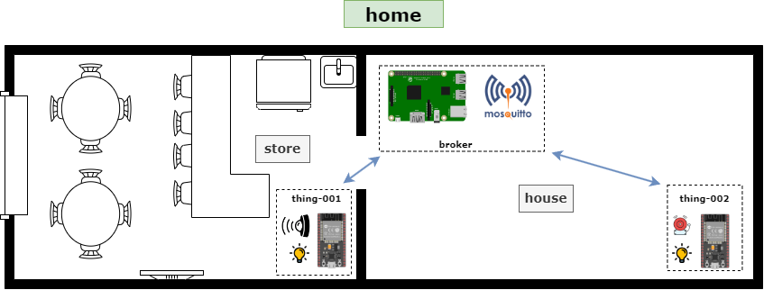

A continuación se describen los elementos involucrados:
* **Broker**: Implementado en una Raspberri Pi.
* **thing-001**: ESP32 ubicado en la tienda para detectar la llegada de clientes y para controlar el encendido y apagado de la lampara en la tienda.
* **thing-002**: ESP32 ubicado en la casa, este acciona una alarma cuando se detecta la presencia de un nuevo cliente. Tambien, permite el encendido y apagado de la lampara del a casa.

## Implentación de las cosas

### Red MQTT

La red iot a implementar se muestra en el siguiente diagrama:

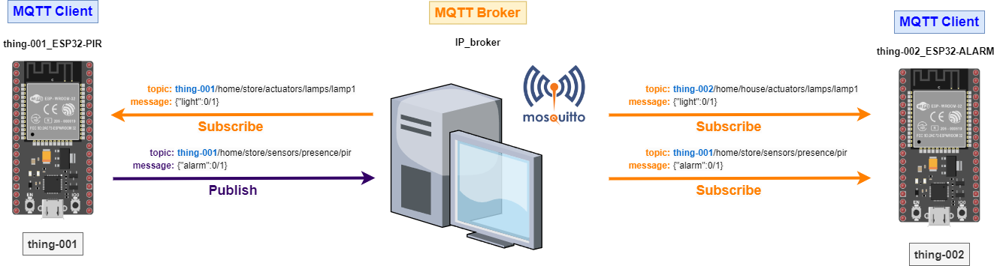

### Thing 1 - ESP-PIR 

1. **Hardware**:
   
   * **Lista de componentes**:
   
     |#|Elemento|Cantidad|
     |--|--|--|
     |1|ESP32|1|
     |2|HC-SR501 PIR MOTION SENSOR (kit Elegoo)|1|

   * **Esquematico**:

     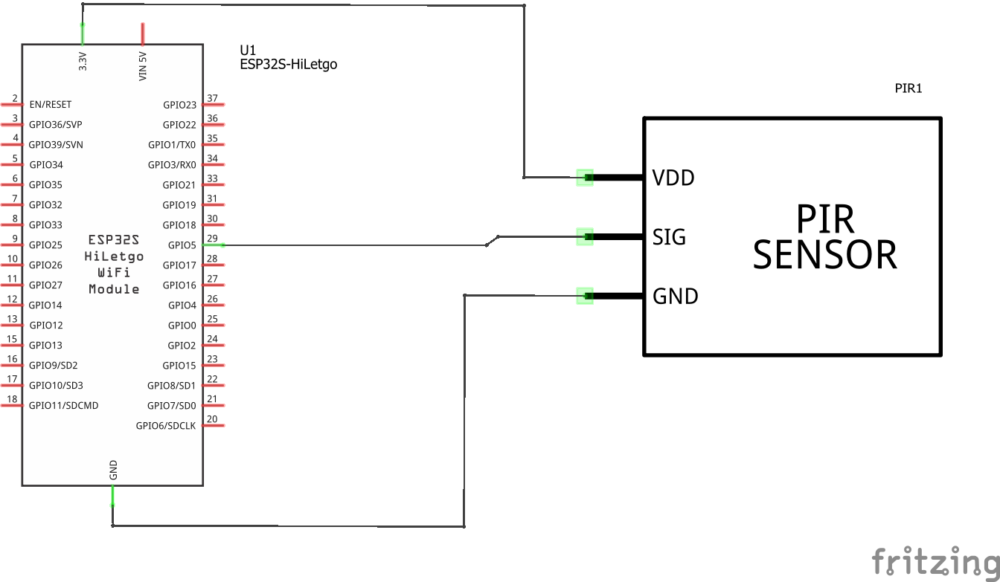

   * **Conexión**: Ojo, en el kit elegoo los pines **Vcc** y el **GND** son los opuestos a los mostrados en la siguiente figura:
     
     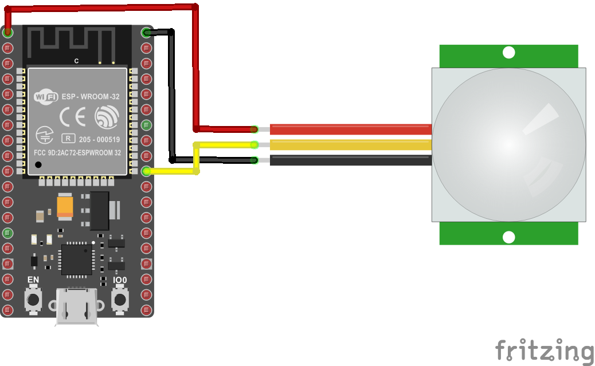

2. **Librerias**: 
   
   |#|Libreria|Observaciones|
   |---|---|---|
   |1|PubSubClient|Libreria que implementa el protocolo MQTT|
   |2|ArduinoJsON ([link](https://arduinojson.org/))|Libreria para manejar información en formato JSON|

3. **Parametros WiFi**:
   
   |Parametro|Valor|
   |---|---|
   |SSID|```"IoT"```|
   |PASSWORD|```"1245678h"```|

4. **Parametros MQTT**: 
   
   |Parametro|Valor|
   |---|---|
   |BROKER|```"192.168.43.55"```|
   |ID|```"thing-001"```|
   
5. **Topicos**:
   
   La cosa **thing-001** implementará el siguiente **topic tree**:

   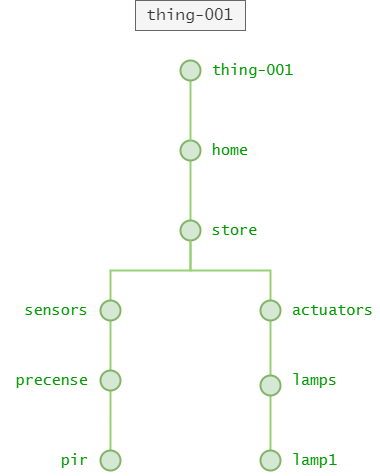

   La siguiente tabla describe los topicos involucrados:
   
   |#|Topico|Mensaje|Descripción|Rol (S/P)|
   |---|---|---|---|---|
   |1|```thing-001/home/store/sensors/precense/pir```|```{"alarm":cmd}```|```cmd``` corresponde un valor entero que indica presencia (```1```) o ausencia (```0```) de personas.|```P```|
   |2|```thing-001/home/store/actuators/lamps/lamp1```|```{"ligth":cmd}```|```cmd``` valor entero del comando para prender (```1```) o apagar (```0```) la lampara de la tienda.|```S```|
   

6. **Código**:

**Archivo de configuración**: platformio.ini

```ini
[env:nodemcu-32s]
platform = espressif32
board = nodemcu-32s
framework = arduino
lib_deps = 
	bblanchon/ArduinoJson@^6.21.3
	knolleary/PubSubClient@^2.8
```

**Header**: config.h

```h
#pragma once

#include <string>

using namespace std;


// WiFi credentials
const char *SSID = "IoT";
const char *PASSWORD = "1245678h";

// ------------------------- MQTT Network ------------------------- //
const string BROKER = "192.168.43.55";

// ----------- thing-001 (self - ESP32-PIR)
// I/O config
// Lamps
#define LIGHT_PIN 2
// PIR
#define PIR_MOTION_SENSOR 5

// MQTT settings
const string ID = "thing-001";
const string CLIENT_NAME = ID + "_ESP32-PIR";

// Topics
const string TOPIC1 = ID + "/home/store/sensors/presence/pir";
const string TOPIC2 = ID + "/home/store/actuators/lamps/lamp1";

// ----------- thing-002 (ESP32-ALARM)
// No se necesita poner nada

// ----------- iot-server (control)
// No se ha implementado aun
```

**Archivo main**: main.cpp

```cpp
#include <Arduino.h>
#include <WiFi.h>
#include <ArduinoJson.h>
#include <PubSubClient.h>

#include "config.h"

const unsigned MOV_TIMER = 1000;  // 1000 ms

WiFiClient espClient;
PubSubClient client(espClient); // Setup MQTT client

int motion_detected = LOW; 

// Timer

hw_timer_t * timer = NULL;       // H/W timer 

volatile bool event_timer = false; // Interrupt counter

void ARDUINO_ISR_ATTR onTimer(){
  event_timer = true; // Event timer: bandera 1 s 
}

void setup_timer() {
  timer = timerBegin (0    /* timer 0*/, 
                     80,   /* Preescaler: 80 */
                     true  /* Counting: UP (true)*/ 
                    );
  timerAttachInterrupt(timer, &onTimer, true);

  timerAlarmWrite(timer, 
                  MOV_TIMER*1000, /* Irq cada 1000*1000ms = 1 s */
                  true            /* Repeat the alarm (true) */
                 );
  timerAlarmEnable(timer);
}

// --- ESP32

void setup_ports() {
  pinMode(LIGHT_PIN, OUTPUT); 
  pinMode(PIR_MOTION_SENSOR, INPUT); 
}


// ---- Wifi

void connectWiFi() {
  Serial.print("Connecting to ");
  Serial.print(SSID);
  while (WiFi.status() != WL_CONNECTED) {   
    Serial.print(".");
    WiFi.begin(SSID, PASSWORD, 6);
    delay(500);
  }
  Serial.println();
  Serial.print(ID.c_str());
  Serial.println(" connected!");
  Serial.print("IP address: ");
  Serial.println(WiFi.localIP());
}

// ---- MQTT

void clientCallback(char* topic, byte* payload, unsigned int length) {
  String response;

  for (int i = 0; i < length; i++) {
    response += (char)payload[i];
  }
  Serial.print("Message arrived [");
  Serial.print(topic);
  Serial.print("] ");
  Serial.println(response);
  
  DynamicJsonDocument doc(1024);
  deserializeJson(doc, response);
  JsonObject obj = doc.as<JsonObject>();

  bool alarm_on = obj["light"];
  if(alarm_on == HIGH)  {
    // Turn the light on
    digitalWrite(LIGHT_PIN, HIGH);
  }
  else if (alarm_on == LOW) {  
    // Turn the light off
    digitalWrite(LIGHT_PIN, LOW);
  }
}

void reconnectMQTTClient() {
  while (!client.connected()) {
    Serial.println("Attempting MQTT connection...");
    if (client.connect(CLIENT_NAME.c_str())) {
      Serial.print("connected to Broker: ");
      Serial.println(BROKER.c_str());
      // Topic(s) subscription
      client.subscribe(TOPIC2.c_str());
    }
    else {
      Serial.print("Retying in 5 seconds - failed, rc=");
      Serial.println(client.state());
      delay(5000);
    }
  }
}

void createMQTTClient() {
  client.setServer(BROKER.c_str(), 1883);
  client.setCallback(clientCallback);
  reconnectMQTTClient();
}

void setup() {
  // Setup ports
  setup_ports();
  // Serial setup
  Serial.begin(9600);
  while (!Serial)
    ; // Wait for Serial to be ready
  delay(1000);
  connectWiFi();
  createMQTTClient();
  setup_timer();
}

void loop() {
  reconnectMQTTClient();
  client.loop();
  if (event_timer) {
    event_timer = false; // Reconocimiento de la irq (evento)
    motion_detected = digitalRead(PIR_MOTION_SENSOR);

    Serial.println("Hi, people is coming");
    DynamicJsonDocument doc(1024);
    doc["alarm"] = motion_detected;
    
    string telemetry;
    serializeJson(doc, telemetry);
    Serial.print("Sending telemetry [");
    Serial.print(TOPIC1.c_str());
    Serial.print("]:");
    Serial.println(telemetry.c_str());
    client.publish(TOPIC1.c_str(), telemetry.c_str());
  }
  delay(100);  
}
```

#### Debug de la Thing 1 - ESP-PIR 

La siguiente figura muestra el debug realizado para verificar que la **cosa** funciona bien:

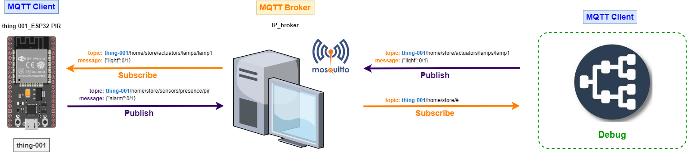

La salida del monitor serial para ESP32 se muestra a continuación:

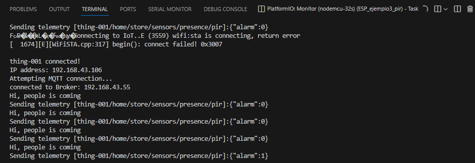

La siguiente tabla resume los comandos empleados para realizar el debug de esta cosa:

|Acción|Comando mosquito|
|---|---|
|Observación de los comandos que recibe la cosa **thing-001**|```mosquitto_sub -t thing-001/home/store/#```|
|Encendido de la lampara de la tienda (asociada a la cosa **thing-001**)|```mosquitto_pub -t thing-001/home/store/actuators/lamps/lamp1 -m '{"light": 1}'```|
|Apagado de la lampara de la tienda (asociada a la cosa **thing-001**)|```mosquitto_pub -t thing-001/home/store/actuators/lamps/lamp1 -m '{"light": 0}'```|

La salida de aplicar los comandos anteriormente mostrados se muestra a continuación:

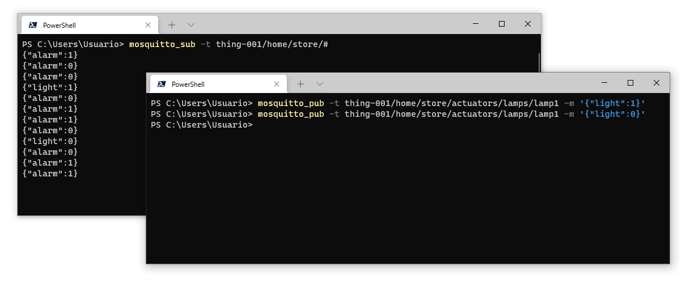

La siguiente figura muestra el debug el ESP conectado al pir si se hubiera usado el MQTT explorer:

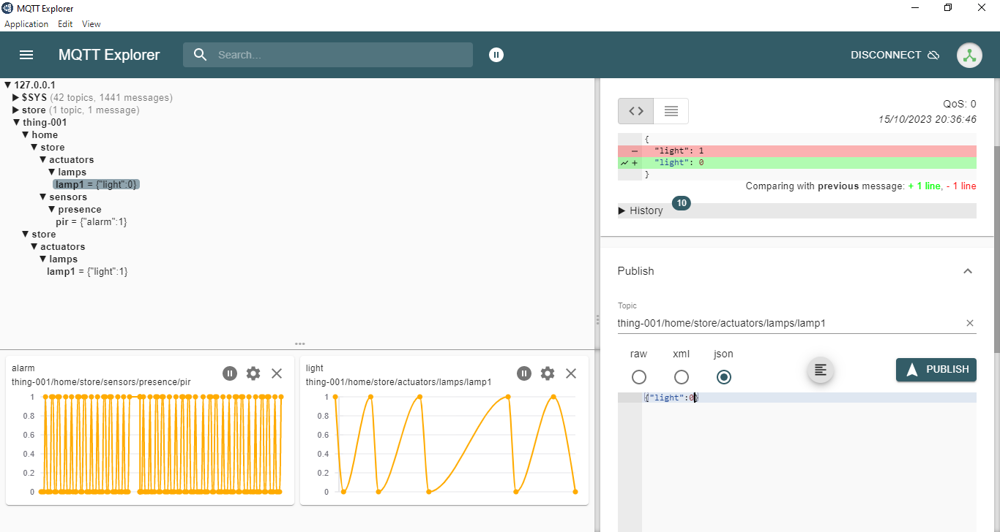

### Thing 2 - ESP-ALARM

1. **Hardware**:
   
   * **Lista de componentes**:
   
     |#|Elemento|Cantidad|
     |--|--|--|
     |1|ESP32|1|
     |2|PASSIVE BUZZER (kit Elegoo)|1|

   * **Esquematico**:

     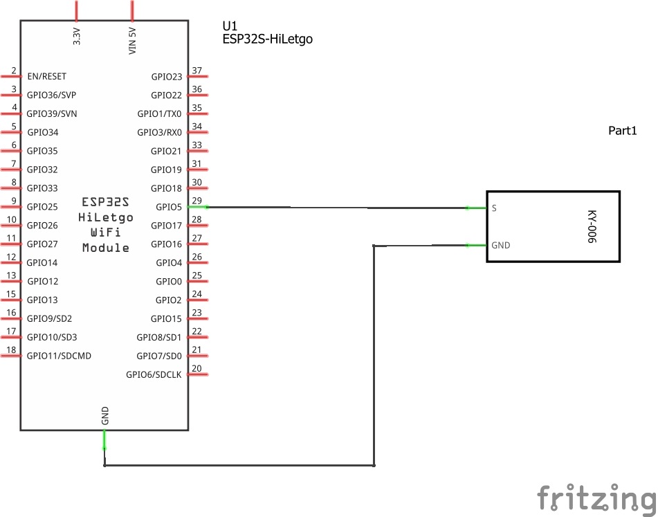

   * **Conexión**: 
     
     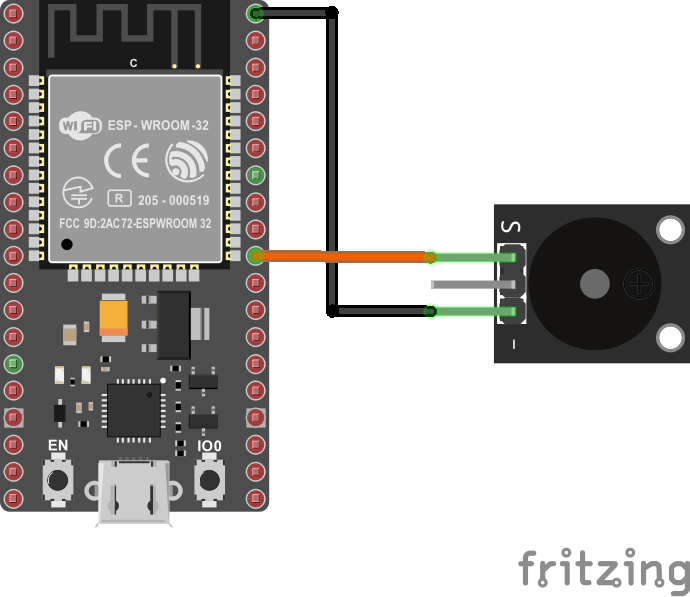

2. **Librerias**: 
   
   |#|Libreria|Observaciones|
   |---|---|---|
   |1|PubSubClient|Libreria que implementa el protocolo MQTT|
   |2|ArduinoJsON ([link](https://arduinojson.org/))|Libreria para manejar información en formato JSON|

3. **Parametros WiFi**:
   
   |Parametro|Valor|
   |---|---|
   |SSID|```"IoT"```|
   |PASSWORD|```"1245678h"```|

4. **Parametros MQTT**: 
   
   |Parametro|Valor|
   |---|---|
   |BROKER|```"192.168.43.55"```|
   |ID|```"thing-002"```|
   
5. **Topicos**:
   
   La cosa **thing-001** implementará el siguiente **topic tree**:

   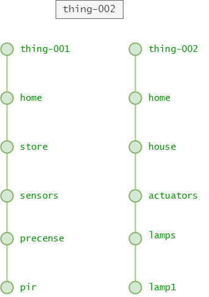

   La siguiente tabla describe los topicos involucrados:
   
   |#|Topico|Mensaje|Descripción|Rol (S/P)|
   |---|---|---|---|---|
   |1|```thing-001/home/store/sensors/precense/pir```|```{"alarm":cmd}```|```cmd``` corresponde un valor entero que indica presencia (```1```) o ausencia (```0```) de personas.|```P```|
   |2|```thing-002/home/house/actuators/lamps/lamp1```|```{"ligth":cmd}```|```cmd``` valor entero del comando para prender (```1```) o apagar (```0```) la lampara de la tienda.|```S```|

6. **Código**:

**Archivo de configuración**: platformio.ini

```ini
[env:nodemcu-32s]
platform = espressif32
board = nodemcu-32s
framework = arduino
lib_deps = 
	bblanchon/ArduinoJson@^6.21.3
	knolleary/PubSubClient@^2.8
```

**Header**: config.h

```h
#pragma once

#include <string>

using namespace std;


// WiFi credentials
const char *SSID = "IoT";
const char *PASSWORD = "1245678h";

// ------------------------- MQTT Network ------------------------- //
const string BROKER = "192.168.43.55";

// ----------- thing-001 (self - ESP32-PIR)

// MQTT settings
const string ID_PIR = "thing-001";

// ----------- thing-002 (self - ESP32-ALARM)

// I/O config
// Lamps
#define LIGHT_PIN 2
// Buzzer
#define BUZZER_PIN 5

// MQTT settings
const string ID = "thing-002";
const string CLIENT_NAME = ID + "_ESP32-ALARM";

// Topics
const string TOPIC1 = ID_PIR + "/home/store/sensors/presence/pir";
const string TOPIC2 = ID + "/home/house/actuators/lamps/lamp1";

// ----------- iot-server (control)
// No se ha implementado aun
```

**Archivo main**: main.cpp

```cpp
#include <Arduino.h>
#include <WiFi.h>
#include <PubSubClient.h>
#include <ArduinoJson.h>

#include "config.h"

WiFiClient espClient;
PubSubClient client(espClient); // Setup MQTT client

const int BUZZER_CHANNEL = 0;
const int FREQ = 1000;
const int RESOLUTION = 8;

// --- ESP32

void setup_ports() {
  pinMode(LIGHT_PIN, OUTPUT); // Configure LIGHT_PIN as an output
  // BUZZER PWM init
  ledcSetup(BUZZER_CHANNEL, FREQ, RESOLUTION);
  // BUZZER pin init
  ledcAttachPin(BUZZER_PIN, BUZZER_CHANNEL); 
}

// ---- Wifi

void connectWiFi() {
  Serial.print("Connecting to ");
  Serial.print(SSID);
  while (WiFi.status() != WL_CONNECTED) {   
    Serial.print(".");
    WiFi.begin(SSID, PASSWORD, 6);
    delay(500);
  }
  Serial.println();
  Serial.print(ID.c_str());
  Serial.println(" connected!");
  Serial.print("IP address: ");
  Serial.println(WiFi.localIP());
}

// ---- MQTT


// Handle incomming messages from the broker
void clientCallback(char* topic, byte* payload, unsigned int length) {
  String response;

  for (int i = 0; i < length; i++) {
    response += (char)payload[i];
  }
  Serial.print("Message arrived [");
  Serial.print(topic);
  Serial.print("] ");
  Serial.println(response);
  DynamicJsonDocument doc(1024);
  deserializeJson(doc, response);
  JsonObject obj = doc.as<JsonObject>();
  
  if (strcmp(topic,TOPIC1.c_str()) == 0){
    // Alarm topic: "thing-001/home/store/sensors/presence/pir";
    bool alarm_on = obj["alarm"];
    if(alarm_on == HIGH)  {
      ledcWrite(BUZZER_CHANNEL, 128);
    }
    else if (alarm_on == LOW) {  
      ledcWriteTone(BUZZER_CHANNEL, 0);
    }
  }
  else if(strcmp(topic,TOPIC2.c_str()) == 0) {
    // Lamp topic: "thing-002/home/house/actuators/lamps/lamp1"
    digitalWrite(LIGHT_PIN, obj["light"]);
  }
}

void reconnectMQTTClient() {
  while (!client.connected()) {
    Serial.println("Attempting MQTT connection...");
    if (client.connect(CLIENT_NAME.c_str())) {
      Serial.print("connected to Broker: ");
      Serial.println(BROKER.c_str());
      // Topic(s) subscription
      client.subscribe(TOPIC1.c_str());
      client.subscribe(TOPIC2.c_str());
    }
    else {
      Serial.print("Retying in 5 seconds - failed, rc=");
      Serial.println(client.state());
      delay(5000);
    }
  }
}

void createMQTTClient() {
  client.setServer(BROKER.c_str(), 1883);
  client.setCallback(clientCallback);
  reconnectMQTTClient();
}

void setup() {
  // Setup ports
  setup_ports();
  // Serial setup
  Serial.begin(9600);
  while (!Serial)
    ; // Wait for Serial to be ready
  delay(1000);
  connectWiFi();
  createMQTTClient();
}

void loop() {
  reconnectMQTTClient();
  client.loop();
  delay(1000);
}
```

#### Debug de la Thing 2 - ESP-ALARM

La siguiente figura muestra el debug realizado para verificar que la **cosa** funciona bien:

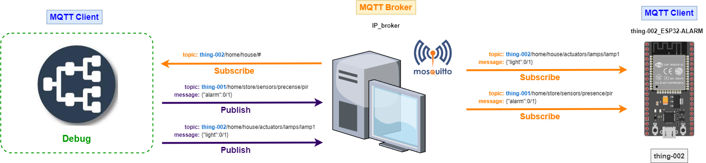

La siguiente tabla resume los comandos empleados para realizar el debug de esta cosa:

|Acción|Comando mosquito|
|---|---|
|Encender la lampara de la casa|```mosquitto_pub -t thing-002/home/house/actuators/lamps/lamp1 -m '{"light":1}' ```|
|Apagar la lampara de la casa|```mosquitto_pub -t thing-002/home/house/actuators/lamps/lamp1 -m '{"light":0}' ```|
|Comando que simula la llegada de un cliente|```mosquitto_pub -t thing-001/home/store/sensors/presence/pir -m '{"alarm":1}' ```|
|Comando que simula cuando no hay presencia de clientes|```mosquitto_pub -t thing-001/home/store/sensors/presence/pir -m '{"alarm":0}'```|
|Observación de los que recibe el ESP32 cuando se desea aprender y apagar la lampara|```mosquitto_sub -t thing-002/home/house/#```|
|Observación de los que recibe el ESP32 hay o no presencia de clientes|```mosquitto_sub -t thing-001/home/store/#```|

La salida al aplicar los comandos para verificar el encendido y apagado de la lampara de la casa se muestra a continuación:

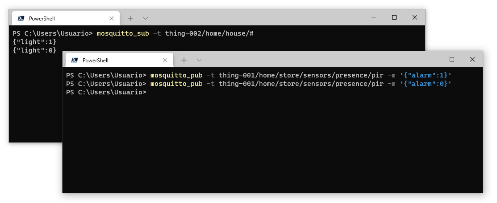

Por otro lado, la salida al aplicar los comandos para verificar la activación y desactivación de la alarma cuando hay presencia se muestran a continuación:

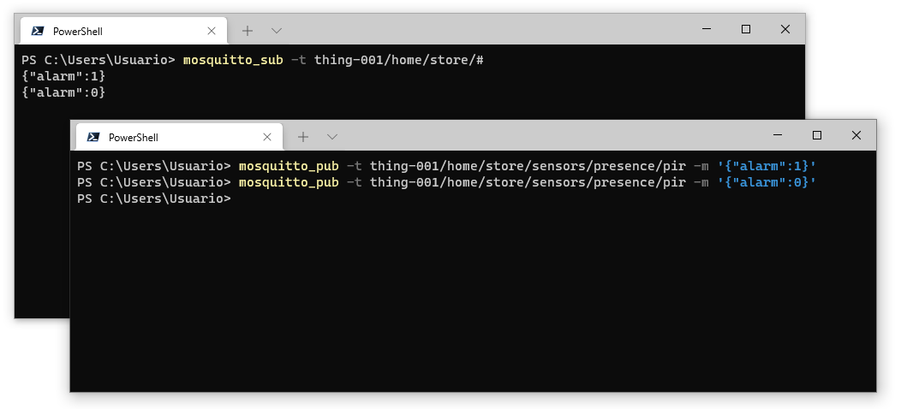

La siguiente figura muestra el debug de la alarma si se hubiera usado el MQTT explorer:

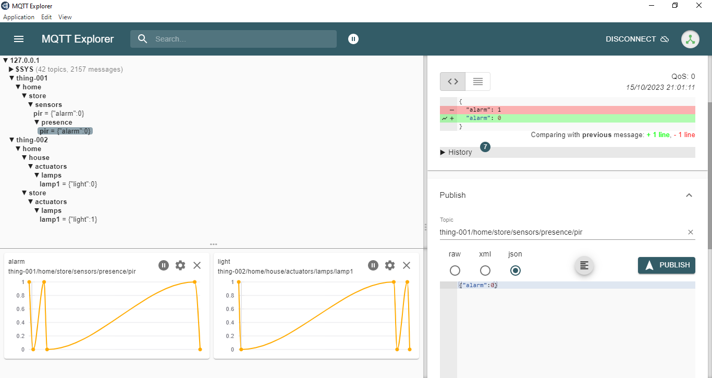

## Integración de las cosas

Para hacer el debug completo de todo a la vez, se ponen a funcionar de manera simultanea todas las cosas y por medio de un cliente se puede observar el uso de mensajes entre las cosas implicadas:

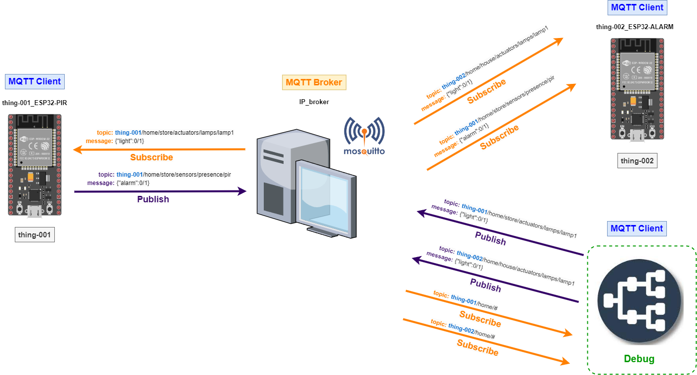


La salida en MQTT explorer se muestra a continuación:


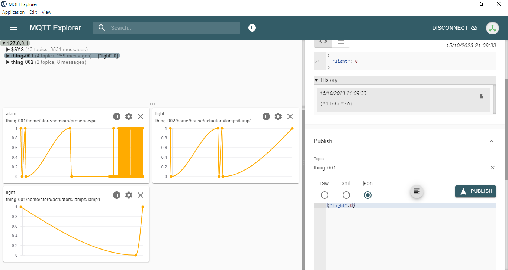

## Simulaciones

* **Simulación thing-001**: [link](https://wokwi.com/projects/378619110441876481)
* **Simulación thing-002**: [link](https://wokwi.com/projects/378623800783269889)

