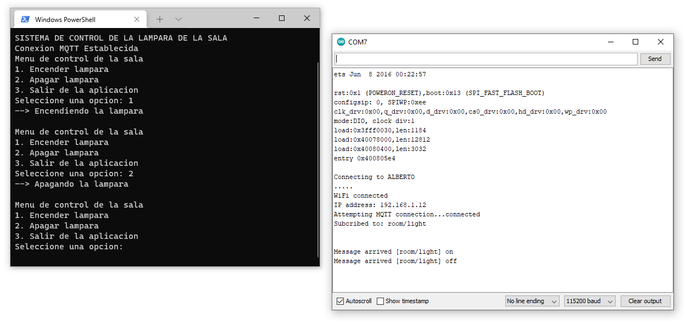
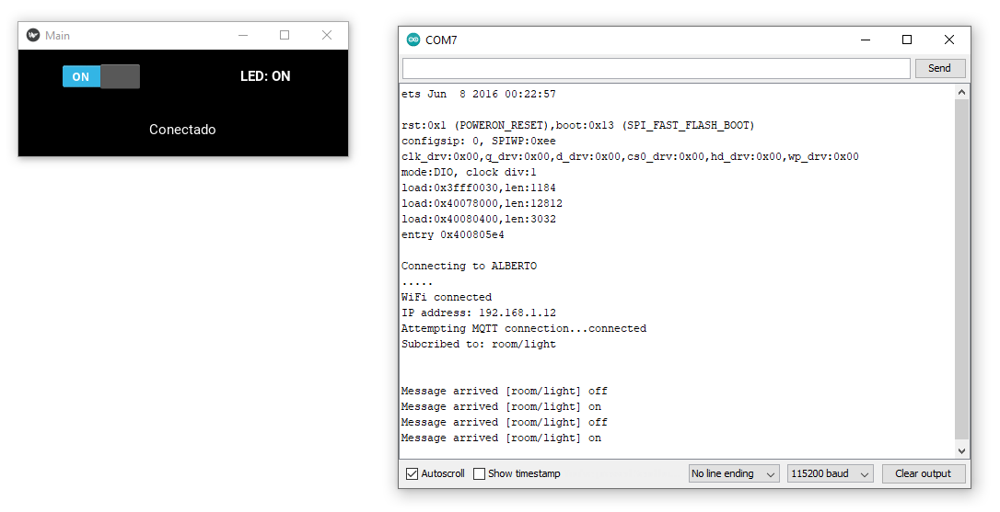

# Ejemplo de una implementacion IoT muy sencilla por pasos

## Instalación del entorno virtual

### Paso 1 - Creación del entorno

Inicialmente, se va crear un entorno virtual de desarrollo en python. Para esto habra una terminal nueva y ejecute el siguiente comando:

```
python -m venv mqtt_env
```

En este caso, el comando anterior nos permitio la creación de un entorno virtual el cual llamamos **mqtt_env**

### Paso 2 - Activación del entorno

Una vez creado el entorno virtual (en nuestro caso lo llamamos **mqtt_env**), acceda a este. En el caso linux, el entorno virtual se activa ejecutando el comando:

```
source mqtt_env/bin/activate # Linux
```

Si lo que esta usando es Windows, el comando de acceso activación del entorno de desarrollo local es:

```
.\mqtt_env\Scripts\activate # Windows
```

### Paso 3 - Instalación de librerias necesarias

Dentro del entorno de desarrollo, empleando la herramienta ```pip```, llevar a cabo la instalación de las librerias necesarias. La siguiente lista muestra los comandos ejecutados en nuestro caso:

```
pip install paho-mqtt
pip install pyserial
pip install "kivy[base]" kivy_examples
pip install kivymd
pip install python-dotenv
```

### Paso 4 - Realizar desarrollo bajo el entorno

El entorno de desarrollo proporciona una consola local con su propia versión de python. Lo que sigue es simplemente proceder a realizar desarrollo codificando aplicaciones y por medio de comandos de la consola de python probar los scripts de python. Esto se reduce basicamente a ejecutar el comando:

```
python python_script.py
```

Donde **python_script.py** es el archivo que se esta probando.

### Paso 5 - Crear un archivo requeriments (Opcional)

Con esto ya se tiene entorno de ejecución local con todos los prerequisitos necesarios para trabajar en python. Como recomendación es bueno guardar las lista de librerias ya instaladas, para lo cual se puede usar el siguiente comando (cada vez que se instale una nueva):

```
pip freeze > requirements.txt
```

Con esto se producira un archivo de texto llamado **requeriments.txt** el cual puede ser usado de manera que los comandos de instalación de librerias no tengan que ser nuevamente ejecutados:

### Paso 6 - Salir del entorno virtual 

Cuando se haya terminado todo el trabajo dentro del entorno, lo unico que hay que hacer es desactivarlo para salir. Esto se hace ejecutanto el comando:

```
deactivate
```
## Requisitos minimos

Antes de seguir, verifique que tiene instaladas las siguientes herramientas en su maquina:
1. MQTT Explorer ([link](http://mqtt-explorer.com/)).
2. Mosquito ([link](https://mosquitto.org/)). Para mas información ver [Mosquitto MQTT Broker](http://www.steves-internet-guide.com/mosquitto-broker/).
3. Librerias python necesarias.

## Enunciado de la aplicación

Desarrolle una aplicación que permita encender y apagar un Led para el siguiente hardware:


La aplicación se conectara mediante el serial enviando dos comandos basicos enviados por MQTT para modificar el estado del led:
* **H**: Comando empleado para encender el Led.
* **L**: Comando empleado para apagar el Led.

El procedimiento de desarrollo de la aplicación seguira tres pasos basicos los cuales son:
1. Implementación y pruebas del firmware que se encargara del implementara la logica de la **cosa** ([link](mqtt_paso1/)).
   
   

2. Desarrollo y test de una aplicación de escritorio sencilla en un lenguaje de programación (python en nuestro caso). Esta aplicación será por consola. se implementará una aplicación de escritorio igualmente sencilla, pero esta sera grafica ([link](mqtt_paso2/)).
   
   

3. Desarrollo de una aplicación grafica para el control de la **cosa**. Esta aplicación implementará, aunque de manera muy sencilla el concepto de IoT al hacer uso del protocolo MQTT para el envio de comandos a la cosa ([link](mqtt_paso3/)).
   
    

## Referencias

* http://downonearthtutorials.blogspot.com/2014/09/real-time-serial-data-monitor-with.html
* https://learn.sparkfun.com/tutorials/introduction-to-mqtt/introduction
* https://learn.sparkfun.com/tutorials/using-home-assistant-to-expand-your-home-automations/example-1-mqtt--esp32
* https://randomnerdtutorials.com/esp32-mqtt-publish-subscribe-arduino-ide/
