# Paso 1 - Implentacion del programa en la plataforma

## Hardware

### Lista de componentes

|Elemento|Descripcion|
|--|--|
|1|Placa de desarrollo ESP32|
|2|Led|
|3|Resistencia de 330 Ohm|

### Conexion

A continuación se muestra el diagrama de conexión. El led se conecta al puerto P26 (GPIO26) de la tarjeta como se muestra a continuación:


Notese que respecto a la implementación de hardware (componentes y conexión) no cambia para nada.

## Sofware

En este caso, la finalidad del programa será la misma (prender y apagar un led); lo que cambia es la forma como se hace pues para el caso ya no será por medio del envio de comandos mediante comunicación serial, sino que los comandos seran enviados inalambricamente empleando el protocolo MQTT.

De este modo, antes de escribir el programa es necesario tener claro los topicos y los comandos (mensaje) asociados al protocolo MQTT. Estos se resumen en la siguiente tabla.

|Type|Topic|Messaje|
|---|---|---|
|Subscriber|```room/light```| <ul><li>```on``` : Comando que al ser recibido enciende el led led</li><li>```off``` : Comando empleado para apagar el led</li></ul> |
|Publisher|```room/light/state```| <ul><li>```on``` : Mensaje que indica que el led conectado al ESP esta encendido</li><li>```off``` : Indicador de que el led conectado al ESP esta apagado </li></ul> |

Para saber un poco mas sobre como implementar en el ESP32 el protocolo MQTT se recomienda que estudie el siguiente [link](https://learn.sparkfun.com/tutorials/using-home-assistant-to-expand-your-home-automations/introduction) alli se presenta codigo para el ESP32 (ver **MQTT_Light_Example.ino** em el siguiente [link](https://learn.sparkfun.com/tutorials/using-home-assistant-to-expand-your-home-automations/example-1-mqtt--esp32)) que adaptado para nuestro objetivo a nuestro ejemplo:

Basicamente la parte que se tiene que implementar es la siguiente:

* **Configuración de la red wifi**:
  
  |Variable| Valor|Observaciones|
  |---|---|---|
  |```*ssid```|```"WIFI_LIS"```|Nombre del Access Point a la que se conectara el ESP32|
  |```*password```|""|Passoword del Access Point al que se conectara el ESP32|

* **Configuración de la red MQTT**:
  
|Variable|Valor|Observaciones|
|---|---|---|
|```broker(192,168,1,-)```|```broker(192,168,0,117)```|Dirección IP del equipo (RPi o computador) donde esta el broker. En este caso se supuso que el broker estaba en la maquina con IP ```192.168.0.117```. Para saber la IP de la maquina en la cual esta el broker use en esta el comando ```ifconfig```|
|```*ID```|```light_01```|Identificador de la **cosa** en la red|
|```LIGHT_PIN```|```26```|Pin al que se conectara la luz, recuerde que este depende de la conexión fisica del hardware|
|```*TOPIC```|```room/light```|Topico empleado para prender y apagar la luz mediante los comandos ```"on"``` y ```"off"```|
|```*STATE_TOPIC```|```room/light/state```|Topico empleado para conocer el estado de la luz|

A continuación se muestra la porción del codigo adaptada con los valores de las tablas anteriores:

```ino
#include <WiFi.h>
#include <PubSubClient.h>

// WiFi Network Credentials
const char *ssid = "WIFI-LIS";   // name of your WiFi network
const char *password = ""; // password of the WiFi network

// MQTT Network
IPAddress broker(192,168,0,117); // IP address of your MQTT broker eg. 192.168.1.50
const byte LIGHT_PIN = 13;           // Pin to control the light with
const char *ID = "light_01";  // Name of our device, must be unique
const char *TOPIC = "room/light";  // Topic to subcribe to
const char *STATE_TOPIC = "room/light/state";  // Topic to publish the light state to
```

Finalmente, el codigo completo se muestra a continuación (notese que es el código descargado de la pagina original con modificaciones menores):

```ino
/******************************************************************************
Ejemplo adaptado de: https://learn.sparkfun.com/tutorials/using-home-assistant-to-expand-your-home-automations/example-1-mqtt--esp32

------------------------------------------------------------------------------

MQTT_Light_Example.ino
Example for controlling a light using MQTT
by: Alex Wende, SparkFun Electronics

This sketch connects the ESP32 Thing Plus to a MQTT broker and subcribes to the topic
room/light. When "on" is recieved, the pin LIGHT_PIN is set HIGH.
When "off" is recieved, the pin LIGHT_PIN is set LOW.
******************************************************************************/

#include <WiFi.h>
#include <PubSubClient.h>

// WiFi Network Credentials
const char *ssid = "-----";   // name of your WiFi network
const char *password = "-----"; // password of the WiFi network


// MQTT Network
IPAddress broker(192,168,0,117);       // IP address of your MQTT broker eg. 192.168.1.4
const byte LIGHT_PIN = 26;           // Pin to control the light with P26 (GPIO26)
const char *ID = "light001";    // Name of our device, must be unique
const char *TOPIC = "room/light";  // Topic to subcribe to
const char *STATE_TOPIC = "room/light/state";  // Topic to publish the light state to


WiFiClient wclient;

PubSubClient client(wclient); // Setup MQTT client

// Handle incomming messages from the broker
void callback(char* topic, byte* payload, unsigned int length) {
  String response;

  for (int i = 0; i < length; i++) {
    response += (char)payload[i];
  }
  Serial.print("Message arrived [");
  Serial.print(topic);
  Serial.print("] ");
  Serial.println(response);
  if(response == "on")  // Turn the light on
  {
    digitalWrite(LIGHT_PIN, HIGH);
    client.publish(STATE_TOPIC,"on");
  }
  else if(response == "off")  // Turn the light off
  {
    digitalWrite(LIGHT_PIN, LOW);
    client.publish(STATE_TOPIC,"off");
  }
}

// Connect to WiFi network
void setup_wifi() {
  Serial.print("\nConnecting to ");
  Serial.println(ssid);

  WiFi.begin(ssid, password); // Connect to network

  while (WiFi.status() != WL_CONNECTED) { // Wait for connection
    delay(500);
    Serial.print(".");
  }

  Serial.println();
  Serial.println("WiFi connected");
  Serial.print("IP address: ");
  Serial.println(WiFi.localIP());
}

// Reconnect to client
void reconnect() {
  // Loop until we're reconnected
  while (!client.connected()) {
    Serial.print("Attempting MQTT connection...");
    // Attempt to connect
    if(client.connect(ID)) {
      client.subscribe(TOPIC);
      Serial.println("connected");
      Serial.print("Subcribed to: ");
      Serial.println(TOPIC);
      Serial.println('\n');
    } else {
      Serial.println(" try again in 5 seconds");
      // Wait 5 seconds before retrying
      delay(5000);
    }
  }
}

void setup() {
  Serial.begin(115200); // Start serial communication at 115200 baud
  pinMode(LIGHT_PIN, OUTPUT); // Configure LIGHT_PIN as an output
  delay(100);
  setup_wifi(); // Connect to network
  client.setServer(broker, 1883);
  client.setCallback(callback);// Initialize the callback routine
}

void loop() {
  if (!client.connected())  // Reconnect if connection is lost
  {
    reconnect();
  }
  client.loop();
}
```

Por ahora no se preocupe por entender la logica de la aplicación pues esto se vera con mas detalle cuando se trate con profundidad el tema de **MQTT** El siguiente paso consiste en probar el correcto funcionamiento de la aplicación.

## Prueba

Pasos

1. Verificar que el broker esta corriendose. En el caso de linux usar:

```bash
sudo netstat -tanlp | grep 1883
```

Para Windows usar:

```cmd
netstat -an | findstr "1883"
```

En nuestro caso (teniamos una maquina con windows) y el resultado se muestra a continuación:

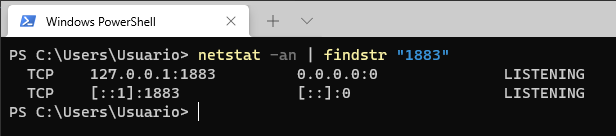


Para ver que el mosquito esta bien puede ademas usar el comando:

```bash
mosquitto -v
```

Antes de proseguir al registro de los topicos, se recomienda que ejecute el comando de ayuda del mosquito y observe brevemente las opciones a usar:

```bash
mosquitto -h
```

2. Inicialmente vamos a usar el **mosquito** probar los topicos definidos en la tabla inicial:

* **Terminales que simulan el ESP32**:

|Terminal|Type|Topic|Comando en mosquito|Observaciones|
|---|---|---|---|---|
|1|Subscriber|```room/light```|```mosquitto_sub -h 127.0.0.1 -t "room/light"```|Terminal que simulara los comandos recibidos por el ESP32|
|2|Publisher|```room/light/state```|<ul><li>**Led on**: <br> ```mosquitto_pub -h 127.0.0.1 -t "room/light/state" -m "on"``` </li>**Led off**: <br> ```mosquitto_pub -h 127.0.0.1 -t "room/light/state" -m "off"``` </li>|Terminal que simulara los comandos que envia el ESP32 para indicar el estado de las luces|
 
* **Terminales que simulan la aplicación de escritorio**:

|Terminal|Type|Topic|Comando en mosquito|Observaciones|
|---|---|---|---|---|
|3|Subscriber|```room/light/state```|```mosquitto_sub -h 127.0.0.1 -t "room/light/state"```|Terminal que simulara los comandos recibidos por la aplicación de escritorio (recibidos desde el publisher del ESP32)| 
|4|Publisher|```room/light/```|<ul><li>**Led on**: <br> ```mosquitto_pub -h 127.0.0.1 -t "room/light" -m "on"``` </li><li>**Led off**: <br> ```mosquitto_pub -h 127.0.0.1 -t "room/light" -m "off"``` </li></ul>| Terminal que simulara los comandos de control enviados desde la aplicación de escritorio para controlar el ESP32|

Para realizar las pruebas registre primero las terminales que funcionaran como suscriptores, tal y como se muestra en el siguiente orden:

* **Terminal 1**: Subscriber del ESP32

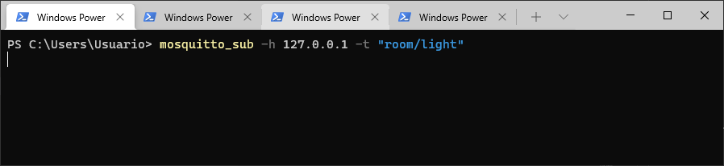

* **Terminal 3**: Subscriber de la aplicación de escritorio.

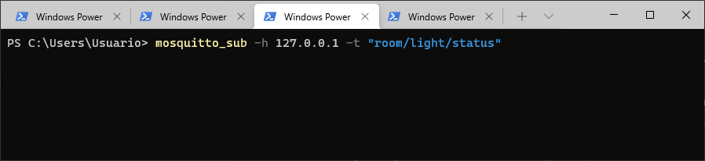

Luego, simule el encendido y apagado de una luz enviando a traves de la **terminal 4** los comandos de encendido y apagado del led:

```bash
mosquitto_pub -h 127.0.0.1 -t "room/light" -m "on"
mosquitto_pub -h 127.0.0.1 -t "room/light" -m "off"
```

A continuación se muestra el resultado de la aplicación de estos comandos en la terminal 4:

* **Terminal 4**: Terminal de la aplicación de escritorio a partir de la cual se envian los comandos de encendido y apagado de luz al ESP32: 
  
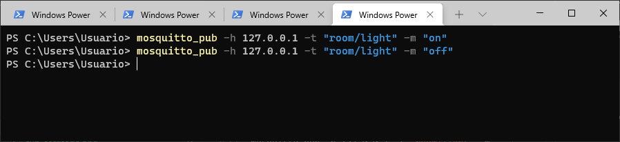

Si todo esta bien, en la **terminal 1** (subscriber en el ESP32), se deberan mostrar los **comandos** (mensajes) enviados desde la **terminal 4**:

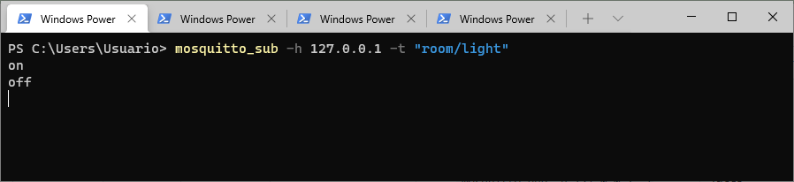

Finalmente, simulemos el caso en el cual en la aplicación de escritorio se visualiza el mensaje publicado desde el ESP32 en el cual se informa del estado del led conectado a este. Para ello usando la **terminal 2** ejecute los siguientes comandos:

```bash
mosquitto_pub -h 127.0.0.1 -t "room/light/state" -m "on"
mosquitto_pub -h 127.0.0.1 -t "room/light/state" -m "off"
```

A continuación se muestra el resultado de la aplicación de estos comandos en la **terminal 2**:

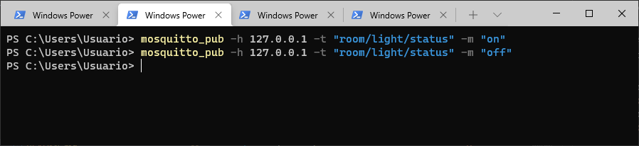

El anterior seria el mensaje que se enviaria a traves del ESP32 a la aplicación de escritorio. 

Para ver el resultado de la aplicación de escritorio al recibir los mensajes desde el ESP32, observe la salida de la **terminal 3**, la cual recibe el estado de la luz publicado por el ESP32:

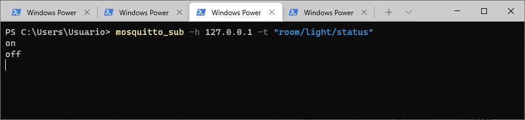

Con lo anterior queda simulada la comunicación en la red MQTT.

3. Probar la correcta conexión del ESP32 a la red MQTT.
   
   En este caso, se pueden cerrar las **terminales 1 y 2** pues estas eran las que hacian las veces del ESP32. Solo se dejarian las correspondientes a la aplicación de escritorio (**terminales 3 y 4**) tal y como se muestra en la siguiente figura:

   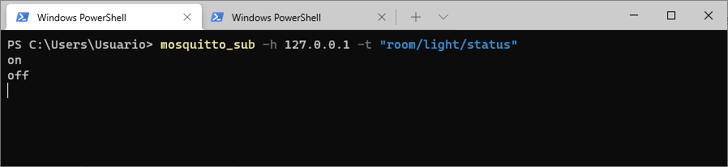

   Sin embargo para mayor comodidad vamos a cerrar todas las terminales asociadas al mosquito y vamos a iniciar de nuevo la prueba. Para lo cual se debe realizar lo siguiente:

   * **Paso 1 - Suscritor asociado a la aplicación**: Recuerde que esto se hace con base en el siguiente comando (ya visto para la **terminal 3**):

   ```bash 
   mosquitto_sub -h 127.0.0.1 -t "room/light/state"
   ```

<!--
> **Nota importante (Dio por que mi Dios es muy bueno)**: Antes de seguir al siguinte paso, si la instalación del mosquitto fue realizada en una maquina con Windows 10, es necesario desbloquear el puerto 1883 en el firewall. Para mas información se recomienda que vea la parte final del siguiente video: **How to configure an MQTT Mosquitto broker and enable user authentication on Windows** ([link](https://www.youtube.com/watch?v=72u6gIkeqUc)) 
-->
   * **Paso 2 - Aplicación del ESP32**: Una vez codificado el programa, se puede descargar el programa en el ESP32. Despues de hacer esto, abrir el **monitor serial**  configuradolo a una velocidad de ```115200``` la  cual fue la que se configuro en el programa en el ESP32 para la comunicación serial. Si la conexión con la red WiFi y el broker es exitosa, la salida será similar a la mostrada en la siguiente figura:
  
   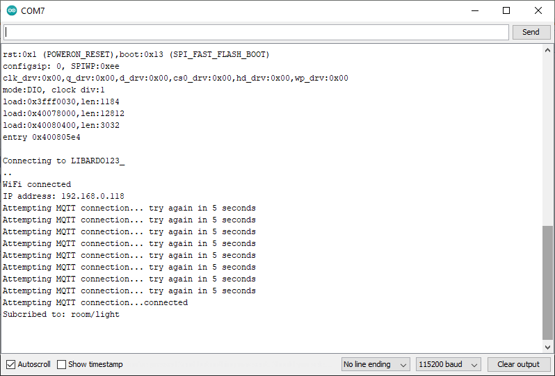
  
  * **Paso 3 - Interacción con el ESP32 desde el Mosquito**: Como se habia menciodado previamente, suscribiendo dos terminales (**clientes**) las cuales van a simular la comunicación que se da entre la aplicación de escritorio y el ESP32 mediante MQTT. Retomemos la tabla asociada las **terminales 3 y 4** las cuales simulaban la aplicación del PC:

|Terminal|Type|Topic|Comando en mosquito|
|---|---|---|---|
|1|Subscriber|```room/light/state```|```mosquitto_sub -t "room/light/state"```|T
|2|Publisher|```room/light/```|<ul><li>**Led on**: <br> ```mosquitto_pub -t "room/light" -m "on"``` </li><li>**Led off**: <br> ```mosquitto_pub -t "room/light" -m "off"``` </li></ul>| T

Como se puede ver en la tabla anterior, si se hace una comparación con los comandos mostrados en la tabla asociada a las **temirminales 3 y 4**, no se hizo uso de la opción ```-h```, ya que la maquina en la cual se estan haciendo las pruebas por consola es la misma en la cual se encuentra instalado el broker.

A continuación se muestra el envio de comandos de encendido y apagado desde la terminal al ESP 32:

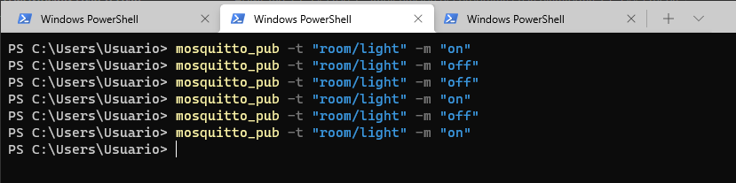

Si todo esta bien, cuando se envian comandos ```on``` y ```off```, el led se deberá apagar y prender respectivamente, asi mismo, deberá aparecer un mensaje que evidencie esto en el monitor serial:

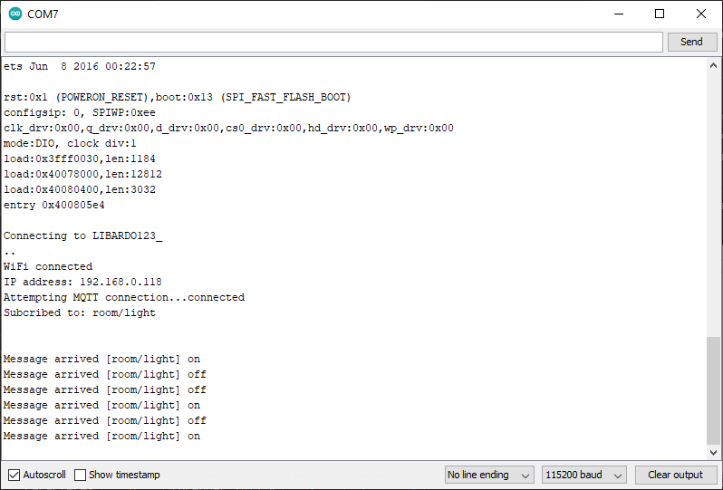

Adicionalmente, ya que el ESP32 publica el estado del led cuando este cambia, en la terminal suscriptora al topico para esto (```room/light/state```), el resultado será el siguiente:

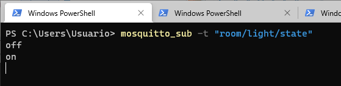

Finalmente, si todo esto esta bien hecho, es por que la aplicación asociada al ESP32 ya esta lista por lo que puede seguir con el siguiente paso.

> ### Errores
> Hay unos errores debido a la inconsistencia entre los comandos que se aplicaron y los que se mostraron en algunas de las figuras. Se espera corregir este error en proximas revisiones.
