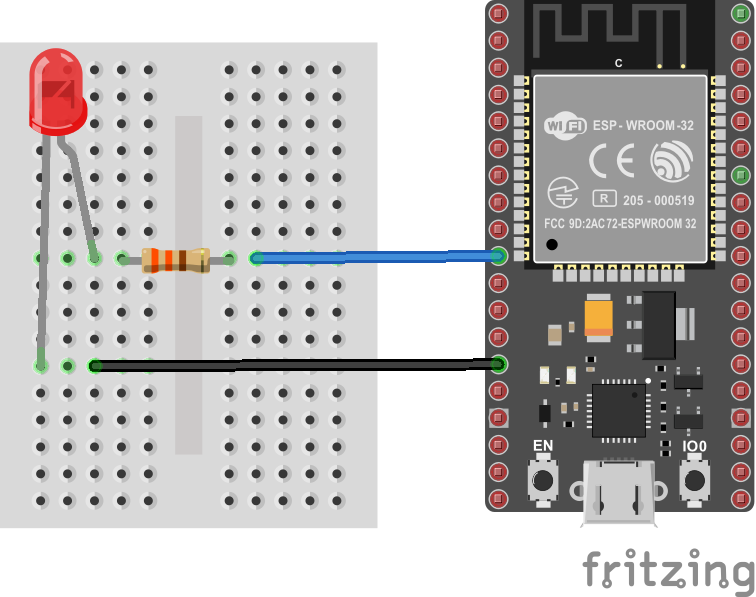
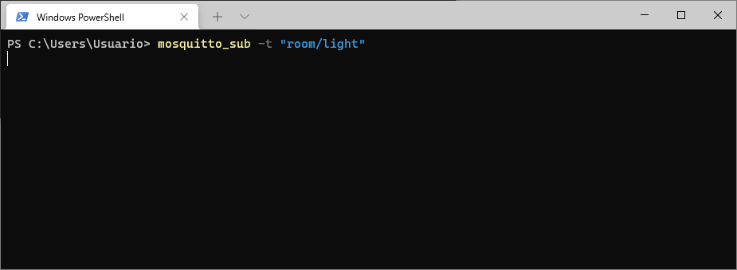
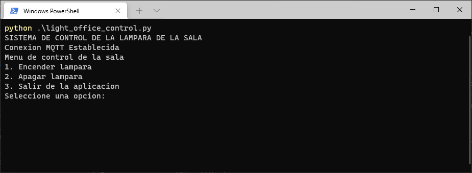
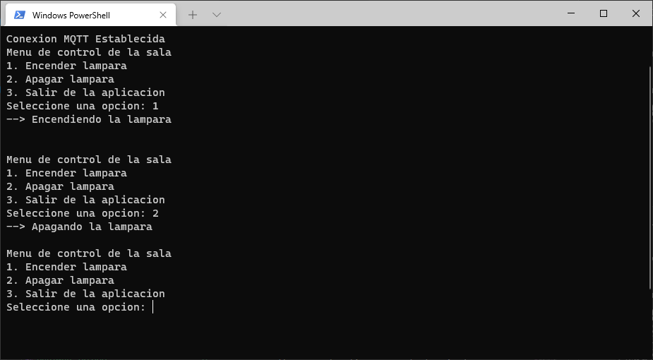
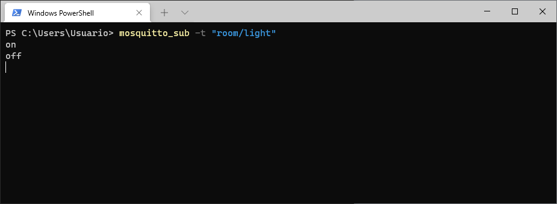
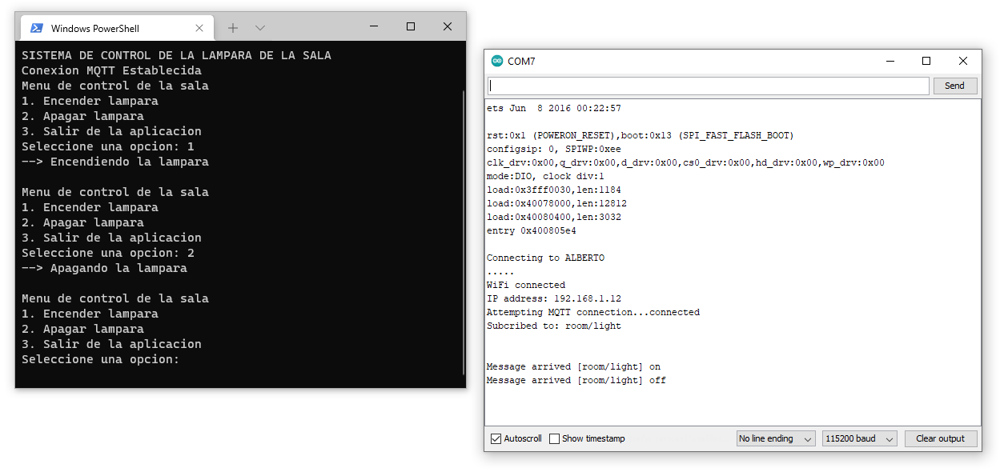

# Paso 2 - Implementación en python de un cliente MQTT

## Requisitos previos

Antes de realizar scripts que permitan la interación entre aplicaciones usando MQTT, se necesario instalar el cliente paho (https://www.eclipse.org/paho/) el cual se encuentra disponible para diferentes lenguajes de programación (ver [lista](https://www.eclipse.org/paho/index.php?page=downloads.php)). La instalación, para el caso de python, se lleva mediante el comando:

```bash
pip install paho-mqtt
```

Una vez instalado, la recomendación es probar la instalación ejecutando el archivo ejemplo mostrado en la siguiente [pagina](https://www.eclipse.org/paho/index.php?page=clients/python/index.php); el cual, por comodidad, se escribe nuevamente a continuación:

```python
import paho.mqtt.client as mqtt

# The callback for when the client receives a CONNACK response from the server.
def on_connect(client, userdata, flags, rc):
    print("Connected with result code "+str(rc))
    # Subscribing in on_connect() means that if we lose the connection and
    # reconnect then subscriptions will be renewed.
    client.subscribe("$SYS/#")

# The callback for when a PUBLISH message is received from the server.
def on_message(client, userdata, msg):
    print(msg.topic+" "+str(msg.payload))

client = mqtt.Client()
client.on_connect = on_connect
client.on_message = on_message

client.connect("mqtt.eclipseprojects.io", 1883, 60)

# Blocking call that processes network traffic, dispatches callbacks and
# handles reconnecting.
# Other loop*() functions are available that give a threaded interface and a
# manual interface.
client.loop_forever()
```

Para mas información al respecto puede consultar la sección de [examples](https://github.com/eclipse/paho.mqtt.python/tree/master/examples) en el repositorio del cliente MQTT para python ([repo](https://github.com/eclipse/paho.mqtt.python)). 

Adicionalmente, la pagina [Steves Internet Guide](http://www.steves-internet-guide.com/) cuenta con información de mucha utilidad para jugar con el protocolo MQTT.

## Hardware

El hardware será el mismo que se ha venido trabajando en el [Paso 1 - Implentacion del programa en la plataforma](../mqtt_paso1/)

### Lista de componentes

|Elemento|Descripcion|
|--|--|
|1|Placa de desarrollo ESP32|
|2|Led|
|3|Resistencia de 330 Ohm|

### Conexión

A continuación se muestra el diagrama de conexión. El led se conecta al puerto P26 (GPIO26) de la tarjeta como se muestra a continuación:



Notese que respecto a la implementación de hardware (componentes y conexión) no cambia para nada.


### Software del ESP

El software que se descarga al ESP32 no cambia para nada tampoco. La siguiente tabla implementa los topicos y los comandos empleados para que el hardware interactue mediante MQTT:

|Type|Topic|Messaje|
|---|---|---|
|Subscriber|```room/light```| <ul><li>```on``` : Comando que al ser recibido enciende el led led</li><li>```off``` : Comando empleado para apagar el led</li></ul> |
|Publisher|```room/light/state```| <ul><li>```on``` : Mensaje que indica que el led conectado al ESP esta encendido</li><li>```off``` : Indicador de que el led conectado al ESP esta apagado </li></ul> |

A continuación se muestra el software del ESP32 (no olvidar configurar los parametros del programa de acuerdo a los de su red local):

```ino
/***************************************************************************************
MQTT_Light_Example.ino
Example for controlling a light using MQTT
by: Alex Wende, SparkFun Electronics

This sketch connects the ESP32 Thing Plus to a MQTT broker and subcribes to the topic
room/light. When "on" is recieved, the pin LIGHT_PIN is set HIGH.
When "off" is recieved, the pin LIGHT_PIN is set LOW.
****************************************************************************************/

#include <WiFi.h>
#include <PubSubClient.h>

// WiFi Network Credentials
const char *ssid = "-----";   // name of your WiFi network
const char *password = "-----"; // password of the WiFi network


// MQTT Network
IPAddress broker(192,168,0,-);       // IP address of your MQTT broker eg. 192.168.1.4
const byte LIGHT_PIN = 26;           // Pin to control the light with P26 (GPIO26)
const char *ID = "light001";    // Name of our device, must be unique
const char *TOPIC = "room/light";  // Topic to subcribe to
const char *STATE_TOPIC = "room/light/state";  // Topic to publish the light state to


WiFiClient wclient;

PubSubClient client(wclient); // Setup MQTT client

// Handle incomming messages from the broker
void callback(char* topic, byte* payload, unsigned int length) {
  String response;

  for (int i = 0; i < length; i++) {
    response += (char)payload[i];
  }
  Serial.print("Message arrived [");
  Serial.print(topic);
  Serial.print("] ");
  Serial.println(response);
  if(response == "on")  // Turn the light on
  {
    digitalWrite(LIGHT_PIN, HIGH);
    client.publish(STATE_TOPIC,"on");
  }
  else if(response == "off")  // Turn the light off
  {
    digitalWrite(LIGHT_PIN, LOW);
    client.publish(STATE_TOPIC,"off");
  }
}

// Connect to WiFi network
void setup_wifi() {
  Serial.print("\nConnecting to ");
  Serial.println(ssid);

  WiFi.begin(ssid, password); // Connect to network

  while (WiFi.status() != WL_CONNECTED) { // Wait for connection
    delay(500);
    Serial.print(".");
  }

  Serial.println();
  Serial.println("WiFi connected");
  Serial.print("IP address: ");
  Serial.println(WiFi.localIP());
}

// Reconnect to client
void reconnect() {
  // Loop until we're reconnected
  while (!client.connected()) {
    Serial.print("Attempting MQTT connection...");
    // Attempt to connect
    if(client.connect(ID)) {
      client.subscribe(TOPIC);
      Serial.println("connected");
      Serial.print("Subcribed to: ");
      Serial.println(TOPIC);
      Serial.println('\n');
    } else {
      Serial.println(" try again in 5 seconds");
      // Wait 5 seconds before retrying
      delay(5000);
    }
  }
}

void setup() {
  Serial.begin(115200); // Start serial communication at 115200 baud
  pinMode(LIGHT_PIN, OUTPUT); // Configure LIGHT_PIN as an output
  delay(100);
  setup_wifi(); // Connect to network
  client.setServer(broker, 1883);
  client.setCallback(callback);// Initialize the callback routine
}

void loop() {
  if (!client.connected())  // Reconnect if connection is lost
  {
    reconnect();
  }
  client.loop();
}
```

## Software de aplicación

Este consiste en el script de python que permitira realizar el control del encendido y apagado del led conectado al ESP32 mediante el protocolo MQTT. 

En este caso, el programa python lo unico que hace es enviar (publish) comandos al ESP32 para prender y apagar el led. La siguiente tabla determina la comunicación MQTT implementada en el script:

|Type|Topic|Messaje|
|---|---|---|
|Publisher|```room/light```| <ul><li>```on``` : Comando que al ser recibido enciende el led led</li><li>```off``` : Comando empleado para apagar el led</li></ul> |

A continuación se implementa el codigo del python ([light_office_control.py](light_office_control.py)) de la aplicación:

```python
import paho.mqtt.client as mqtt
import time

# Variables de la aplicacion
BROKER_IP = "BROKER-IP"
TOPIC = "room/light"

# Comandos
messLampOn = "on"
messLampOff = "off"

# Mensajes
messReceibed = False

def on_connect(mqttc, obj, flags, rc):
    print("Conexion MQTT Establecida")

# 1. Creacion de la isntanca del cliente
CLIENT_ID = "officeLamp"
mqtt_client = mqtt.Client(client_id=CLIENT_ID)
mqtt_client.on_connect = on_connect

# 2. Incovacion del metodo connect
mqtt_client.connect(BROKER_IP, 1883, 60)

# 3. Llamando el loop para mantener el flujo de trafico de red en el broker
# 4. No se llevo a cabo en este caso.
mqtt_client.loop_start()

print("SISTEMA DE CONTROL DE LA LAMPARA DE LA SALA")
while True:
    print("Menu de control de la sala")
    print("1. Encender lampara")
    print("2. Apagar lampara")
    print("3. Salir de la aplicacion")
    opc = input("Seleccione una opcion: ")
    if opc == '1':
        print("--> Encendiendo la lampara\n")
        mqtt_client.publish(TOPIC,messLampOn)  # Uso de publish para prender la lampara
    elif opc == '2':
        print("--> Apagando la lampara\n")
        mqtt_client.publish(TOPIC,messLampOff) # Uso de publish para apagar la lampara
    elif opc == '3':
        messReceibed = False
        print("--> Chao bambino\n")
        break
    else:
        messReceibed = False
        print("--> OPCION INVALIDA\n")
mqtt_client.loop_stop()
```

## Pruebas

### Prueba 1 - Verificación de la aplicación de escritorio

Una vez codificado el ejemplo [light_office_control.py](light_office_control.py), modifique los parametros necesarios para su funcionamiento. Inicialmente, haga la prueba en su maquina configurando la variable asociada a la IP del broker con la del localhost (```BROKER_IP = "127.0.0.1"```), asi:

```python
import paho.mqtt.client as mqtt
import time

# Variables de la aplicacion
BROKER_IP = "127.0.0.1"
TOPIC = "room/light"

# ...
```

Asi mismo, debera verificar que el broker se encuentra en ejecución.

Luego proceda a habrir una terminal del mosquito la cual simulara la comunicación con el ESP32. Esta terminal, permitirá verificar si el comando (mensaje) que publica el programa python mediante el topico ```room/light```, esta llegando correctamente. El cliente se deberá susbribir al mismo topico desde el cual el cliente esta enviando los comandos, asi:

```bash
mosquitto_sub -t room/light
```

A continuación se muestra la salida:



Posteriormente ejecute el script de python:

```
python3 light_office_control.py
```

A continuación se muestra el resultado:



Luego, lo unico que resta es hacer uso de la terminal para verificar que los comandos que esten siendo enviados desde la aplicación de python, se desplieguen en la terminal suscriptora del mosquitto. Por ejemplo, a continuación se envian dos comandos, el primero para apagar, y el segundo para encender: 



Si todo esta bien, el resultado para la terminal en mosquito debera mostrar los comandos enviados en desde la aplicación de python, tal y como se muestra a continuación:




### Prueba 2 - Verificación de la aplicación de hardware

Este procedimiento consiste en verificar que el programa que se ejecuta en el microcontrolador esta bien tal y como se hizo en el [paso 1](../mqtt_paso1/). Como esto ya se realizó, omitimos el procedimiento.

### Prueba 3 - Verificación de la aplicación completa


El último paso consiste en juntar todo **Software de aplicación + Hardware**, para este fin siga los siguientes pasos:
1. Verifique el el mosquitto esta en ejecución y verifique la IP del equito donde esta corriendo el broker.

2. Configure el programa del hardware con los parametros de la red y la IP del broker. Luego descarguelos y si quiere observar con animo de debug use la terminal serial. 


* **Configuración de la red wifi**:
  
  |Variable| Valor|
  |---|---|
  |```*ssid```|```"WIFI_LIS"```|
  |```*password```|""|

* **Configuración de la red MQTT**:

Asumiendo que el broker se encuentra en ejecución en la IP ```192.168.1.4``` tenemos:

|Variable|Valor|
|---|---|
|```broker(192,168,1,-)```|```broker(192,168,1,4)```|
|```*ID```|```light_01```|
|```LIGHT_PIN```|```26```|
|```*TOPIC```|```room/light```|
|```*STATE_TOPIC```|```room/light/state```|


3. Ejecute el programa de escritorio y mediante el envio de comandos verifique que el led se esta encendiento y apagando cada vez que se envia una peticion.



## Referencias

* https://docs.microsoft.com/es-es/windows/dev-environment/
  

