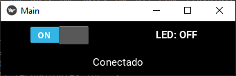
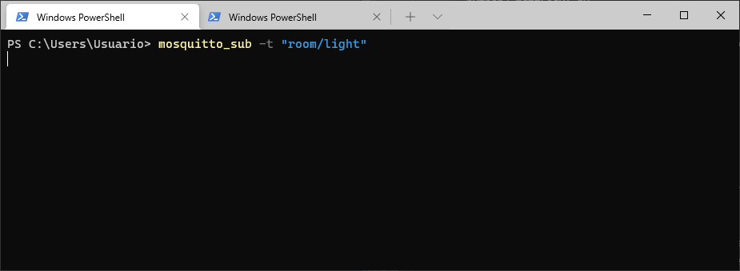
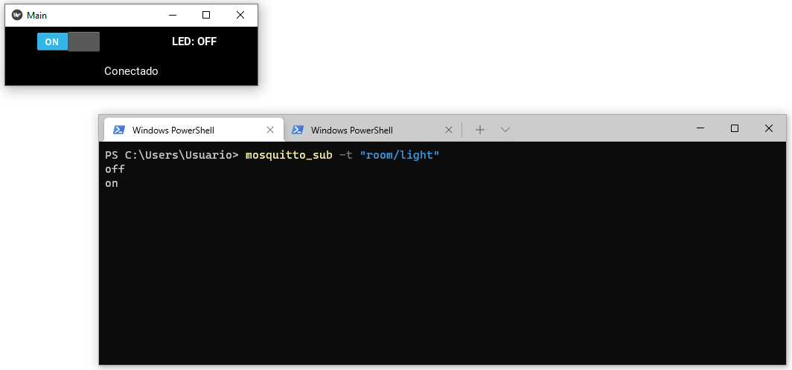
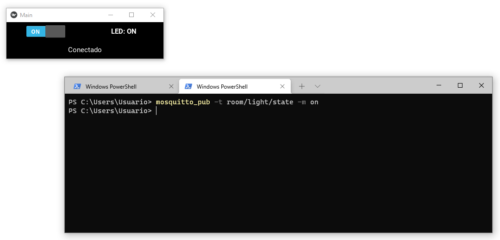
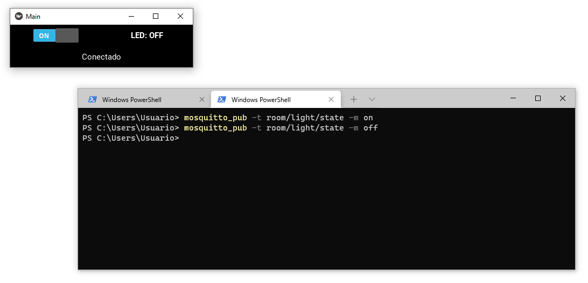
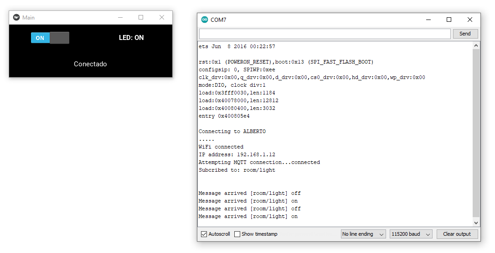

# Paso 3 - Implementación en python de un cliente MQTT empleando interfaces graficas

## Requisitos previos

1. Mosquitto Broker.
2. Python Paho.
3. Kivy.

## Hardware

El hardware será el mismo que se ha venido trabajando en el [Paso 1 - Implentacion del programa en la plataforma](../mqtt_paso1/)

### Lista de componentes

|Elemento|Descripcion|
|--|--|
|1|Placa de desarrollo ESP32|
|2|Led|
|3|Resistencia de 330 Ohm|

### Conexión

A continuación se muestra el diagrama de conexión. El led se conecta al puerto P26 (GPIO26) de la tarjeta como se muestra a continuación:


Notese que respecto a la implementación de hardware (componentes y conexión) no cambia para nada.


### Software del ESP

El software que se descarga al ESP32 no cambia para nada tampoco. La siguiente tabla implementa los topicos y los comandos empleados para que el hardware interactue mediante MQTT:

|Type|Topic|Messaje|
|---|---|---|
|Subscriber|```room/light```| <ul><li>```on``` : Comando que al ser recibido enciende el led led</li><li>```off``` : Comando empleado para apagar el led</li></ul> |
|Publisher|```room/light/state```| <ul><li>```on``` : Mensaje que indica que el led conectado al ESP esta encendido</li><li>```off``` : Indicador de que el led conectado al ESP esta apagado </li></ul> |

A continuación se muestra el software del ESP32 (no olvidar configurar los parametros del programa de acuerdo a los de su red local):

```ino
/***************************************************************************************
MQTT_Light_Example.ino
Example for controlling a light using MQTT
by: Alex Wende, SparkFun Electronics

This sketch connects the ESP32 Thing Plus to a MQTT broker and subcribes to the topic
room/light. When "on" is recieved, the pin LIGHT_PIN is set HIGH.
When "off" is recieved, the pin LIGHT_PIN is set LOW.
****************************************************************************************/

#include <WiFi.h>
#include <PubSubClient.h>

// WiFi Network Credentials
const char *ssid = "-----";   // name of your WiFi network
const char *password = "-----"; // password of the WiFi network


// MQTT Network
IPAddress broker(192,168,0,-);       // IP address of your MQTT broker eg. 192.168.1.4
const byte LIGHT_PIN = 26;           // Pin to control the light with P26 (GPIO26)
const char *ID = "light001";    // Name of our device, must be unique
const char *TOPIC = "room/light";  // Topic to subcribe to
const char *STATE_TOPIC = "room/light/state";  // Topic to publish the light state to


WiFiClient wclient;

PubSubClient client(wclient); // Setup MQTT client

// Handle incomming messages from the broker
void callback(char* topic, byte* payload, unsigned int length) {
  String response;

  for (int i = 0; i < length; i++) {
    response += (char)payload[i];
  }
  Serial.print("Message arrived [");
  Serial.print(topic);
  Serial.print("] ");
  Serial.println(response);
  if(response == "on")  // Turn the light on
  {
    digitalWrite(LIGHT_PIN, HIGH);
    client.publish(STATE_TOPIC,"on");
  }
  else if(response == "off")  // Turn the light off
  {
    digitalWrite(LIGHT_PIN, LOW);
    client.publish(STATE_TOPIC,"off");
  }
}

// Connect to WiFi network
void setup_wifi() {
  Serial.print("\nConnecting to ");
  Serial.println(ssid);

  WiFi.begin(ssid, password); // Connect to network

  while (WiFi.status() != WL_CONNECTED) { // Wait for connection
    delay(500);
    Serial.print(".");
  }

  Serial.println();
  Serial.println("WiFi connected");
  Serial.print("IP address: ");
  Serial.println(WiFi.localIP());
}

// Reconnect to client
void reconnect() {
  // Loop until we're reconnected
  while (!client.connected()) {
    Serial.print("Attempting MQTT connection...");
    // Attempt to connect
    if(client.connect(ID)) {
      client.subscribe(TOPIC);
      Serial.println("connected");
      Serial.print("Subcribed to: ");
      Serial.println(TOPIC);
      Serial.println('\n');
    } else {
      Serial.println(" try again in 5 seconds");
      // Wait 5 seconds before retrying
      delay(5000);
    }
  }
}

void setup() {
  Serial.begin(115200); // Start serial communication at 115200 baud
  pinMode(LIGHT_PIN, OUTPUT); // Configure LIGHT_PIN as an output
  delay(100);
  setup_wifi(); // Connect to network
  client.setServer(broker, 1883);
  client.setCallback(callback);// Initialize the callback routine
}

void loop() {
  if (!client.connected())  // Reconnect if connection is lost
  {
    reconnect();
  }
  client.loop();
}
```

## Software de aplicación

Este consiste en el script de python que permitira realizar el control del encendido y apagado del led conectado al ESP32 mediante el protocolo MQTT. A diferencia de la aplicación implementada en el [paso 2](../mqtt_paso2/), en este caso, la aplicación grafica, ademas de implementar el envio de comandos para encender y apagar el led mediante ```publish```, tambien recibe la información, sobre el estado del led (encendido o apagado), enviada desde el ESP32. Para esto ultimo, la aplicación python suscribe al topic desde el cual el ESP32 publica el estado del led. La implementación del cliente MQTT implementado en el script de python se resume en la siguiente tabla: 

|Type|Topic|Messaje|
|---|---|---|
|Publisher|```room/light```| <ul><li>```on``` : Comando que al ser recibido enciende el led led</li><li>```off``` : Comando empleado para apagar el led</li></ul> |
|Subscriber|```room/light/state```| <ul><li>```on``` : Mensaje que indica que el led conectado al ESP esta encendido</li><li>```off``` : Indicador de que el led conectado al ESP esta apagado </li></ul> |

A continuación se implementa el codigo del python ([mqttLedUI.py](mqttLedUI.py)) de la aplicación:


```python

import sys
import glob
import paho.mqtt.client as mqtt

from kivy.app import App
from kivy.uix.boxlayout import BoxLayout
from kivy.uix.button import Button
from kivy.uix.textinput import TextInput
from kivy.uix.label import Label
from kivy.uix.switch import Switch
from kivy.uix.dropdown import DropDown
from kivy.logger import Logger

# Variables de la aplicacion
BROKER_IP = "IP_BROKER"
TOPIC = "room/light"
TOPIC_STATE = "room/light/state"

# Comandos
messLampOn = "on"
messLampOff = "off"

CLIENT_ID = "roomLamp_001"

class MainApp(App):   
        
    def on_start(self):      
        self.conect_status = False
        print("Configurando cliente mqtt...")
        self.mqtt_client=mqtt.Client(client_id=CLIENT_ID)
        self.mqtt_client.connect(BROKER_IP, 1883, 60) #connect to broker
        self.mqtt_client.on_connect = self.on_connect #attach function to callback
        self.mqtt_client.on_message = self.on_message #attach function to callback

        self.mqtt_client.loop_start() #start the loop        
        print("Subscribing to topic: ", TOPIC_STATE)
        self.mqtt_client.subscribe(TOPIC_STATE)
        return super().on_start()
        
    def on_stop(self):
        self.lightOFF()       
        self.mqtt_client.disconnect()        
        self.connection_status.text = "Desconectado"
        self.light_switch.disabled = True
        print("Conexion MQTT Terminada...")
        print("Cerrando la aplicacion")
            
    def build(self):        
        # -------------------------- Main layout -------------------------- #
        main_layout = BoxLayout(orientation="vertical")
        
        # -------------------------- Top layout -------------------------- #
        self.top_layout = BoxLayout(orientation="horizontal")        
        # Top layout - light_switch (Switch)
        self.light_switch = Switch(active=True)
        self.light_switch.disabled = True

        self.light_switch.bind(active=self.change_light)
        self.top_layout.add_widget(self.light_switch)        
        # Top layout - light_status (Label)
        self.light_status = Label(text='[b]LED[b]: OFF',markup=True)
        self.top_layout.add_widget(self.light_status)
        
        # -------------------------- Botton layout -------------------------- #
        self.botton_layout = BoxLayout(orientation="horizontal")                             
        # Botton layout - connection_status (Label)
        self.connection_status = Label(text='Desconectado')
        self.botton_layout.add_widget(self.connection_status)
                 
        # Agregando elementos al widget principal
        main_layout.add_widget(self.top_layout)
        main_layout.add_widget(self.botton_layout)        
        return main_layout
    
    def change_light(self, instance, value):
        if(value == True):            
            self.lightON()
        else:
            self.lightOFF()
    
    def on_connect(self, client, userdata, flags, rc):
        if(rc == 0):
            print("Conexión MQTT aceptada")
            self.conect_status = True
            self.connection_status.text = "Conectado"             
            self.light_switch.disabled = False
            self.conect_status = True
        else:
            print("Conexión MQTT rechazada")
            self.conect_status = False
        # ToDo: Agregar el caso donde no sea posible la conexion

    def on_message(self, mqttc, obj, msg):
        print(msg.payload)
        if(msg.payload == b'on'):
            self.light_status.text='[b]LED[b]: ON'
        else:
            self.light_status.text='[b]LED[b]: OFF'

    def lightON(self):
        print("--> Encendiendo la lampara\n")
        self.mqtt_client.publish(TOPIC, messLampOn)  # Uso de publish para prender la lampara

    def lightOFF(self):
        print("--> Apagando la lampara\n")
        self.mqtt_client.publish(TOPIC, messLampOff) # Uso de publish para apagar la lampara

if __name__ == "__main__":
    app = MainApp()
    app.run()
```

## Pruebas

Antes de empezar debera verificar que el broker se encuentra en ejecución. A continuación se describen las diferentes pruebas a llevar a cabo.

### Prueba 1 - Verificación de la aplicación de escritorio

Una vez codificado el ejemplo [mqttLedUI.py](mqttLedUI.py), modifique los parametros necesarios para su funcionamiento. Inicialmente, haga la prueba en su maquina configurando la variable asociada a la IP del broker con la del localhost (```BROKER_IP = "127.0.0.1"```), asi:

```python
#...
from kivy.logger import Logger

# Variables de la aplicacion
BROKER_IP = "IP_BROKER"
TOPIC = "room/light"
TOPIC_STATE = "room/light/state"

# ...
```

Una vez hecho esto, inicie la ejecución de la aplicación mediante el comando:

```bash
python3 mqttLedUI.py
```

Si todo esta bajo control, debera salir una interfaz grafica como la mostrada a continuación:



* **Verificación del comando de control del led**: Como se dijo previamente, la interfaz permite el control de encendido y apagado del led mediante el envio del comando de encendido (**on**) o apagado (**off**). Para ello, verificar esto, se usa una terminal de mosquitto que suscriba al topico en el cual la interfaz grafica publica el comando, asi:



Para probar que en efecto, la interfaz envia los comandos correctamente mediante el **switch button** se envia los comandos por MQTT y su todo esta bien el resultado se debe mostrar en la terminal anteriormente creada:




* **Verificación del mensaje enviado desde el ESP**: Como se dijo previamente, cuando el led conectado al ESP32 cambia de estado; el ESP32 le notifica a la aplicación de escritorio publicando el mensaje que indica el estado del led (**ON/OFF**) a traves del topico ```room/light/state```. Como la aplicación de escritorio es la que despliega el estado del led, esta debe estar suscrita a dicho topico para recibir el mensaje de estado del led enviado desde el ESP32. Para comprobar que esto esta bien, lo que se hace es enviar abrir una terminal de mosquitto para simular el mensaje que se publicaria desde el ESP32 cuando se cambia el estado del led y verificar si la parte de la interfaz encargada de la logica de recepción del mensaje responde de acuerdo a lo que se espera. 

Si se quiere probar el caso en el cual el led del ESP32 es encendido, se abre una terminal a parte y se emplea el siguiente comando:

```bash
mosquitto_pub -t room/light/state -m on
```
La salida esperada se muestra a continuación:



Notese de la figura anterior, que en la interfaz, el indicador del estado del led queda como **LED: ON**. De manera similar para probar el caso en el cual desde el ESP32 se manda el indicador de mensaje apagado se deberá emplear el siguiente comando:

```bash
mosquitto_pub -t room/light/state -m off
```

Tal y como lo muestra en la siguiente figura, el indicador del estado del led para tener el mensaje **LED: OFF** tal y como se muestra a continuación:



Una vez hecho todo esto, puede proceder a cerrar las terminales de mosquito y seguir con la prueba que integrara el hardware con el software.

### Prueba 2 - Verificación de la aplicación de hardware

Este procedimiento consiste en verificar que el programa que se ejecuta en el microcontrolador esta bien tal y como se hizo en el [paso 1](../mqtt_paso1/). Como esto ya se realizó, omitimos el procedimiento.

### Prueba 3 - Verificación de la aplicación completa

El último paso consiste en juntar todo **Software de aplicación + Hardware**, para este fin siga los siguientes pasos:
1. Verifique el el mosquitto esta en ejecución y verifique la IP del equito donde esta corriendo el broker.

2. Configure el programa del hardware con los parametros de la red y la IP del broker. Luego descarguelos y si quiere observar con animo de debug use la terminal serial. 


* **Configuración de la red wifi**:
  
  |Variable| Valor|
  |---|---|
  |```*ssid```|```"WIFI_LIS"```|
  |```*password```|""|

* **Configuración de la red MQTT**:

Asumiendo que el broker se encuentra en ejecución en la IP ```192.168.1.4``` tenemos:

|Variable|Valor|
|---|---|
|```broker(192,168,1,-)```|```broker(192,168,1,4)```|
|```*ID```|```light_01```|
|```LIGHT_PIN```|```26```|
|```*TOPIC```|```room/light```|
|```*STATE_TOPIC```|```room/light/state```|


3. Ejecute el programa de escritorio y mediante el envio de comandos verifique que el led se esta encendiento y apagando cada vez que se envia una peticion.



## Referencias

* https://docs.microsoft.com/es-es/windows/dev-environment/
* https://github.com/urielgarrido/PDF-Campus-Digital-House-Android/tree/master/Campus%20Digital%20House%20Android/Android
* https://github.com/jmalte01/grupo_6_solucionesEnSeguridad
* https://webpages.charlotte.edu/~jmconrad/
* https://webpages.charlotte.edu/~jmconrad/Stiquito_Controlled.htm
* https://webpages.charlotte.edu/~jmconrad/StiquitoControlled/Book3_Chapter02_Figure06.pdf
* https://webpages.charlotte.edu/~jmconrad/index.html
* https://webpages.charlotte.edu/~jmconrad/Stiquito_Applications/ECE_292_syllabus.htm
* https://webpages.charlotte.edu/~jmconrad/AskDrRobot.htm
* https://webpages.charlotte.edu/~jmconrad/classes.htm
* https://webpages.charlotte.edu/~jmconrad/EducationalMaterials/index.html
