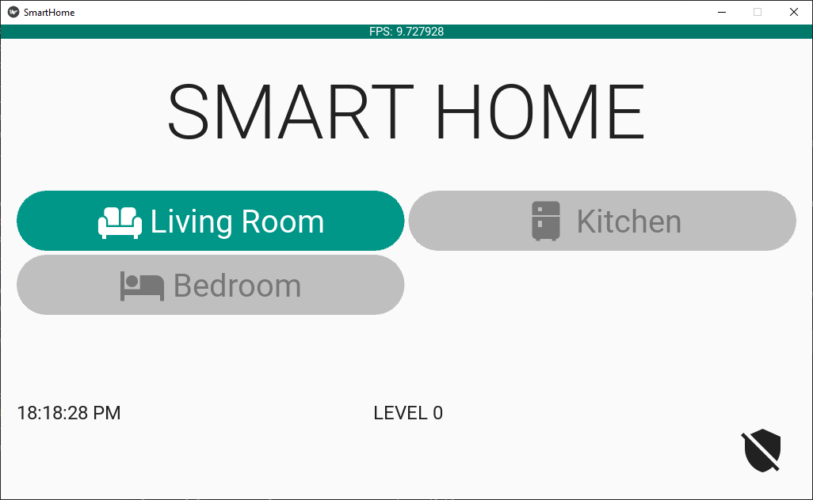
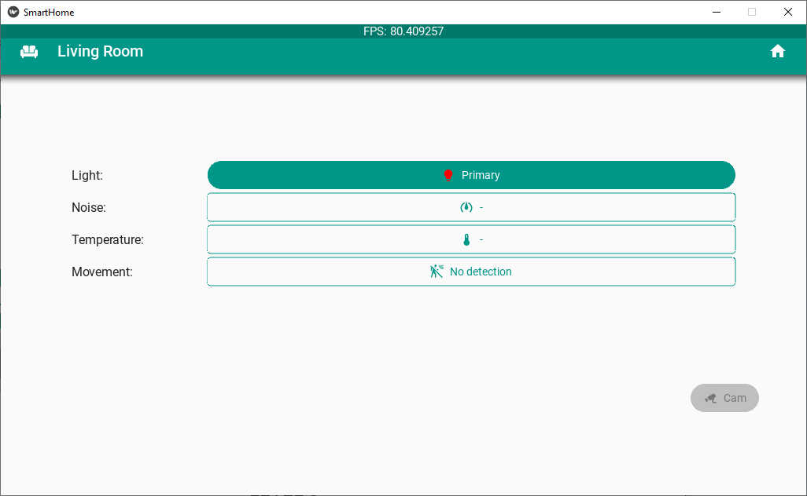

# Interfaz grafica

## Prerequisitos

## Instalación del entorno virtual

En este caso, ya se dispone de un archivo **requirements.txt** cuyo contenido es el siguiente:

```
certifi==2022.12.7
charset-normalizer==3.1.0
docutils==0.19
idna==3.4
Kivy==2.1.0
kivy-deps.angle==0.3.3
kivy-deps.glew==0.3.1
kivy-deps.sdl2==0.4.5
Kivy-examples==2.1.0
Kivy-Garden==0.1.5
paho-mqtt==1.6.1
Pillow==9.4.0
Pygments==2.14.0
pypiwin32==223
pyserial==3.5
python-dotenv==1.0.0
pywin32==305
requests==2.28.2
urllib3==1.26.15
```

La ventaja de tener este archivo es que la instalación de todos los prerequisitos se hace mas facil pues nos ahorramos la ejecución de los comandos pip install intividuales:

```
python -m venv mqtt_env
.\mqtt_env\Scripts\activate # Windows
# source mqtt_env/bin/activate # Linux
pip install -r requirements.txt
```

De alli en adelante se procede a trabajar en el desarrollo como siempre y cuando vamos a salirnos lo hacemos ejecutando el comando:

## Ejemplo a montar

### Interfaz casa



### Interfaz sala



## Referencias

* https://docs.python-guide.org/dev/virtualenvs/
* https://rukbottoland.com/blog/tutorial-de-python-virtualenv/
* https://pythonbasics.org/virtualenv/
* https://realpython.com/python-virtual-environments-a-primer/
* https://learn.microsoft.com/es-es/windows/dev-environment/

