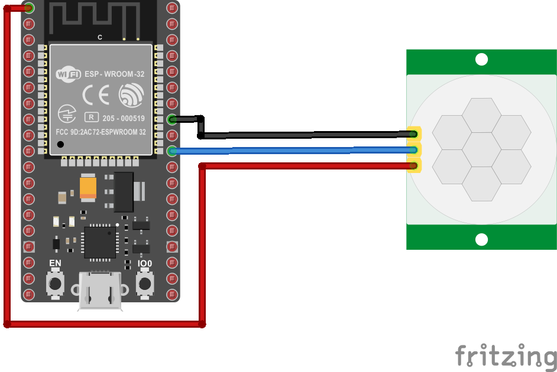
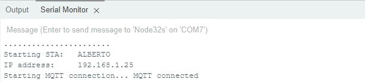
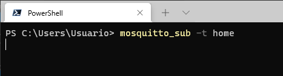
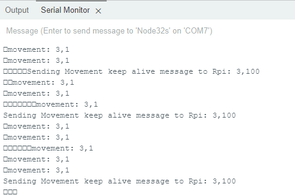
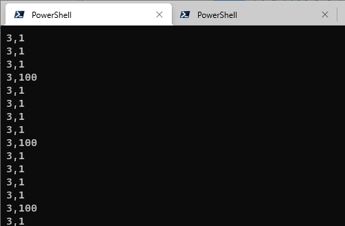
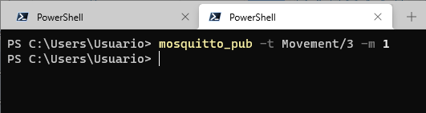
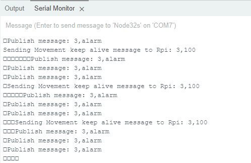
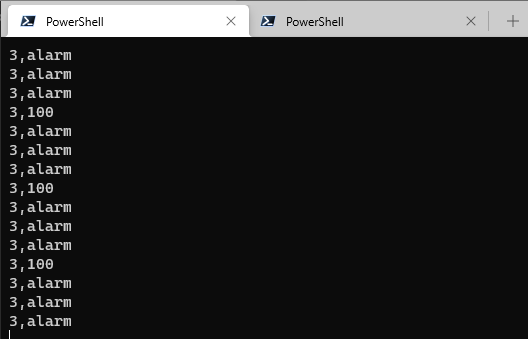
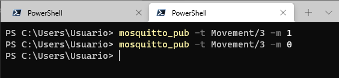

# ESP32 - PIR

## Descripción

El siguiente código permite la activación de una alarma que usa un **sensor PIR HC-SR501** para detectar presencia. La alarma puede ser activada o desactivada de acuerdo al modo de funcionamiento que se configura mediante el envio de un comando usando protocolo MQTT. Asi mismo, cuando una persona es detectada, la alarma, si la alarma ha sido activada, esta informa la presencia enviando un mensaje a los elementos interesados dentro de la red MQTT a la cual pertenece.

La siguiente tabla muestra los diferentes clientes y su rol que permiten la integración de la alarma en la red MQTT:

| ID Dispositivo | Nombre |Rol|Topic (message-topic)|Mensaje (message)|Observaciones|
|---|---|---|---|---|---|
| 3 |```ESPClient_2```|publisher| ```home```|<ul><li>```3,1```<li>```3,alarm```<li>```3,100```</ul>|<ul><li>**```3,1```**: Explicar...<li>**```3,alarm```**: Explicar.<li>**```3,100```**: Explicar...</ul>|
|3 |```ESPClient_2```|susbcriber|```Movement/3```|```---```|La recepción de los siguientes comandos causa el siguiente efecto en el ESP32: <ul><li> **```1```**: Modo vigia <li> **```0```**: Modo normal </ul>  |

## Componentes

|#|Descripción|Cantidad|
|---|---|---|
|1|Placa ESP32|1|
|2|Sensor PIR HC-SR501|1|

El hardware se muestra a continuación:



## Codigo 

El código fue tomado de la siguiente [página](https://github.com/jilopezv/IoT/tree/newModel/things-arduino/PIR_MQTT_esp32). Como se puede observar, el codigo completo de la aplicación se compone (a diferencia de los que se han analizado previamente) de varios archivos los cuales se listan a continuación:
* [config.h](PIR_MQTT_esp32/config.h)
* [ESP32_Utils.hpp](PIR_MQTT_esp32/ESP32_Utils.hpp)
* [ESP32_Utils_MQTT.hpp](PIR_MQTT_esp32/ESP32_Utils_MQTT.hpp)
* [MQTT.hpp](PIR_MQTT_esp32/MQTT.hpp)
* [PIR_MQTT_esp32.ino](PIR_MQTT_esp32/PIR_MQTT_esp32.ino)

Para comprender el funcionamiento de los archivos [config.h](PIR_MQTT_esp32/config.h), [ESP32_Utils.hpp](PIR_MQTT_esp32/ESP32_Utils.hpp), [ESP32_Utils_MQTT.hpp](PIR_MQTT_esp32/ESP32_Utils_MQTT.hpp), [MQTT.hpp](PIR_MQTT_esp32/MQTT.hpp) se recomienda que consulte la pagina **CÓMO USAR MQTT EN EL ESP8266/ESP32** ([link](https://www.luisllamas.es/como-usar-mqtt-en-el-esp8266-esp32/)) pues estos archivos se adaptaron de esta pagina. 

A continuación se muestra el archivo [PIR_MQTT_esp32.ino](PIR_MQTT_esp32/PIR_MQTT_esp32.ino) que es el que implementa la logica de la cosa de acuerdo a la descripción:

```ino
/* ----- Include Libraries ----- */
#include <WiFi.h>
#include <PubSubClient.h>

/* ----- Third Libraries ----- */
#include "config.h"  // Set your network SSID and password in this file
#include "MQTT.hpp"
#include "ESP32_Utils.hpp"
#include "ESP32_Utils_MQTT.hpp"

/* ----- Ports ----- */
#define PIR_MOTION_SENSOR 5               // Pin for PIR sensor in the esp32 board

/* ----- Variables ----- */
long mov_timer = 0;
long ka_timer = 0;

char msg[50];
int value = 0;

// Variable state represents home state-> 0 normal  - 1 lookout
char home_state = 0;

/* Topics */
char topic[] = "home";

/* ----- Main funtions ----- */

// setup
void setup() {
  // set PIN_PIR a pin as an input
  pinMode(PIR_MOTION_SENSOR, INPUT);   
  // Serial setup
  Serial.begin(115200);  
  ConnectWiFi_STA(false);
  InitMqtt();
  delay(5000);
}

// loop
void loop() {
  HandleMqtt();
  long now = millis(); 
  //get PIR data each 500ms 
  if (now - mov_timer > 500) { 
    mov_timer = now;
    Serial.print(home_state);
    if(digitalRead(PIR_MOTION_SENSOR)){//if it detects the moving people?
        if (home_state){
          // lookout state      
          //Serial.println("Hi,people is coming");
          snprintf (msg, 50, "3,alarm");
          Serial.print("Publish message: ");
          Serial.println(msg);
          // sending alarm to gateway!!!
          //client.publish("casa/pir", msg);
          PublisMqttString(topic, msg);
        } else{
          // normal state and movement detected
          snprintf (msg, 50, "3,1");
          Serial.print("movement: ");
          Serial.println(msg);
          PublisMqttString(topic, msg);
        }
    }
  }

  // Sending Keep Alive message each 5 seconds
  if (now - ka_timer > 5000) { 
    ka_timer = now;
    // DeviceID=3,ONLINE_STATE
    snprintf (msg, 50, "3,100" );
    Serial.print("Sending Movement keep alive message to Rpi: ");
    Serial.println(msg);
    PublisMqttString(topic, msg);
  }
  
}
```

Antes de adaptar la plantilla a nuestro ejemplo, es necesario conocer la información solicitada en la siguiente tabla:

|Dato|Valor|
|---|---|
|IP del broker|Consultar la IP con el comando ```ifconfig``` o ```ipconfig```|
|SSID AP|Elegir el access point de la red|
|Pasword AP|Consultar el password del access point o dejar el valor vacio si no tiene|

La configuración del broker se lleva a cabo modificando la variable asociada a la IP donde se esta ejecutando el broker (```MQTT_BROKER_ADRESS```) en el archivo [MQTT.hpp](PIR_MQTT_esp32/MQTT.hpp). Este archivo es sumamente importante pues aqui se lleva a cabo la implementación de la función de suscripción del cliente (SuscribeMqtt()) a un topico determinado (En este caso Motion/2) y se implementa la logica de recepción de un comando para la activación o desactivación del **modo alarma** en la función ```OnMqttReceived()```. A continuación se muestra este archivo completamente:

```hpp
const char* MQTT_BROKER_ADRESS = "192.168.1.4";
const uint16_t MQTT_PORT = 1883;
const char* MQTT_CLIENT_NAME = "ESPClient_2";

extern char home_state;

// Topics
const char* DEVICE_TYPE = "Movement";
const char* DEVICE_ID = "3";

WiFiClient espClient;
PubSubClient mqttClient(espClient);


char topic_sub[100];

void SuscribeMqtt() {
  sprintf(topic_sub,"%s/%s", DEVICE_TYPE, DEVICE_ID);
  mqttClient.subscribe(topic_sub);
}

String payload;

void PublisMqtt(char* topic, unsigned long data) {
   payload = "";
   payload = String(data);
   mqttClient.publish(topic, (char*)payload.c_str());
}

void PublisMqttString(char* topic, char* msg) {
   mqttClient.publish(topic, msg);
}

String content = "";

void OnMqttReceived(char* topic, byte* payload, unsigned int length) {
   Serial.print("Received on ");
   Serial.print(topic);
   Serial.print(": ");

   content = "";   
   for (size_t i = 0; i < length; i++) {
      content.concat((char)payload[i]);
   }
   Serial.print(content);
   Serial.println();

   //If payload is "1", change sensor state to lookout
   if ((char)payload[0]=='1')
     home_state = 1; // Set sensor state ->  1 lookout
   else
     home_state = 0; // Clear sensor state ->  0 normal
}
```

Por otro lado en el archivo [config.h](PIR_MQTT_esp32/config.h), se configura la información asociada al access point y al ... (preguntar que es la IP de lo otro).

```h
const char* ssid     = "SSID";
const char* password = "SSID_PASS";
const char* hostname = "ESP32_PIR_1"; 
IPAddress ip(192, 168, 200, 10); // 192.169.1.4
IPAddress gateway(192, 168, 200, 7); // 192.169.1.255
IPAddress subnet(255, 255, 255, 0); // 255.255.255.0
```

Una vez hecho esto, ya es posible descargar el codigo en la ESP32. Si todo esta bien, una vez descargado este código la ESP32 se deberá haber enganchado a la red Wifi y a la red MQTT mostrando un mensaje como el siguiente en el monitor serial:




## Pruebas

En la tabla mostrada al principio, vimos que en el ESP32 se implementaron un cliente que suscribia y uno que publicaba de modo que los objetivos de la prueba de test serán:
* Verificar que los mesajes que se estan publicando desde la ESP32 esten de acuerdo con la logica descrita en la tabla para el cliente que publica.
* Verificar, que el comportamiento del ESP32 responde de acuerdo con los requerimientos de la aplicación cuando este recibe el mensaje MQTT con el comando para configurar el modo de operación como alarma. Para esto se revisara que el cliente que suscribe en el ESP32 funcione adecuadamente al recibir un comando desde un cliente externo que publica.

Para realizar la prueba vamos a emplear los clientes **```mosquitto_pub```** y **```mosquitto_sub```** teniendo en cuenta que el broker **```mosquitto```** ha sido previamente iniciado. La siguiente tabla muestra los clientes implementados mediante los clientes mosquitto:

| Dispositivo | Aplicación |Rol|Topic (message-topic)|Mensaje (message)|Observaciones|Comando empleado|
|---|---|---|---|---|---|---|
| Computador |Cliente ```mosquitto_pub```|publisher| ```Movement/3```|Comandos enviados: <ul><li> **```1```**: Modo vigia <li> **```0```**: Modo normal </ul> |Estos comandos se envian al cliente que suscribe en el ESP32 activando o desactivando en este el modo vigia o modo normal|Comandos enviados desde la consola: <ul> <li>```mosquitto_pub -t Movement/3 -m 0```<li>```mosquitto_pub -t Movement/3 -m 1```</ul>|
|Computador |Cliente ```mosquitto_sub```|susbcriber|```home```|```---```| En la consola de este cliente se imprimiran los mensajes enviados desde el cliente que publica en el ESP32. Ma especificamente, los comandos mostrados serán: ```3,1```, ```3,alarm``` y ```3,100```|Comando ejecutado: <br>```mosquitto_sub -t home```|

Antes de empezar no olvide abrir la terminal que va a suscribir a ```home``` el comando ```mosquitto_sub -t home``` tal y como se muestra a continuación:



A continuación se muestra el orden de las pruebas realizado:

1. Se verificó el estado de operación **normal** del ESP32. En este caso el ESP32 publica al topico **```home```** los mensajes **```3,1```** y **```3,100```** lo cual se evidencia en la terminal serial del ESP32:

   
   
   Si todo esta bien, estos mensajes se deben desplegar en la consola del ```mosquitto_sub``` asociada a este topico como se muestra a continuación:

   

2. Se realizo la prueba de activación del **modo alarma**, para esto, se envio desde la terminal del **mosquito_pub** el mensaje con comando (```1```) para activar este modo al topico ```Motion/3``` tal y como se muestra en la siguiente figura:
   
   

   El efecto en el ESP32, es el cambio en lo que se imprime en consola serial tal y como se muestra en la siguiente figura:
   
   

   Notese de la figura anterior, que ya el ESP32 publica al topic ```home``` el mensaje que indica el estado de alarma ```3,alarm```. En la siguiente figura, se puede apreciar que en efecto el mensaje que recibe la consola **mosquitto_sub** muestra que el mensaje ha cambiado de ```3,1``` (lo que habia antes) a ```3,alarm``` (Mensaje de indicación de alarma).
   
   

3. Se realizo la prueba de desactivación del **modo alarma**, para esto, se envio desde la terminal del **mosquito_pub** el mensaje con comando ```0``` al topico ```Motion/3``` tal y como se muestra en la siguiente figura:
   
   
   
   El resultado sera nuevamente similar al caso normal tal y como se muestra a continuación:
   
   

