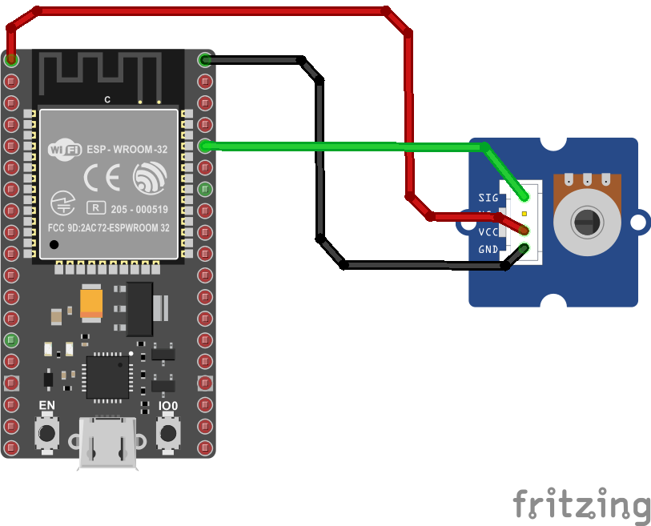
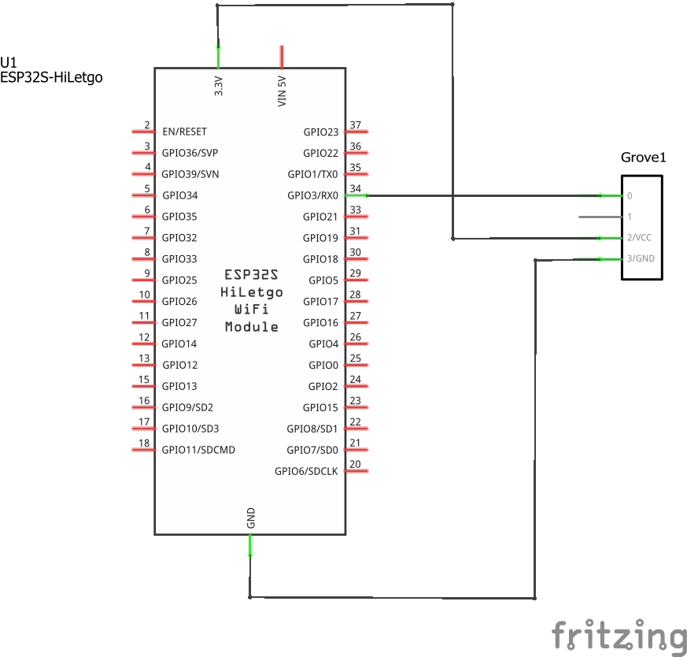
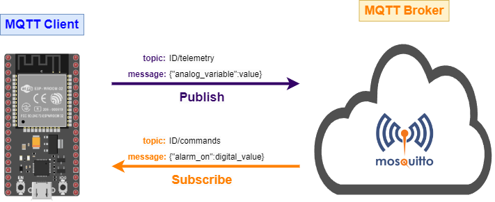
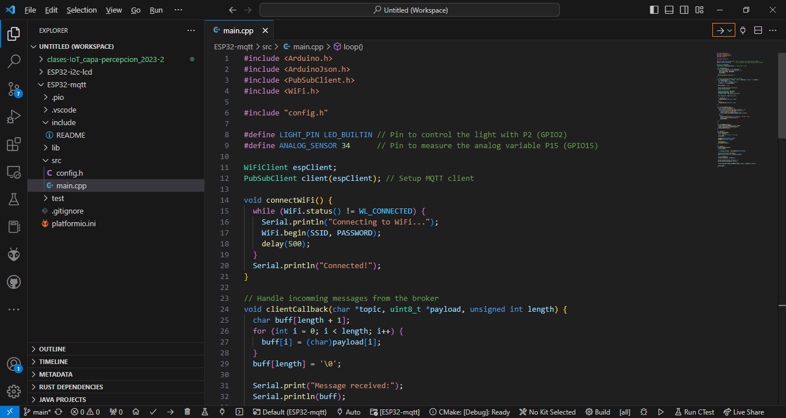
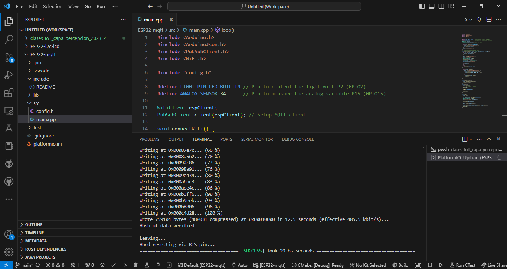
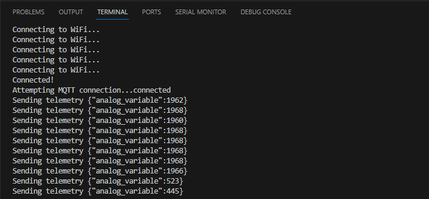

# Paso 1 - Implentacion del programa en la plataforma

> **Importante**: Este ejemplo se basa en el capitulo **Connect your device to the Internet** ([link](https://github.com/microsoft/IoT-For-Beginners/blob/main/1-getting-started/lessons/4-connect-internet/README.md)) del repositorio **IoT for Beginners** ([link](https://github.com/microsoft/IoT-For-Beginners/tree/main)) de Microsoft.  


## Hardware

### Lista de componentes

|Elemento|Descripcion|
|--|--|
|1|Placa de desarrollo ESP32|
|2|Grove - Rotary Angle Sensor|


### Conexion

A continuación se muestra el diagrama de conexión de la cosa (thing) la cual esta implementada en un ESP32. 



El esquematico se muestra a continuación:



## Sofware

### Cliente MQTT implementado en el ESP32

El programa implementado en el ESP32 (thing) permite la medición de una variable Analoga (potenciometro) y el encendido y apagado de un led (el que viene integrado en la tarjeta) mediante el uso del protocolo MQTT. La siguiente tabla muestra la información asociada al protocolo MQTT:

|Type|Topic|Messaje|
|---|---|---|
|Subscriber|```ID/commands```| <ul><li>**```{"alarm_on": 1}```**: Comando enviado para encender el led. <li> **```{"alarm_on": 0}```**: Comando enviado para apagar el led.</ul>|
|Publisher|```ID/telemetry```| ```{"analog_variable":valor}```: Mensaje que contiene el valor de la variable medida.|

En la tabla anterior, el ```ID``` es el identificador de la cosa (el cual debe ser unico dentro de la red MQTT). El ESP32, se conectara a un broker publico el cual se encuentra en la URL *test.mosquitto.org*. La siguiente tabla describe esto:

|Variable|Valor|Observaciones|
|---|---|---|
|```BROKER```|```"test.mosquitto.org"```|Dirección del broker|
|```ID```|```IOT_UDEA-001```|Identificador de la **cosa** en la red|
|```CLIENT_NAME```|```ID + "sensor_client"```|Nombre del cliente|
|```CLIENT_TELEMETRY_TOPIC```|```ID + "/telemetry"```|Topico a traves del cual el ESP32 envia (publica) la información asociada al sensor analogo leido|
|```SERVER_COMMAND_TOPIC```|```ID + "/commands"```|Topico a traves del cual el ESP32 recibe (suscribe) el comando para el encendido y apagado del led|

Finalmente, es importante tener en cuenta que la aplicación del ESP32 usa comunicación serial por UART para mostrar los mensajes enviados con la información del valor medido por el sensor y los valores recibidos asociados al comando que prende y apaga el led.

### Configuración de la red wifi
  
  |Variable| Valor|Observaciones|
  |---|---|---|
  |```*SSID```|```"WIFI_LIS"```|Nombre del Access Point a la que se conectara el ESP32|
  |```*PASSWORD```|```""```|Passoword del Access Point al que se conectara el ESP32|

### Anatomia del proyecto en platformio

El proyecto se desarrollo en platformio. A continuación resaltamos los tres archivos mas importantes:

* **platformio.ini**: Archivo de configuración del proyecto. Aqui se configura la tarjeta empleada (en este caso la nodemcu-32s) y las liberias empleadas:
  
  ```ini
  [env:nodemcu-32s]
  platform = espressif32
  board = nodemcu-32s
  framework = arduino
  lib_deps = 
    knolleary/PubSubClient @ 2.8
    bblanchon/ArduinoJson @ 6.17.3
  ```

* **config.h**: Parametros de configuración de la red Wifi, la red MQTT y demas parametros asociados a la cosa (ESP32). Modifique los valores de acuerdo a una configuración similar a la dada en la segunda tabla:
  
  ```h
  #pragma once

  #include <string>

  using namespace std;

  // WiFi credentials
  const char *SSID = "<SSID>";
  const char *PASSWORD = "<PASSWORD>";

  // MQTT settings
  const string ID = "<ID>";

  const string BROKER = "test.mosquitto.org";
  const string CLIENT_NAME = ID + "sensor_client";

  const string CLIENT_TELEMETRY_TOPIC = ID + "/telemetry";
  ```

* **main.cpp**: Programa que implementa la logica del cliente:
  
    ```cpp
    #include <Arduino.h>
    #include <ArduinoJson.h>
    #include <PubSubClient.h>
    #include <WiFi.h>
    
    #include "config.h"
    
    #define LIGHT_PIN LED_BUILTIN // Pin to control the light with P2 (GPIO2)
    #define ANALOG_SENSOR 34      // Pin to measure the analog variable P15 (GPIO15)
    
    WiFiClient espClient;
    PubSubClient client(espClient); // Setup MQTT client
    
    void connectWiFi() {
      while (WiFi.status() != WL_CONNECTED) {
        Serial.println("Connecting to WiFi...");
        WiFi.begin(SSID, PASSWORD);
        delay(500);
      }
      Serial.println("Connected!");
    }
    
    // Handle incomming messages from the broker
    void clientCallback(char *topic, uint8_t *payload, unsigned int length) {
      char buff[length + 1];
      for (int i = 0; i < length; i++) {
        buff[i] = (char)payload[i];
      }
      buff[length] = '\0';
    
      Serial.print("Message received:");
      Serial.println(buff);
    
      DynamicJsonDocument doc(1024);
      deserializeJson(doc, buff);
      JsonObject obj = doc.as<JsonObject>();
    
      bool alarm_on = obj["alarm_on"];
    
      if (alarm_on) {
        digitalWrite(LIGHT_PIN, HIGH);
      }
      else {
        digitalWrite(LIGHT_PIN, LOW);
      }
    }
    
    void reconnectMQTTClient() {
      while (!client.connected()) {
        Serial.print("Attempting MQTT connection...");
        if (client.connect(CLIENT_NAME.c_str())) {
          Serial.println("connected");
          client.subscribe(SERVER_COMMAND_TOPIC.c_str());
        }
        else {
          Serial.print("Retying in 5 seconds - failed, rc=");
          Serial.println(client.state());
          delay(5000);
        }
      }
    }
    
    void createMQTTClient() {
      client.setServer(BROKER.c_str(), 1883);
      client.setCallback(clientCallback);
      reconnectMQTTClient();
    }
    
    void setup() {
      Serial.begin(9600);
      while (!Serial)
        ; // Wait for Serial to be ready
      delay(1000);
    
      pinMode(ANALOG_SENSOR, INPUT);
      pinMode(LIGHT_PIN, OUTPUT);
    
      connectWiFi();
      createMQTTClient();
    }
    
    void loop() {
      reconnectMQTTClient();
      client.loop();
    
      int analog_variable = analogRead(ANALOG_SENSOR);
    
      DynamicJsonDocument doc(1024);
      doc["analog_variable"] = analog_variable;
    
      string telemetry;
      serializeJson(doc, telemetry);
    
      Serial.print("Sending telemetry ");
      Serial.println(telemetry.c_str());
    
      client.publish(CLIENT_TELEMETRY_TOPIC.c_str(), telemetry.c_str());
    
      delay(1000);
    }
    ```

### Cliente MQTT asociado al ESP32

La siguiente siguiente figura muestra la red MQTT con el ESP32 como unico cliente:



### Descargando la aplicación

En la siguiente figura se muestra el archivo **main.cpp** en Platformio. Para descargarlo, se presiona la flecha (recuadro naranja en la figura):



Si el programa se descarga con exito en la ESP32, la salida será similar a la mostrada a continuación:



En la siguiente figura muestra el monitor serial con el programa en funcionamiento:



## Prueba

En construcción...

## Cliente python


## Referencias

* https://www.seeedstudio.com/blog/2021/02/19/build-an-mqtt-intercom-with-wio-terminal-with-code/
* https://files.seeedstudio.com/products/SenseCAP/114992170/Developer%20Guide%20for%20Private%20MQTT%20Messaging%20of%20SenseCAP%20SensorHub%20v2.0.pdf
* https://www.hackster.io/Salmanfarisvp/mqtt-on-wio-terminal-4ea8f8
* https://www.seeedstudio.com/Wio-Terminal-Getting-Started-with-TinyML-Kit-p-5324.html
* https://www.seeedstudio.com/environment-monitoring.html
* https://www.seeedstudio.com/Wio-Terminal-p-4509.html
* https://www.seeedstudio.com/IoT-for-beginners-with-Seeed-and-Microsoft-Wio-Terminal-Starter-Kit-p-5006.html
* https://www.seeedstudio.com/iot_into_the_wild.html
* https://wiki.keyestudio.com/KS0085_Keyestudio_Smart_Home_Kit_for_Arduino
* https://keyestudio.com/
* https://wiki.keyestudio.com/Main_Page
* https://thingsboard.io/docs/samples/raspberry/grove/
* https://www.seeedstudio.com/IoT-for-beginners-with-Seeed-and-Microsoft-Wio-Terminal-Starter-Kit-p-5006.html
* https://xtrium.com/esp32-wont-connect-to-wifi/
* https://randomnerdtutorials.com/solved-reconnect-esp32-to-wifi/


  