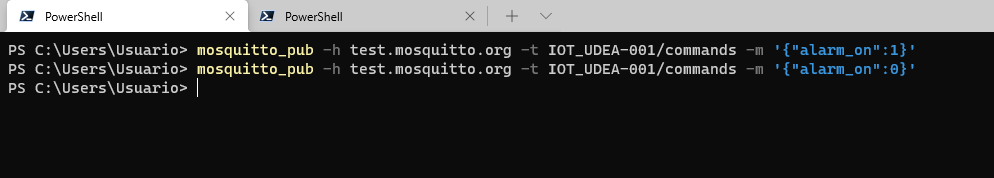

# Prueba usando el cliente mosquito pub y sub

En construcción...

## Topologia


* **Terminales que simulan el ESP32**:

|Terminal|Type|Topic|Comando en mosquito|Observaciones|
|---|---|---|---|---|
|1|Subscriber|```ID/#```|```mosquitto_sub -h test.mosquitto.org -t IOT_UDEA-001/#```|Terminal donde se observan todos los topicos asociados a la cosa ```ID```|
|2|Publisher|```ID/commands```|<ul><li>**Led on**: <br> ```mosquitto_pub -h test.mosquitto.org -t IOT_UDEA-001/commands -m '{"alarm_on":1}'``` </li>**Led off**: <br> ```mosquitto_pub -h test.mosquitto.org -t IOT_UDEA-001/commands -m '{"alarm_on":0}'``` </li>|Terminal que simulara los comandos que se envian al ESP32 para prender y apagar las luces|
 

Para realizar las pruebas registre primero las terminales que funcionaran como suscriptores, tal y como se muestra en el siguiente orden:

**Terminal 1**: Subscriber

El comando digitado en la consola es:

```bash
mosquitto_sub -h test.mosquitto.org -t IOT_UDEA-001/#
```

Si todo esta bien, en esta consola se empezaran a observar todos los mensajes enviados al ESP32. En la siguiente figura se muestran los mensajes asociados a las mediciones:


Como esta terminal esta suscrita a todos los topicos ```ID/#```, los mensajes enviados para encender y apagar el led, tambien se mostraran aqui, la siguiente figura resalta esto:


* **Terminal 2**: Publisher

En esta terminal se envian los comandos de encendido y apagado del led:
* **Encendido del led**:
  
  ```bash
  mosquitto_pub -h test.mosquitto.org -t IOT_UDEA-001/commands -m '{"alarm_on":1}'
  ```
    
* **Apagado del led**:
  
  ```bash
  mosquitto_pub -h test.mosquitto.org -t IOT_UDEA-001/commands -m '{"alarm_on":0}'
  ```

En la siguiente figura se muestra el resultado de enviar los comandos para encender y apagar el led:



La siguiente figura, muestra la salida en el monitor serial conectado a la ESP32. Notese que aqui se muestran todos los mensajes que el ESP32 envia y se recibe al emplear el protocolo MQTT:

