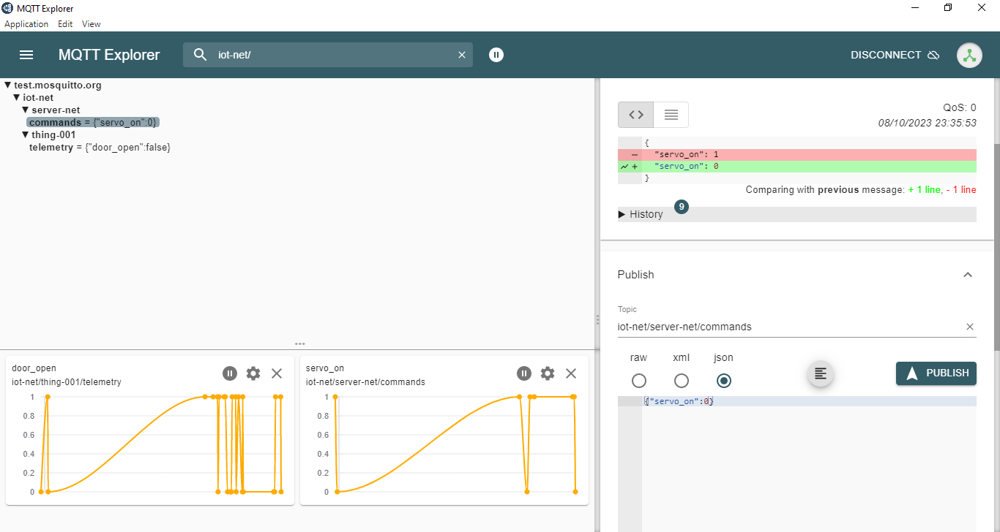

# Ejemplo 1 - Thing 1


## Hardware

### Componentes

Componentes:
* Servomotor
* Modulo boton
* ESP32

### Esquematico


### Diagrama de conexión


## Sofware

Libreias empleadas:
* ESP32Servo
* ArduinoJson
* PubSubClient

**Archivo de configuración**: platformio.ini (aun no se ha probado en plaformio)

```ini
[env:nodemcu-32s]
platform = espressif32
board = nodemcu-32s
framework = arduino
lib_deps = 
    knolleary/PubSubClient @ 2.8
    bblanchon/ArduinoJson @ 6.17.3
    madhephaestus/ESP32Servo @ 1.1.0
```


**Header**: config.h

```h
#pragma once

#include <string>

using namespace std;

// pines
#define SERVO_PIN 13
#define DOOR_PIN LED_BUILTIN
#define DOOR_BUTTON 4

// WiFi credentials
const char *SSID = "Wokwi-GUEST";
const char *PASSWORD = "";

// MQTT settings
const string NET_ID = "iot-net";
const string ID = "thing-001";
const string SERVER_ID = "server-net";

const string BROKER = "test.mosquitto.org";
const string CLIENT_NAME = ID + "door_client";

const string CLIENT_TELEMETRY_TOPIC = NET_ID + "/" + ID + "/telemetry";
const string SERVER_COMMAND_TOPIC = NET_ID + "/" + SERVER_ID + "/commands";
```

```cpp
#include <WiFi.h>
#include <PubSubClient.h>
#include <ESP32Servo.h>
#include <ArduinoJson.h>
#include "config.h"

// Interrupciones
volatile byte BUTTON_EVENT_TOGGLE = LOW;
volatile byte door_moving = LOW;
byte MOTOR_MQTT_EVENT = LOW;

// Constantes del programa
const int ANGLE_CLOSE = 90;
const int ANGLE_OPEN = 180;
const int DEBOUNCE_DELAY = 300;
const int OPEN = 1;
const int CLOSE = 0;
// Variables de status
bool door_open = false;

**Main source**: main.cpp

// Variables de control
int pos = 0;    // posicion del servo
Servo servo_door;  // create servo object to control a servo
WiFiClient espClient;
PubSubClient client(espClient); // Setup MQTT client

//variables to keep track of the timing of recent interrupts
unsigned long button_time = 0;  
unsigned long last_button_time = 0; 

void increment() {
  button_time = millis();
  //check to see if increment() was called in the last 250 milliseconds
  if (button_time - last_button_time > DEBOUNCE_DELAY) {
    BUTTON_EVENT_TOGGLE = HIGH;
    door_moving = !door_moving;
    last_button_time = button_time;
  }
}

void connectWiFi() {
    while (WiFi.status() != WL_CONNECTED) {
      Serial.println("Connecting to WiFi...");
      WiFi.begin(SSID, PASSWORD, 6); 
      delay(500);
  }
  Serial.println("Connected!");
}

// Handle incomming messages from the broker
void clientCallback(char *topic, uint8_t *payload, unsigned int length) {
  char buff[length + 1];
  for (int i = 0; i < length; i++) {
    buff[i] = (char)payload[i];
  }
  buff[length] = '\0';

  Serial.print("Message received:");
  Serial.println(buff);
  
  DynamicJsonDocument doc(1024);
  deserializeJson(doc, buff);
  JsonObject obj = doc.as<JsonObject>();

  int servo_on = obj["servo_on"];
  if(servo_on == OPEN) {
    // Abrir puerta (con el servo): 1
    if(!door_open) {
      // Activar el servo cuando la puerta esta cerrada
      door_moving = HIGH;
      door_open = open_door();
    }
  }
  else {
    // Cerrar puerta (con el servo): 0
    if(door_open) {
      door_moving = HIGH;
      // Activar el servo cuando la puerta esta abierta
      door_open = close_door();
    }
  }
  MOTOR_MQTT_EVENT = HIGH;
}

void reconnectMQTTClient() {
  while (!client.connected()) {
    Serial.print("Attempting MQTT connection...");
    if (client.connect(CLIENT_NAME.c_str())) {
      Serial.println("connected");
      client.subscribe(SERVER_COMMAND_TOPIC.c_str());
    }
    else {
      Serial.print("Retying in 5 seconds - failed, rc=");
      Serial.println(client.state());
      delay(5000);
    }
  }
}

void createMQTTClient() {
  client.setServer(BROKER.c_str(), 1883);
  client.setCallback(clientCallback);
  reconnectMQTTClient();
}

void setup() {
  // Pin init
  pinMode(DOOR_BUTTON, INPUT);
  pinMode(DOOR_PIN, OUTPUT);
  // Servo init
  servo_door.attach(SERVO_PIN);  
  servo_door.write(ANGLE_CLOSE);    
  door_open = false;
  door_moving = false;  
  digitalWrite(DOOR_PIN, door_open);
  // Serial init
  Serial.begin(9600);
  while (!Serial)
    ; // Wait for Serial to be ready
  delay(1000);
  // Interrupts init
  attachInterrupt(digitalPinToInterrupt(DOOR_BUTTON), increment, RISING);
  // Wifi init
  connectWiFi();
  // MQTT init
  createMQTTClient();
}

bool open_door() {
  for (pos = ANGLE_CLOSE; pos <= ANGLE_OPEN; pos += 1) { // goes from 0 degrees to 180 degrees
    // in steps of 1 degree
    servo_door.write(pos);              // tell servo to go to position in variable 'pos'
    delay(15);                       // waits 15ms for the servo to reach the position
  }
  door_moving = LOW;
  return true;
}

bool close_door() {
  for (pos = ANGLE_OPEN; pos >= ANGLE_CLOSE; pos -= 1) { // goes from 180 degrees to 0 degrees
    servo_door.write(pos);              // tell servo to go to position in variable 'pos'
    delay(15);                       // waits 15ms for the servo to reach the position
  }
  door_moving = LOW;
  return false;
}


void loop() { 
  reconnectMQTTClient();
  client.loop();
  DynamicJsonDocument doc(1024);
  string telemetry;
  if (BUTTON_EVENT_TOGGLE) {
    // Cambio del estado de la puerta
    if (door_moving == HIGH) {
      // Se mete si la puerta esta quieta
      if (door_open == false) {
        door_open = open_door();        
        digitalWrite(DOOR_PIN, door_open);
        doc["door_open"] = door_open;
        serializeJson(doc, telemetry);
        Serial.print("Sending telemetry ");
        Serial.println(telemetry.c_str());
        client.publish(CLIENT_TELEMETRY_TOPIC.c_str(), telemetry.c_str());
        delay(3000);
        door_open = close_door();
        telemetry = "";
        doc["door_open"] = door_open;
        serializeJson(doc, telemetry);
        Serial.print("Sending telemetry ");
        Serial.println(telemetry.c_str());
        client.publish(CLIENT_TELEMETRY_TOPIC.c_str(), telemetry.c_str());
      }
      //door_moving = false; // La puerta queda quieta nuevamente
    }
    digitalWrite(DOOR_PIN, door_open);
    BUTTON_EVENT_TOGGLE = LOW;
  }
  if (MOTOR_MQTT_EVENT) {
    telemetry = "";
    doc["door_open"] = door_open;
    serializeJson(doc, telemetry);
    Serial.print("Sending telemetry ");
    Serial.println(telemetry.c_str());
    client.publish(CLIENT_TELEMETRY_TOPIC.c_str(), telemetry.c_str());
    MOTOR_MQTT_EVENT = LOW;   
  }  
  delay(100);
}
```

## Simulación


### Hardware 

El hardware empleado se muestra a continuación:


### Test

Link de simulación: [link](https://wokwi.com/projects/378073791238957057)

La salida serial se muestra a continuación:


La salida en el MQTT explorer es la siguiente:




## Referencias

* https://realpython.com/python-wordle-clone/
* https://rich.readthedocs.io/en/stable/
* https://www.textualize.io/
* https://randomnerdtutorials.com/esp32-servo-motor-web-server-arduino-ide/


